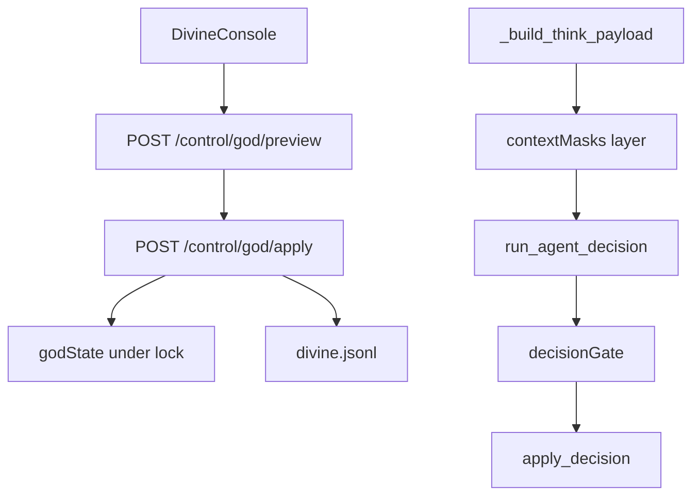
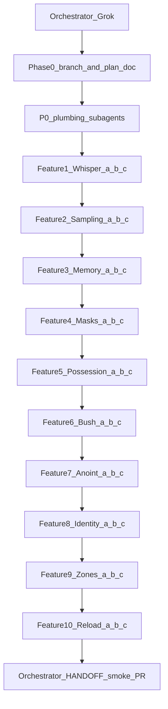

# Divine Console Matrix Expansion — Implementation Plan

**Status: Planned — not executing. Awaiting explicit implementation approval.**

**Branch strategy:** Feature work lands on `feature/divine-matrix-interventions` branched from [`feature/god-mode`](https://github.com/dbrito1231/simulation) (the repo’s actual God-mode branch; there is no branch named exactly `god-mode`). Eventual PR base = `feature/god-mode`, not `main`.

**Delivery model:** Grok orchestrator plans/dispatches/reviews; **only Composer 2.5 implementer subagents** write feature code and behavior specs (per [`.cursor/rules/simulation-model-policy.mdc`](.cursor/rules/simulation-model-policy.mdc) and [`.claude/agents/implementer.md`](.claude/agents/implementer.md)). Orchestrator does not implement multi-file work.

**Plan doc deliverable (on approval of this plan, before feature code):** orchestrator creates the branch and writes [`docs/plan-divine-matrix-interventions.md`](docs/plan-divine-matrix-interventions.md) (docs-only). Behavior-changing specs and feature code wait for a second explicit “implement” approval, then run as the subagent sequence below.

---

## Goal / non-goals

**Goal:** Operator authors pressure and meaning via Divine Console; agents remain protagonists who respond. Ten Matrix-style interventions manipulate LLM brains and environment through the existing God control plane, with full auditability.

**Non-goals:**
- No God kinds in `DECISION_ACTIONS` / `DECISION_SCHEMA` / `SYSTEM_PROMPT` / `apply_decision` action sync / `ACTION_LABELS`
- No avatar God / user-controlled sprite
- No treating intervened runs as comparable to untouched autonomous runs
- No free-prose compiler expansion (Phase 8 stays as-is)
- No rewriting Path1 tile economy into a full Minecraft editor
- No multiplayer / remote God session sync
- No committing credentials, `simulation/logs/`, or live `state.db`

---

## Verified architecture facts (load-bearing)

| Fact | Evidence | Consequence |
|---|---|---|
| God is a separate control plane: `/control/god/{capabilities,sight,preview,apply,cancel,compile}` behind `GOD_ROUTES_ACTIVE` + optional `X-God-Token` | [`server.py`](simulation/server.py) ~4223–4252 | New kinds extend `_validate_god_envelope` / `_god_apply_*` only |
| `godState` shape: `version`, `intervened`, `nextInterventionSeq`, `providence`, `privateOmens`, `activeEvents`, `recentInterventions` | [`SimEngine._default_god_state`](simulation/sim_engine.py) ~15606 | Extend with new maps; bump `GOD_STATE_VERSION` when shape changes |
| Private omens never in `/state`; snapshot allowlists `god.providence`, `activePublicEvents`, `recentPublicInterventions` | [`snapshot()`](simulation/sim_engine.py) ~18264 | Masks, possession, anointment private fields must follow same allowlist |
| Cognition inject: `_build_think_payload` → `_divine_prompt_lines` → `divine_*_line` → `build_user_prompt` | [`sim_engine.py`](simulation/sim_engine.py) ~14290, [`server.py`](simulation/server.py) ~3467 | Reality Distortion / Anointed / Whisper hook here |
| Decision path: think worker → `run_agent_decision` → under lock `apply_decision` at ~14852; Sage emergency already discards decisions | [`sim_engine.py`](simulation/sim_engine.py) ~14779–14852 | Possession gate inserts immediately before `apply_decision` |
| Sampling today: `build_decision_payload` hardcodes temp 0.4 / `model_for_decision` → `MODEL_SMART`; `to_ollama_body` already forwards temp/top_p/top_k/min_p | [`server.py`](simulation/server.py) ~3672–3700, [`llm_wire.py`](simulation/llm_wire.py) | Temperature Dial overlays per-agent overrides onto that payload |
| `MemoryStore.store/query/recent` exist; **no delete-by-filter API** | [`server.py`](simulation/server.py) ~672–731 | Memory Surgery needs engine-owned delete/insert helpers |
| Agents carry `persona`, `personality`, `personalityTraits`, `beliefs`; roles from `roles.json` | agent init ~2098–2141 | Identity Forge mutates agent fields + prompt lines |
| Persistence: `save_state` → `_write_state_db(DB_PATH)`; `restore_state` setdefault-migrates `godState` | ~15133–15232 | Reload checkpoints = copy files + restore path |
| Path1 has district `terrain`/`tiles` grids; structure type `"door"` is craft recipe only — **no keyed lock / limbo station** | ~5425–5540, `STRUCTURE_TYPES["door"]` | Architect Zones are new god overlays, not reuse of craft doors |
| Divine Console: 8 tabs, `wireDivineForm` Preview→Apply | [`viewer.js`](simulation/viewer.js) | New tabs/fieldsets; no new `/control` style outside god routes |
| Smoke: [`scripts/god_mode_smoke.py`](scripts/god_mode_smoke.py) ~70 engine tests + HTTP; deterministic, no Ollama | Extend per phase |

---

## Shared plumbing (build first, then features)

All new mutating commands keep the existing **preview → apply → cancel/expiry → `divine.jsonl`** contract. Kind names stay off the agent action sync invariant.

### A. `godState` extensions (`GOD_STATE_VERSION` → 2)

Add (all optional / setdefault on restore):

- `whisperCampaigns: {}` — campaignId → `{theme, targets: {agentIdStr: omenId}, expiresFrame, ...}`
- `agentSampling: {}` — agentIdStr → `{model, temperature, top_p?, top_k?, min_p?, expiresFrame?, sourceId}`
- `contextMasks: {}` — agentIdStr → `{mode, payload, expiresFrame, id}`
- `decisionGates: {}` — agentIdStr → `{mode: compulsion|veto|possession, ...}`
- `burningBush: {}` — agentIdStr → `{thread: [...], bargain?: {...}}`
- `anointments: {}` — agentIdStr → `{destinyText, stigmataTags, oracleHints[], expiresFrame}`
- `identityForges: {}` — agentIdStr → `{persona?, role?, personality?, copyFromId?, progress, rate}`
- `architectZones: []` — `{id, bounds|tiles, kind: paint|door|limbo, key?, holds: [], expiresFrame}`
- `checkpoints: []` — metadata only (paths outside DB): `{id, label, frameTick, path, createdAt}`

Private maps never appear in `/state` `god` allowlist. Sight may expose **status summaries without secret text** (same pattern as omen: `{active, expiresFrame}`).

### B. Context mask pipeline

After `_build_think_payload` builds the true snapshot (and after `_divine_prompt_lines`), call `_apply_context_mask(agent, payload)`:

| Mode | Behavior |
|---|---|
| `dream` | Replace selected payload fields with fabricated snapshot from mask record |
| `blue_pill` | Strip `divine_public_line` / `divine_private_line` and public divine event lines |
| `red_pill` | Inject explicit simulation-truth lines (flags, that they are agents, active god intervened) — still never exposes other agents’ private omen text |
| `whisper_chain` | Replace/forge `recent_conversations` / nearby chat slice with authored lines |

Masks expire via `_expire_divine_effects`; cancel by id.

### C. Decision gate

In the think-worker success path, **immediately before** `self.apply_decision(agent, decision)` (~14852), and also wrapping deterministic emergency `apply_decision` call sites that should respect compulsion/possession (document which: LLM path always; Sage rush heal **bypasses** gate so survival stays authoritative):

1. **Compulsion** — replace decision with pinned `{action,...}` (must pass `normalize_decision` / exist in `available_actions` or be force-flagged with audit)
2. **Thought veto** — if pending operator review: hold agent (no apply), stash candidate; Console approve/reject/rewrite via god command; timeout → reject + rest
3. **Possession** — skip LLM entirely when gate mode is possession (short-circuit before `run_agent_decision` in scheduling), apply puppeteer decision under lock

Veto must be **non-blocking for the tick thread**: stash under `godState.decisionGates`, mark agent `divineHold=True` so movement/think scheduling pauses; operator resolve is async via `/control/god/apply`. Cap concurrent veto holds (e.g. 3) to avoid deadlock of the whole village.

### D. Memory ops API (engine-mediated)

Add `SimEngine` helpers (not raw HTTP from Console):

- `_god_memory_insert(agent, text, salience, kind="divine_false_memory")`
- `_god_memory_delete(agent, *, keyword=None, frameFrom=None, frameTo=None, kinds=None)` → count deleted from `MemoryStore.entries` + mirror local `working`/`shortTerm` lists
- `_god_belief_plant(agent, beliefId|customText, salience)` — uses existing beliefs/`memeTexts` patterns; kind attributed divine

Extend `MemoryStore` with `delete_where(predicate)` under its lock. All ops only via god apply; audit `public: false` for false memories.

### E. Capabilities / viewer

Extend `control_god_capabilities` `kinds` list and add a **Matrix** Divine Console tab (or sub-panels under Voice/Miracles) wired through existing `wireDivineForm`. Irreversible kinds get `.divine-fieldset-irreversible`.

---

## Per-feature design (preferred build order)

### 1. Whisper Campaign

**Kind:** `whisper_campaign` (batch) + reuse `private_omen` machinery per target.

**Payload:** `{theme, durationFrames, whispers: [{targetId, text}, ...]}` — max N targets (e.g. 12), each text via `_normalize_divine_text`, one omen per agent (replace semantics unchanged).

**Persistence:** `godState.whisperCampaigns[id]` links theme + omen ids; closing campaign revokes remaining omens.

**Audit:** one parent `whisper_campaign` applied record (`public: false`) + per-omen records (existing).

**UX:** Voice tab — multi-agent form: shared theme + per-agent text rows.

**Smoke:** batch apply; `/state` still has no omen text; each agent’s `_divine_prompt_lines` differs; campaign cancel clears all.

### 2. Temperature Dial

**Kind:** `agent_sampling` / `revoke_agent_sampling`.

**Payload:** `{targetId, model: "sim-smart"|"sim-fast", temperature: 0.0–1.5, top_p?, top_k?, min_p?, durationFrames?}`.

**Injection:** In `build_decision_payload`, after defaults, if think payload carries `divine_sampling` from `_build_think_payload` (read `godState.agentSampling`), overlay model + sampling keys. `model_for_decision` honors override when present. Does **not** change PIANO/`lm_complete` background callers unless explicitly same agent decision path.

**Risk:** `sim-fast` for decisions can starve PIANO (shared pool) — cap concurrent fast-routed decision agents to 1 in smoke docs; prefer `sim-smart` default.

**UX:** new Matrix/Brain panel — agent select + sliders; show effective values in Sight.

**Smoke:** payload options reflect override; expiry restores defaults; no Ollama required if assert on `build_decision_payload` output only.

### 3. Memory Surgery

**Kinds:** `memory_insert`, `memory_delete`, `belief_plant`.

**Payloads:**
- insert: `{targetId, text, salience, kind?}`
- delete: `{targetId, keyword?, frameFrom?, frameTo?, kinds?}` (at least one filter required)
- belief: `{targetId, beliefId?, text?, plantInMemeTexts: bool}`

**Audit:** `public: false`; never write false memories into public activity/chronicle.

**UX:** Matrix → Memory form; Sight shows counts only.

**Smoke:** insert → query hit; delete by keyword; belief appears in think payload beliefs line; save/restore preserves vector store entries via existing memory export path (document whether memory_store.json must be checkpointed with Reload — yes for Déjà Vu consistency).

### 4. Reality Distortion

**Kind:** `context_mask` / cancel via `god_cancel` on mask id.

**Payload:** `{targetId, mode: dream|blue_pill|red_pill|whisper_chain, durationFrames, dreamSnapshot?, forgedConversations?}`.

**Hook:** `_apply_context_mask` (shared plumbing B). Dream snapshot is a validated allowlisted subset of think-payload keys (nearby, resources, weather, conversations) — reject unknown keys.

**UX:** Matrix → Distortion; mode radio + JSON/fields for dream/whisper.

**Smoke:** blue_pill strips divine lines; red_pill adds truth lines without leaking other private omens; whisper_chain forges conversation text in payload only (does not mutate `conversationLog`).

### 5. Possession Pipeline

**Kinds:** `decision_compulsion`, `decision_veto_arm`, `decision_veto_resolve`, `agent_possession`, plus revoke.

**Modes in `godState.decisionGates`:**
- compulsion: `{pinnedDecision, expiresFrame, remainingTurns?}`
- veto: `{armed: true, pendingDecision?, status}`
- possession: `{pinnedDecision | queue, bypassLlm: true}`

**Hooks:** pre-LLM short-circuit for possession; post-LLM gate before `apply_decision`. Compelled/possessed decisions still run through `normalize_decision` when possible; invalid pin → reject preview.

**Attribution:** activity/chronicle must mark `source="divine"` / `kind` distinct so possession never looks emergent. `llm.jsonl` records skipped LLM with `divine_possession: true`.

**UX:** Matrix → Possession; pin action builder from `available_actions` list via Sight; veto queue panel.

**Smoke:** compulsion forces `rest`; possession skips LLM mock; veto hold then resolve; Sage emergency still heals (bypass).

### 6. Burning Bush (+ Merovingian Bargain)

**Kinds:** `burning_bush_message`, `burning_bush_close`, `merovingian_bargain`, `bargain_settle`.

**Dialogue:** God message injected as private prompt line (`Divine audience: ...`) distinct from omen/providence templates; agent reply captured when next decision includes talk/reason — or dedicated inbox on agent `burningBushInbox` drained into prompt. Thread in `godState.burningBush` (private).

**Bargain (included in this phase, not deferred):** `{targetId, termsText, successPredicate: allowlisted, failurePredicate, rewardPrimitive?, punishPrimitive?, expiresFrame}`. Predicates are **allowlisted only** (e.g. `agent_has_resource`, `structure_built`, `frame_reached`) — never free code. Settle on tick via `_tick_divine_bargains` under lock; fire god primitives already validated (grant/vitals/story modifiers).

**UX:** Matrix → Burning Bush chat UI; Bargain form with predicate dropdowns.

**Smoke:** message appears only in target prompt; bargain success grants resource; expiry settles failure path; no `/state` leak of thread text.

### 7. Anointed

**Kind:** `anoint`, `revoke_anoint`.

**Object:** `{destinyText, stigmataTags: [str], oracleHints: [{text, revealFrame}], expiresFrame}`.

**Prompt injection:**
- Target: destiny + due oracle hints in private divine lines
- **Other** agents: stigmata tags folded into nearby-agent descriptions (`_get_nearby_detailed` / prompt formatter) — never into `/state` agent public fields beyond maybe a non-secret status if we choose **not** to (prefer Sight-only)

**UX:** Matrix → Anoint form.

**Smoke:** target sees destiny; neighbor prompt contains stigmata; oracle appears only after `revealFrame`; revoke clears.

### 8. Identity Forge

**Kinds:** `identity_edit`, `identity_copy_overwrite`, `identity_forge_cancel`.

**Edit:** mutate `agent["persona"]`, `personality`, optionally `role` (must exist in `roles.json`); irreversible class unless duration-scoped shadow copy in `identityForges` that restores on expiry.

**Copy Overwrite:** `{targetId, sourceId, ratePerThink: 0.0–1.0}` — each think blends persona/personality strings toward source; optional flag `syncMemories` calls Memory Surgery plant of selected source memories (explicit, not automatic full clone).

**UX:** Matrix → Identity; dual agent pickers + progress in Sight.

**Smoke:** role swap changes specialty lines; copy progresses across N thinks; cancel restores snapshot taken at apply.

### 9. Architect Zones

**Kind:** `architect_zone`, `architect_zone_cancel`, `architect_release_hold`.

**Zone record:** `{id, kind: paint|door|limbo, districtId?, cells: ["gx,gy"|bounds], paintTerrain?, keyId?, holdAgentIds[], expiresFrame}`.

**Mechanics:**
- **paint:** write district `terrain` cells (Path1) with revert snapshot on cancel/expiry when `reversible: true`
- **door:** movement check in `_move_agent` — agents without matching key item/flag bounce; key is god-granted tag on agent `godKeys: set` (not a craft item unless we reuse inventory string)
- **limbo:** set `divineHold` + teleport/park agents to a fixed limbo point (Trainman station coords constant); release via command

**UX:** Matrix → Zones; click-to-paint deferred — v1 uses numeric bounds/cell list inputs (viewer canvas paint can be phase 9b if time).

**Smoke:** door blocks move; limbo freezes think; release restores; cancel reverts paint.

### 10. Reload / Déjà Vu

**Kinds:** `checkpoint_create`, `checkpoint_restore`, `deja_vu_replay` (optional short).

**Create:** pause-safe copy of `state.db` (+ `-wal` truncate via existing PRAGMA pattern) and `memory_store.json` into `simulation/backup/god-checkpoints/<id>/`; metadata in `godState.checkpoints` (paths relative). Cap N=5.

**Restore:** require preview disclosure “irreversible world replace”; on apply: pause engine, replace DB files, `restore_state()`, clear preview/request caches, resume. Audit heavily (`public: true`).

**Déjà Vu replay (bounded):** store last K tick decision digests optional — v1 ships **checkpoint restore only**; short tick replay is a **stretch** behind flag `GOD_DEJA_VU_REPLAY` default off (implement stub that rejects unless flag on). Prefer honest v1 over half-broken replay.

**UX:** Matrix → Reload; list checkpoints; confirm modal.

**Smoke:** create → mutate → restore returns prior frameTick/agents; `/state` god public ok; live `state.db` not corrupted by smoke (use temp paths like existing god smoke).

---

## Subagent dispatch model

### Roles

| Role | Model | Does | Does not |
|---|---|---|---|
| **Orchestrator** | Grok 4.5 (this session) | Branch/docs Phase 0; write each subagent prompt with file/symbol scope; review diffs; run/confirm full smoke between features; open PR | Edit engine/server/viewer/specs for features; finish work after usage limits |
| **Implementer** | Composer 2.5 via Task `subagent_type: implementer` (`composer-2.5` or `composer-2.5-fast`) | Spec edits, code, focused smoke for its step | Invent APIs outside this plan; put God kinds in `DECISION_ACTIONS`; open the merge PR |

### Dispatch rules

1. **Sequential features** (1→10). Do not start feature N+1 until orchestrator has reviewed feature N (diff + its smoke).
2. **Within a feature:** always `a` specs → `b` engine/server/smoke → `c` viewer (SDD). Never code before owning-spec update in the same feature.
3. **One implementer at a time** on shared files (`sim_engine.py`, `server.py`, `viewer.js`) to avoid merge thrash.
4. **Each Task prompt must include:** branch name, exact kinds/payloads from this plan, files to touch, smoke functions to add, privacy/`divine.jsonl` invariants, "do not touch DECISION_ACTIONS".
5. **Usage-limit mid-step:** pause; do not hand remaining edits to Grok; resume the same step with a fresh Composer implementer after review of partial diff.
6. **Commits:** orchestrator asks user before committing. Default: implementer leaves a clean diff; orchestrator commits when asked.

### Phase 0 — Orchestrator + plumbing foundation

| Step | Who | Deliverable |
|---|---|---|
| 0-orch | Orchestrator | `git fetch`; update `feature/god-mode`; create `feature/divine-matrix-interventions`; write `docs/plan-divine-matrix-interventions.md`; docs-only commit if user asks |
| 0a | Implementer | Specs only: `godState` v2 maps, mask/gate/memory API outlines in `01`/`02`/`03`/`04`/`12` |
| 0b | Implementer | `_default_god_state` / `_normalize_god_state` v2 fields; stub `_apply_context_mask` (no-op); stub decision-gate helper (passthrough); `MemoryStore.delete_where`; **no user-facing kinds yet** |

### Features 1–10 — three subagents each

Pattern for every feature:

| Step | Who | Touches (typical) | Smoke |
|---|---|---|---|
| **Na** specs | Implementer | Owning specs from map below | — |
| **Nb** engine | Implementer | `sim_engine.py` validate/apply/expiry; `server.py` if cognition/MemoryStore; `scripts/god_mode_smoke.py` | Feature-specific deterministic tests |
| **Nc** viewer | Implementer | `index.html` / `viewer.js` / `viewer.css`; `specs/11-viewer.md` sync | Manual note in smoke docstring; no Ollama |

| Feature | Focus | Nb must land |
|---|---|---|
| 1 Whisper | Batch private omens | `whisper_campaign` + privacy assertions |
| 2 Sampling | Per-agent LLM dial | `agent_sampling` + `build_decision_payload` overlay asserts |
| 3 Memory | Insert/delete/belief | `memory_*` / `belief_plant` + MemoryStore delete |
| 4 Masks | Dream/Blue/Red/WhisperChain | `context_mask` four modes |
| 5 Possession | Compulsion/veto/possession | Gate before `apply_decision`; Sage bypass; LLM skip |
| 6 Bush | Dialogue + bargain | Thread privacy; allowlisted settle |
| 7 Anoint | Destiny/stigmata/oracle | Neighbor prompt stigmata; oracle `revealFrame` |
| 8 Identity | Edit/copy overwrite | Role in roles.json; cancel restores snapshot |
| 9 Zones | Paint/door/limbo | `_move_agent` door; limbo `divineHold` |
| 10 Reload | Checkpoint restore | Temp-dir create/restore; replay stub rejects if flag off |

### Phase 11 — Orchestrator ship

| Step | Who | Deliverable |
|---|---|---|
| 11a | Implementer (optional) | `docs/HANDOFF.md` refresh summarizing Matrix surface |
| 11b | Orchestrator | Full `uv run python scripts/god_mode_smoke.py`; single-server check; push branch; **PR into `feature/god-mode`** when user asks |

Default: **one PR** with stacked commits (one logical commit per Nb/Nc or per feature).

---

## Spec ownership map (SDD: specs first per feature subagent Na)

| Spec | Sections to add |
|---|---|
| [`specs/00-overview.md`](specs/00-overview.md) | Product stance: Matrix interventions still optional God control plane |
| [`specs/01-architecture.md`](specs/01-architecture.md) | Flag index if any new flags (`GOD_DEJA_VU_REPLAY`); `GOD_STATE_VERSION` note |
| [`specs/02-engine-core.md`](specs/02-engine-core.md) | godState v2 fields; decision gate; architect zones; checkpoints; expiry |
| [`specs/03-cognition.md`](specs/03-cognition.md) | Masks, sampling overlay, burning bush lines, anoint/stigmata, identity prompt |
| [`specs/04-http-api.md`](specs/04-http-api.md) | New kinds on preview/apply; capabilities; Sight projections |
| [`specs/05-world.md`](specs/05-world.md) | Architect paint/door movement rules |
| [`specs/06-agents.md`](specs/06-agents.md) | persona/role mutation; divineHold; godKeys |
| [`specs/08-systems-economy.md`](specs/08-systems-economy.md) | Only if bargain/grant primitives touch yields |
| [`specs/09-systems-society.md`](specs/09-systems-society.md) | Attribution: possession/anoint must not look emergent |
| [`specs/11-viewer.md`](specs/11-viewer.md) | Matrix tab UX contract (each Nc) |
| [`specs/12-ops.md`](specs/12-ops.md) | Audit field extensions; checkpoint disk layout; smoke coverage |

God kinds never enter [`specs/07-actions.md`](specs/07-actions.md).

---

## Risks

- **Save compatibility:** `GOD_STATE_VERSION` 2 + `_normalize_god_state` setdefault; malformed new maps dropped
- **Prompt token budget:** masks/anoint/bush/stigmata add lines — hard-cap char budgets (reuse `GOD_TEXT_MAX_CHARS` / memory budget patterns)
- **`/state` leaks:** every new private structure must be absent from snapshot allowlist; add smoke assertions
- **Decision-gate deadlocks:** veto cap + timeout→rest; never block tick thread on HTTP
- **Ollama concurrency:** sampling to `sim-fast` for decisions contends with PIANO — document and optionally refuse preview if >1
- **Possession vs Sage emergency:** emergency bypasses gate (survival > story)
- **Checkpoint + memory_store.json drift:** restore both or document split-brain
- **Identity role swap:** may break elder/Sage assumptions — validate role in roles.json; refuse anointing dead agents; warn on elder swap in preview
- **Subagent thrash:** overlapping edits to `sim_engine.py` — enforce one Nb at a time; orchestrator rebases/resolves before next dispatch

---

## Explicit out of scope

- God Compiler Phase 8 enhancements
- Canvas click-to-paint Architect UI (forms only in v1)
- Full tick-accurate Déjà Vu replay (flag-gated stub only)
- Multi-operator God auth roles / RBAC beyond existing token
- Putting Matrix commands in agent `available_actions`
- Automatic full memory clone on Identity Forge without explicit Memory Surgery
- Changing default `GOD_MODE_ENABLED` / auth posture
- Orchestrator (Grok) writing feature implementation

---

## Definition of done (later implementation pass)

1. All 10 features landed via the subagent sequence above (Déjà Vu replay = stub unless flag enabled and completed)
2. Specs updated in the Na step before Nb code (SDD)
3. `uv run python scripts/god_mode_smoke.py` green with new cases
4. Manual: server on **5001**, single `simulation/server.py`, Divine Console Matrix flows, `divine.jsonl` attribution correct, `/state` privacy intact
5. Branch pushed; **PR opened into `feature/god-mode`**
6. No credentials/logs/`state.db` committed

---

## This plan-only pass (after you approve *this* Cursor plan)

1. Orchestrator: `git fetch`; checkout/update `feature/god-mode`
2. Orchestrator: create `feature/divine-matrix-interventions`
3. Orchestrator: write [`docs/plan-divine-matrix-interventions.md`](docs/plan-divine-matrix-interventions.md) including this subagent matrix
4. Optional docs-only commit — **no feature code, no behavior-changing specs yet**
5. Stop and ask for explicit **implementation** approval (which starts Phase 0a/0b implementer dispatches)
