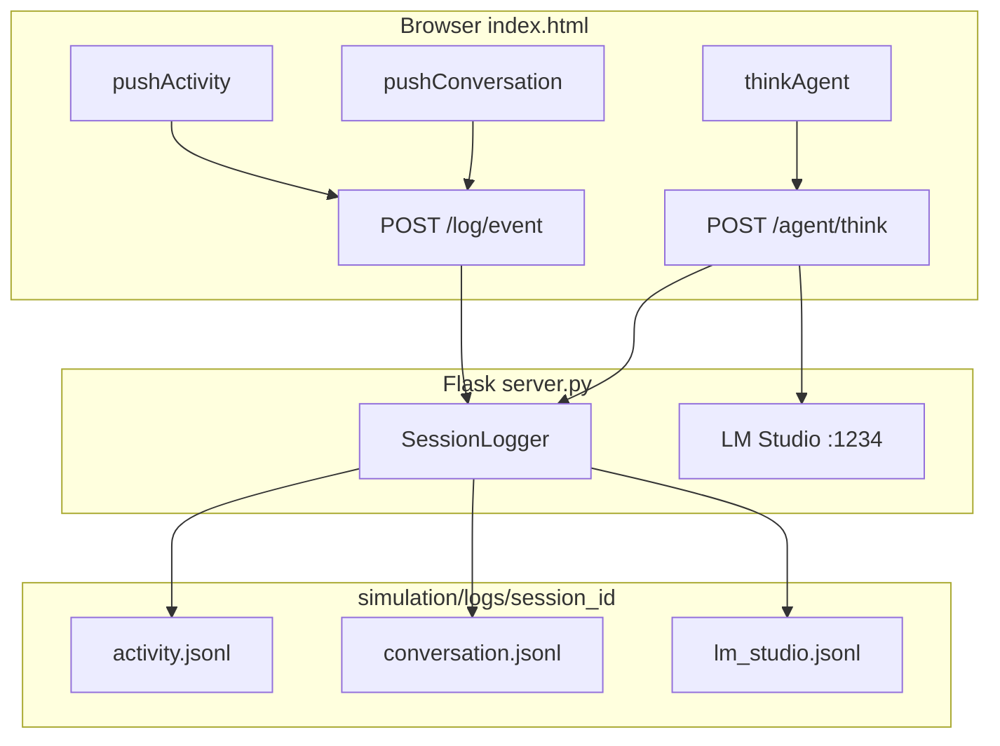

# Implement Simulation Logging

## Current state

- **Activity** and **conversation** logs live only in browser memory in [`simulation/index.html`](simulation/index.html) via `pushActivity()` and `pushConversation()` — lost on refresh.
- **LM Studio traffic** passes through [`simulation/server.py`](simulation/server.py) `agent_think()` with no recording.
- Original specs forbid file writes and extra endpoints; this feature intentionally overrides that.

## Target architecture



## Log layout

On server start, create a session directory:

```
simulation/logs/2026-06-23T14-30-22/
  activity.jsonl
  conversation.jsonl
  lm_studio.jsonl
```

- **Format:** JSON Lines (one JSON object per line) for easy parsing and streaming.
- **Common fields on every record:** `ts` (ISO-8601 UTC), `session_id`, `type`.
- **Rotation:** none for v1 — new folder each time `server.py` starts. Old sessions remain on disk.

## 1. Server logging module (inline in `server.py`)

Keep scope minimal — add a small `SessionLogger` class at the top of [`simulation/server.py`](simulation/server.py) rather than a new Python module (avoids import/path complexity in a 2-file project).

Responsibilities:

- Create `simulation/logs/<session_id>/` on init (`session_id` = local timestamp, e.g. `2026-06-23T14-30-22`).
- Expose three methods: `log_activity()`, `log_conversation()`, `log_lm_exchange()`.
- Each method appends one JSON line to the matching file using stdlib `json.dumps(..., ensure_ascii=False)` + newline.
- Print session path once at startup so you know where logs are going.

Example record shapes:

```json
{"ts":"...","type":"activity","message":"Aria collected food","frame_tick":842}
{"ts":"...","type":"conversation","from":"Aria","to":"Marco","message":"Want to trade?"}
{"ts":"...","type":"lm_studio","agent_name":"Aria","latency_ms":1204,"request":{...},"response":{...},"decision":{...},"error":null}
```

## 2. Verbose LM Studio logging in `agent_think()`

In [`simulation/server.py`](simulation/server.py) `agent_think()` (lines ~242–313), wrap the LM Studio call:

**Log on every think attempt** (success or failure):

| Field | Content |
|-------|---------|
| `agent_name` | from incoming request |
| `latency_ms` | wall-clock time for `requests.post` |
| `request` | full payload sent to LM Studio (`model`, `messages`, `max_tokens`, `temperature`) |
| `response` | raw parsed JSON from LM Studio, or `null` on network/parse failure |
| `http_status` | response status code when available |
| `decision` | normalized decision returned to browser (after `normalize_decision`) |
| `error` | `"LM Studio offline"`, `"bad_response"`, `"compute_error"`, etc., or `null` |

Also log early-exit paths (request exception, JSON parse failure, compute error) so failed calls are not silent.

**Note:** Prompts can be large. Per your requirement, log the full `messages` array verbatim — no truncation in v1.

## 3. New endpoint: `POST /log/event`

Add a lightweight endpoint for browser-origin events:

```python
# Request body
{"type": "activity", "message": "...", "frame_tick": 842}
{"type": "conversation", "from": "...", "to": "...", "message": "..."}
```

- Validate `type` is `"activity"` or `"conversation"`.
- Return `204 No Content` on success (fast, no body).
- Swallow/logging errors internally — logging must never break the simulation.

This is the only new route besides the existing static file routes and `/agent/think`.

## 4. Client wiring in `index.html`

Modify the two existing choke points only — no scattered calls:

**`pushActivity(line)`** — after updating `activityLog`, fire-and-forget:

```javascript
persistLog({ type: "activity", message: line, frame_tick: frameTick });
```

**`pushConversation(from, to, message)`** — same pattern with structured fields.

Add a small `persistLog(payload)` helper:

- `fetch("/log/event", { method: "POST", headers: {...}, body: JSON.stringify(payload), keepalive: true })`
- `.catch(() => {})` — ignore network failures silently (simulation keeps running)

Using `keepalive: true` helps events survive tab close; no `await` in the hot path.

## 5. Repo hygiene

Update [`.gitignore`](.gitignore) to exclude generated logs:

```
simulation/logs/
```

## 6. Verification plan

1. Start `python simulation/server.py` — confirm startup prints session log path.
2. Open `http://127.0.0.1:5001`, let agents act for ~1 minute.
3. Check the session folder:
   - `activity.jsonl` grows with action summaries (collect, move, rest, civ level-ups).
   - `conversation.jsonl` grows when agents `talk_to_nearby`.
   - `lm_studio.jsonl` contains full request/response pairs per think call.
4. Refresh the browser — UI logs reset, but files on disk are unchanged.
5. Restart server — new session folder is created; previous session preserved.

## Files changed

| File | Change |
|------|--------|
| [`simulation/server.py`](simulation/server.py) | `SessionLogger`, LM Studio logging in `agent_think`, `POST /log/event` |
| [`simulation/index.html`](simulation/index.html) | `persistLog()` helper; hook into `pushActivity` / `pushConversation` |
| [`.gitignore`](.gitignore) | Ignore `simulation/logs/` |

## Out of scope (v1)

- Log viewer UI or download button
- Log rotation / size limits / retention policy
- Correlation IDs linking activity lines to specific LM Studio calls (can add `think_id` later if needed)
- Changes to specs docs (optional follow-up)
