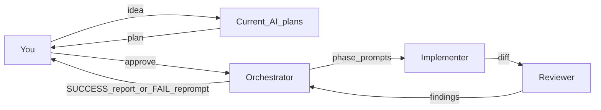

# Create AGENTS.md as AI source of truth

## Scope

**In scope:**

1. Write [`AGENTS.md`](AGENTS.md) at the repo root (currently deleted in the working tree).
2. Create a project Cursor skill at [`.cursor/skills/loop-in-devs/SKILL.md`](.cursor/skills/loop-in-devs/SKILL.md) so you can **manually initiate** the development loop.

**Out of scope (do not touch unless you later approve):** [`CLAUDE.md`](CLAUDE.md), [`.claude/agents/implementer.md`](.claude/agents/implementer.md), [`.cursor/rules/`](.cursor/rules/), [`specs/`](specs/) cross-link rewrites, [`README.md`](README.md). Those still point at the old `CLAUDE.md`-centric guide; aligning them is a follow-up.

## Design principles for AGENTS.md

- **Single SoT:** `AGENTS.md` is the only agent-facing workflow contract. Deep mechanics stay in [`specs/`](specs/) (index: [`specs/00-overview.md`](specs/00-overview.md)); do not duplicate architecture encyclopedias from the old `CLAUDE.md`.
- **KISS:** short sections, imperative rules, no optional frameworks, no parallel workflows.
- **No hallucinations / unproven theories / AI slop:** every claim and change must be grounded in specs, code, or verified evidence; escalate unknowns instead of inventing.
- **No unanswered / invented answers:** implementer and reviewer escalate unknowns; only the orchestrator asks you. Never invent unfactual answers to close a gap.

## Content to put in AGENTS.md

### 1. Header

State that this file is the **single AI development source of truth** for the repo. All AI-driven changes you request must follow the loop below. Point to [`specs/00-overview.md`](specs/00-overview.md) for product/architecture truth. Note that the loop can also be started manually via the `loop-in-devs` skill (see § Manual start).

### 2. KISS (hard rule)

Emphasize Keep It Simple: prefer the smallest change that satisfies the approved plan and owning specs; no speculative refactors, no extra abstractions, no out-of-scope edits unless you explicitly approve.

### 3. No hallucinations, unproven theories, or AI slop (hard rule)

`AGENTS.md` must instruct all roles (plan agent, orchestrator, implementer, reviewer) to:

- **No hallucinations:** do not invent APIs, files, flags, behavior, log findings, or “fixes” that are not grounded in the repo, specs, or verified runtime evidence.
- **No unproven theories:** do not treat guesses, speculation, or unverified mental models as fact. If something is uncertain, escalate to the orchestrator (who asks you) or verify before acting.
- **No AI slop:** no padded prose, fake certainty, decorative refactors, drive-by “improvements,” filler comments, or overbuilt solutions that are not required by the approved plan and owning specs.
- Prefer citeable evidence: owning `specs/` file, concrete code paths, smoke/log results. Reviewer must flag invented claims and unproven explanations as FAIL material.

### 4. Spec-driven development (hard rule)

Mirror the contract already in [`specs/00-overview.md`](specs/00-overview.md) § Spec-driven development:

- Repo follows **spec-driven development**; **[`specs/`](specs/) is the source of truth** for behavior.
- For every change: **update owning spec(s) first (or in the same change), then code** — specs must never drift.
- Ownership / which file to edit: use the index and “Canonical for” lines in the 13 specs (`00`–`12`).
- Action-surface reminder (one line, not a full invariant dump): action changes also keep `server.py` / `sim_engine.py` / `viewer.js` / `specs/07-actions.md` in sync per [`specs/01-architecture.md`](specs/01-architecture.md).

### 5. Development loop (must not skip any step)

Encode this exact cycle as numbered steps plus a short mermaid diagram:

1. **You** submit an idea to the current AI agent → that agent **creates a plan**.
2. **You** decide to proceed with the plan.
3. The AI agent **becomes the orchestrator** (read-only for code edits).
4. Orchestrator splits the approved plan into **phases** with **concrete prompts** for implementers.
5. Orchestrator dispatches each phase prompt to an **implementer**.
6. Implementer makes the changes (specs + code) inside that prompt’s scope.
7. Implementer submits the work to a **reviewer**.
8. Reviewer checks accuracy, plan fit, and code/PR/app security; sends findings to the orchestrator.
9. Orchestrator reports **SUCCESS** to you, or on **FAIL** writes a new implementer prompt/instructions and re-enters step 5. Never skip steps; never invent a side path.

State explicitly: **this loop applies to all changes you request.**

### 6. Subagents (roles, access, models, escalation)

| Role | Access | Model | Duty |
|---|---|---|---|
| **Orchestrator** | Read-only for repo edits; directs work only | Same model as the current AI session that holds the plan | Break large plans into smaller phase plans + implementer prompts; dispatch; receive reviewer findings; report SUCCESS/FAIL to you; **only agent that asks you questions** |
| **Implementer** | Full read/write | Medium: Claude Sonnet 5, or Cursor Composer 2.5 Fast | Implement only under orchestrator rules/prompt; update specs + code; no re-planning; **all doubts/questions go back to orchestrator** (never to you directly, never invent answers) |
| **Reviewer** | Read (and review tooling); no drive-by implementation | Medium: Claude Sonnet 5, or Cursor Composer 2.5 Fast | Verify implementer work is accurate, matches the plan/specs, works as expected; code + PR + application security review; send findings to orchestrator; coordinate via orchestrator if issues |

Additional hard rules to spell out:

- **Only the implementer may make changes**, and only under orchestrator-issued prompts.
- Orchestrator **must** use implementer subagents for any write work.
- Complex projects: orchestrator **must** split into smaller phase plans and attach a **copy-pasteable prompt** per phase (goal, owning specs, in-scope files, out-of-scope, acceptance checks, SDD reminder).
- Reviewer FAIL → orchestrator produces a **new implementer prompt** from findings; do not have the reviewer silently “fix it” unless you later approve that exception (default: re-dispatch implementer).

### 7. Manual start (skill pointer)

Document that you can manually start or re-enter the loop by invoking the project skill **`loop-in-devs`** (`.cursor/skills/loop-in-devs/`). Skill behavior is defined in that skill file; `AGENTS.md` remains the workflow contract the skill must follow.

### 8. Minimal ops pointers (lean, not a second CLAUDE.md)

One short “How to verify” block so implementers/reviewers are not lost:

- Run: `uv sync` then `uv run python simulation/server.py` → `http://127.0.0.1:5001`
- Verify via browser + `simulation/logs/<timestamp>/` (esp. `llm.jsonl`); smokes: `scripts/sid_parity_smoke.py`, `scripts/path1_smoke.py`
- Do not commit credentials, `simulation/logs/`, or `simulation/state.db`
- Deep detail: [`specs/`](specs/), resume context [`docs/HANDOFF.md`](docs/HANDOFF.md), router [`docs/REFERENCE.md`](docs/REFERENCE.md)

### 9. Explicit constraints section

Bullet the MUST / MUST NOT list you provided (loop completeness, no unanswered/invented answers, escalate via orchestrator, no overengineering, no out-of-scope without approval), plus **MUST NOT** hallucinate, advance unproven theories as fact, or produce AI slop.

## Project skill: manual loop initiation

Create [`.cursor/skills/loop-in-devs/SKILL.md`](.cursor/skills/loop-in-devs/SKILL.md) as a **project** skill (repo-local, not personal).

### Skill metadata

- `name`: `loop-in-devs`
- `description`: third-person, WHAT + WHEN — e.g. starts or resumes the repo AI development loop (plan → orchestrator → implementer → reviewer) defined in `AGENTS.md`. Use when the user manually invokes this skill, says to start/run the AI loop, or wants orchestrated implementer/reviewer work.
- `disable-model-invocation: true` — **manual only**; agent must not auto-load this skill from ambient context. You choose when to run it.

### Skill body (KISS)

Keep the skill thin: it is an entry point, not a second copy of `AGENTS.md`.

1. **Read [`AGENTS.md`](AGENTS.md) first** and follow it exactly (SDD, KISS, no hallucinations/unproven theories/AI slop, roles, models, escalation, no skipped steps).
2. **Entry modes** (pick based on what you provide when invoking):
   - **New idea:** create a plan for you; wait for your proceed decision before becoming orchestrator.
   - **Approved plan / proceed:** become orchestrator immediately; split into phase prompts; dispatch implementer → reviewer → report SUCCESS or FAIL-reprompt.
   - **Resume mid-loop:** continue from the last incomplete step (orchestrator / implementer / reviewer) without restarting the whole cycle.
3. **Hard reminders in the skill:**
   - Orchestrator is read-only for edits; only implementers write.
   - Specs under `specs/` updated for every behavior change.
   - Doubts from implementer/reviewer → orchestrator → you.
   - No hallucinations, unproven theories, or AI slop.
   - Models: orchestrator = current session model; implementer/reviewer = Sonnet 5 or Composer 2.5 Fast.
4. No scripts, no extra reference files — single `SKILL.md` only.

## Implementation steps (when you approve this plan)

1. Create [`AGENTS.md`](AGENTS.md) with the sections above — concise prose, tables where they clarify roles/models, one mermaid loop diagram, and the manual-start skill pointer.
2. Create [`.cursor/skills/loop-in-devs/SKILL.md`](.cursor/skills/loop-in-devs/SKILL.md) with frontmatter (`disable-model-invocation: true`) and the thin entry-point instructions above.
3. Self-check against acceptance: loop complete; SDD/`specs/` SoT; specs-always-updated; subagent split + prompts; three roles with models; doubts → orchestrator → you; KISS; no hallucinations/unproven theories/AI slop; manual skill entry; no unrelated out-of-scope files edited.
4. Stop. Do not rewrite `CLAUDE.md` or Cursor rules / Claude agent defs in this change.

## Acceptance mapping

| Your MUST | Where it lands |
|---|---|
| AI loop for all your change requests | `AGENTS.md` § Development loop + opening statement |
| Spec-driven; SoT in `specs/` | `AGENTS.md` § Spec-driven development |
| Specs updated every change | Same section, hard rule |
| Subagents + split plans with prompts | `AGENTS.md` § Subagents + orchestrator duties |
| Orchestrator / implementer / reviewer definitions | `AGENTS.md` § Subagents table + bullets |
| Exact Me→…→SUCCESS/FAIL cycle | Numbered steps + mermaid |
| Doubts → orchestrator → you | Escalation bullets |
| Model assignments | Models column in roles table |
| KISS | Dedicated hard-rule section |
| No hallucinations, unproven theories, or AI slop | `AGENTS.md` § No hallucinations… + constraints MUST NOT |
| Manual loop initiation | Project skill `loop-in-devs` + `AGENTS.md` § Manual start |
