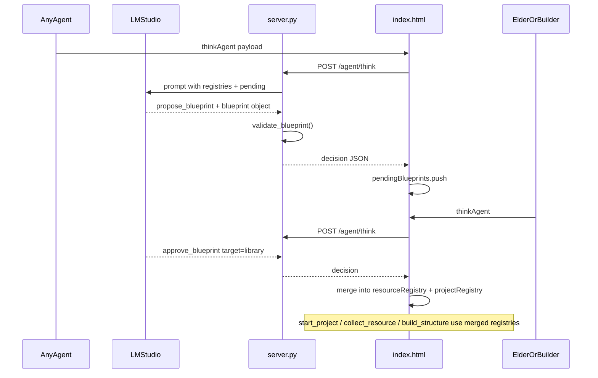
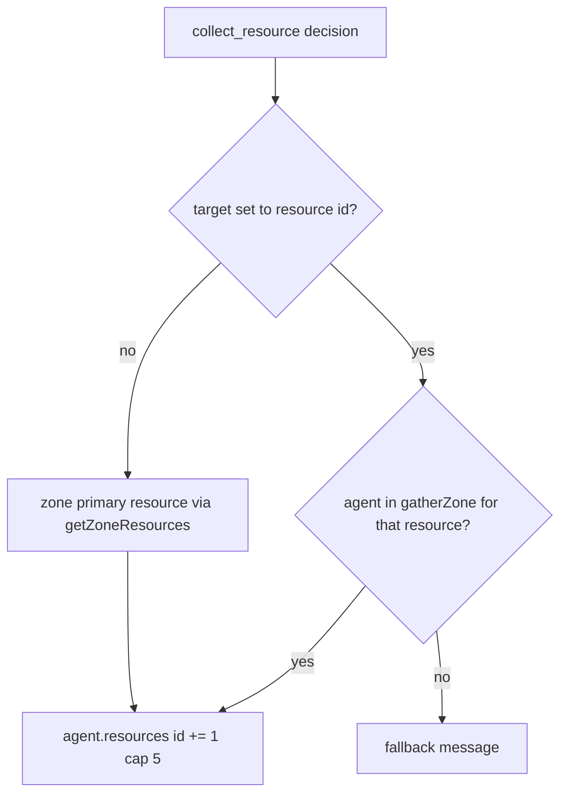

# propose_blueprint flow design

## Goal

Let agents **invent** new build types and resource types through the LLM, while keeping the simulation **safe and drawable**. Creativity lives in proposals; **validation + elder approval** gates what enters game state.



---

## Design principles

| Principle | Choice |
|-----------|--------|
| Who proposes | Any agent (`propose_blueprint`) |
| Who approves | `builder` or `elder` only (`approve_blueprint`) |
| New resources | Bundled inside blueprint proposal (`new_resources[]`) |
| Persistence | Session-only (browser memory); matches stateless server in [specs/01-architecture.md](specs/01-architecture.md) |
| Visuals | Reuse built-in sprite **or** generic placeholder — no LLM pixel art |
| Validation | **Server-first** in [simulation/server.py](simulation/server.py); client re-validates before mutating state |

---

## Extended decision JSON

Keep the existing flat decision shape; add an optional `blueprint` field used only when `action === "propose_blueprint"`.

```json
{
  "action": "propose_blueprint",
  "target": null,
  "message": "Sage, I drafted plans for a library.",
  "new_role": null,
  "relationship_update": null,
  "reasoning": "The village needs knowledge storage.",
  "blueprint": {
    "id": "library",
    "name": "Library",
    "needs": { "wood": 4, "paper": 2 },
    "new_resources": [
      {
        "id": "paper",
        "name": "Paper",
        "gather_zone": "forest",
        "color": "#E8D5B7"
      }
    ],
    "visual_style": "house"
  }
}
```

Approval:

```json
{
  "action": "approve_blueprint",
  "target": "library",
  "message": "Approved. Gather paper from the forest.",
  "reasoning": "A worthy addition to the village."
}
```

Optional rejection (same roles): `reject_blueprint` with `target` = blueprint id.

Add to `AVAILABLE_ACTIONS` in [simulation/index.html](simulation/index.html): `propose_blueprint`, `approve_blueprint`, `reject_blueprint`.

---

## New client state (index.html)

Replace hardcoded-only assumptions with layered registries:

```javascript
const BASE_RESOURCES = {
  food:  { name: "Food", gatherZone: "farm",  color: "#4CAF50" },
  wood:  { name: "Wood", gatherZone: "forest", color: "#795548" },
  gold:  { name: "Gold", gatherZone: "cave",   color: "#FFC107" }
};

const civilization = {
  // existing fields...
  resourceRegistry: { ...BASE_RESOURCES },   // grows on approve
  projectRegistry:  { ...PROJECT_TEMPLATES }, // seed + approved blueprints
  pendingBlueprints: [],                     // awaiting elder/builder
  rejectedBlueprintIds: new Set()            // prevent immediate re-propose spam
};
```

**Pending blueprint record:**

```javascript
{
  id: "library",
  name: "Library",
  needs: { wood: 4, paper: 2 },
  newResources: [{ id, name, gatherZone, color }],
  visualStyle: "house",
  proposedBy: "Zara",
  proposedAt: 1234567890
}
```

**Approved blueprint** merges into `projectRegistry[id]` with same shape as current `PROJECT_TEMPLATES` entries plus `visualStyle` and `custom: true`.

---

## Validation rules (server.py)

Add `validate_blueprint(blueprint, known_resources, pending_ids, approved_ids)` called from `normalize_decision()` when `action == "propose_blueprint"`. On failure, substitute `role_fallback_action()` and attach `(invalid blueprint)` to reasoning.

| Rule | Limit |
|------|-------|
| `id` | `^[a-z][a-z0-9_]{1,24}$`, not in seed templates, not duplicate pending/approved |
| `name` | 1–32 chars, display only |
| `needs` | 1–8 entries, each amount 1–5 |
| Resource keys in `needs` | Must exist in `known_resources` **or** in `new_resources` of same proposal |
| `new_resources` | 0–3 items per proposal |
| New resource `id` | Same slug rules; cannot shadow `food`/`wood`/`gold` |
| `gather_zone` | One of existing zones (`farm`, `forest`, `village`, `market`, `beach`, `cave`, `ocean`) or `null` (trade-only) |
| `visual_style` | `house` \| `farm_plot` \| `workshop` \| `wall` \| `generic` |
| Session caps | Max 5 pending, max 15 approved custom blueprints, max 10 custom resources |

For `approve_blueprint` / `reject_blueprint`: validate `target` matches a pending id; only allow if request role is `elder` or `builder` (pass `role` from client payload into normalization).

Strip or ignore `blueprint` on all other actions.

---

## applyDecision handlers (index.html)

### `propose_blueprint`

1. Re-run client-side validation (defense in depth).
2. Push to `civilization.pendingBlueprints` if not duplicate.
3. Optional `message` → speech bubble + activity: `"Zara proposed Library (needs wood×4, paper×2)"`.
4. Push memory for proposer and bump `sidebarDirty`.

### `approve_blueprint` (builder/elder only)

1. Find pending by `decision.target`.
2. For each `newResources` entry: `civilization.resourceRegistry[id] = { name, gatherZone, color }`.
3. `civilization.projectRegistry[id] = { name, needs, visualStyle, custom: true }`.
4. Remove from `pendingBlueprints`.
5. Activity: `"Sage approved Library blueprint"`.

### `reject_blueprint` (builder/elder only)

Remove pending, add id to `rejectedBlueprintIds`, log activity.

### Update existing cases

| Function | Change |
|----------|--------|
| `pickProjectType()` | Lookup `civilization.projectRegistry` instead of only `PROJECT_TEMPLATES` |
| `start_project` | Use `projectRegistry[type]`; keep role gate (builder/elder) |
| `pickContributionResource()` | Iterate keys from `resourceRegistry` present in active project needs |
| `collect_resource` | If `decision.target` is a valid resource id and agent is in that resource's `gatherZone`, collect it; else fall back to zone primary resource (current behavior via dynamic zone map) |
| `trade_resource` | `mostAbundantResource()` scans all keys in `resourceRegistry` |
| `makeAgents()` / agent init | Start with only base resources; custom keys appear after agents gather/trade |
| `thinkAgent` payload | Add `known_resources`, `pending_blueprints`, `custom_projects` summaries |

**Zone → resource mapping:** Build `getZoneResources(zone)` from `resourceRegistry` (multiple resources per zone allowed after approvals). Beach fisher exception stays special-cased for `food`.

---

## Gathering new resources



Prompt the LLM: *"To gather paper, move to forest and use collect_resource with target paper."*

---

## Rendering ([simulation/sprites.js](simulation/sprites.js))

Update `drawStructure(ctx, structure)`:

1. If `STRUCTURE_GRIDS[structure.type]` exists → draw as today.
2. Else if `structure.visualStyle` maps to a built-in grid → use that grid.
3. Else → **`drawGenericStructure(ctx, x, y, label, accentColor)`** — simple 8×8 pixel block with first letter of name (deterministic color from id hash).

Pass `visualStyle` on structure records at `build_structure` time from the project template.

Update `drawResourceDots` in [simulation/index.html](simulation/index.html) to read colors from `resourceRegistry` instead of a fixed 3-color list (show dots for any resource count > 0, cap visible dots per type for layout).

---

## Server prompt updates ([simulation/server.py](simulation/server.py))

Extend `SYSTEM_PROMPT`:

- Document `propose_blueprint`, `approve_blueprint`, `reject_blueprint`.
- Document `blueprint` object schema with one full example (library + paper).
- Rule: elders/builders should review `pending_blueprints` before starting vanilla projects when pending exist.
- Rule: only propose resources with a `gather_zone` or mark trade-only (`null`).

Extend `USER_PROMPT_TEMPLATE` placeholders:

- `{known_resources}` — `"food (farm), wood (forest), paper (forest, custom)"`
- `{pending_blueprints}` — `"library by Zara: wood 2/4, paper 0/2"` or `none`
- `{approved_custom_projects}` — list of custom build ids

Extend `role_fallback_action()`:

- Elder with pending blueprints nearby → prefer `approve_blueprint` or `talk_to_nearby` to announce review.
- Non-elder with unmet village need → occasionally `propose_blueprint` (low priority vs gather/contribute).

Extend `normalize_decision()`:

- Validate blueprint proposals and approval actions (not just `talk_to_nearby`).

---

## UI (sidebar civ panel)

Add rows under Civilization in [simulation/index.html](simulation/index.html):

- **Resources:** count of registry entries (3 + custom).
- **Pending:** list up to 3 pending blueprint names + proposer.
- **Custom builds:** count of approved custom projects.

Keep compact (11px text) to match existing panel.

---

## Files to modify

| File | Changes |
|------|---------|
| [simulation/server.py](simulation/server.py) | `validate_blueprint()`, approval normalization, prompt/schema docs, new prompt fields |
| [simulation/index.html](simulation/index.html) | Registries, new `applyDecision` cases, dynamic resource/project helpers, payload + sidebar |
| [simulation/sprites.js](simulation/sprites.js) | `drawGenericStructure()`, `drawStructure` fallback chain |

No new files required (project already uses `sprites.js` beyond original two-file spec).

---

## Example end-to-end scenario

1. **Luna** (gatherer) proposes `library` needing `wood` + new `paper` (forest).
2. Proposal lands in `pendingBlueprints`; sidebar shows it.
3. **Sage** (elder) `approve_blueprint` → `paper` enters `resourceRegistry`, `library` enters `projectRegistry`.
4. Agents gather `paper` in forest via `collect_resource` + `target: "paper"`.
5. **Zara** (builder) `start_project` + `target: "library"` → active project uses dynamic needs.
6. Villagers `contribute_resources` until complete.
7. Zara `build_structure` → structure placed with `visual_style: "house"` sprite.

---

## Risks and mitigations

| Risk | Mitigation |
|------|------------|
| LLM invents invalid JSON | Server validation + fallback; strip unknown fields |
| LLM spams proposals | Session caps + `rejectedBlueprintIds` cooldown |
| Ungatherable resources (`gather_zone: null`) | Allowed for trade-only; prompt warns they cannot be collected |
| Multiple resources per zone | `collect_resource` uses explicit `target` resource id |
| Invisible structures | `generic` visual always draws; never silent skip |
| Balance breaking (needs 5×5) | Hard caps in validator |

---

## Out of scope (future)

- `localStorage` persistence across refresh
- Multi-agent vote before approval
- LLM-generated pixel grids
- New gather zones (only new resources **in** existing zones)
- Separate `propose_resource` without a structure (can be added later; bundle keeps v1 simpler)

---

## Implementation order

1. **Registries + helpers** — `resourceRegistry`, `projectRegistry`, dynamic zone/resource helpers; refactor hardcoded `food|wood|gold` loops.
2. **Validation module in server.py** — unit-testable pure functions for slug/needs/caps.
3. **propose_blueprint / approve_blueprint / reject_blueprint** — `applyDecision` + `normalize_decision`.
4. **Prompt + thinkAgent payload** — teach LLM the new actions with examples.
5. **Rendering** — generic structure fallback + dynamic resource dots.
6. **Sidebar** — pending/custom summary.
7. **Manual smoke test** — force a proposal via LLM or temporary debug button; verify gather → contribute → build loop.
