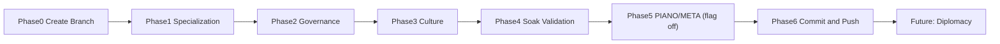

## Scope

Single village, current roster size (8-12 agents). Order: create a working branch -> specialization -> governance -> culture -> soak validation -> slim PIANO/META wiring (flags stay off by default) -> commit and push. Diplomacy (second settlement) is listed at the end as a future phase, not designed here.

All work happens on a new branch, not directly on `feat/server-authoritative-engine`. Note: `docs/HANDOFF.md`'s machine-readable snapshot records a standing "no new branches for this project" convention from a prior session; this plan intentionally overrides that per explicit instruction for this task.

## Phase 0 -- Create the working branch

- Branch off the current branch `feat/server-authoritative-engine` (confirmed via `git branch --show-current`) into a new branch, e.g. `feat/sid-parity-deepening`, before any file edits in Phases 1-5.
- All commits for this plan land on that new branch. Nothing is committed to `feat/server-authoritative-engine` directly.

## Phase 1 -- Emergent specialization that rebalances to real need

Today `_village_needed_role()` only fires on an active build's contribution gap ([simulation/sim_engine.py](simulation/sim_engine.py) lines 4846-4856), gated by `_maybe_auto_switch_role()` on a village cooldown (`ROLE_SWITCH_COOLDOWN = 600`, line 4866). It never reacts to food scarcity, ecology depletion, or role oversupply.

- [simulation/sim_engine.py](simulation/sim_engine.py) -- extend `_village_needed_role()` with two more need sources checked after the existing build-gap check:
  - Survival need: if agents at/below `STARVING_HUNGER` exceed a threshold and no living agent holds a food/fish role, return that role (reuse `EDIBLE_RESOURCES`, the hunger fields already read by `_maybe_feed_starving()` at line 4925).
  - Ecology need: if a resource's district stock ratio is near depletion (reuse the ratio already computed for `_scarcity_reflex_on_depletion`) and its gather role is unfilled, return that role.
- Add an oversupply check: if 2+ agents share the same flexible role (`_is_flexible_role`, line 4843) while a specialty role is empty, `_auto_switch_candidate()` prefers pulling from the oversupplied role first.
- [simulation/server.py](simulation/server.py) -- add `switch_role` to `role_fallback_action()` (line 1643) so a rejected-but-well-formed decision can be redirected into a role switch when `_village_needed_role()` is non-null.
- New benchmark in `_sample_benchmarks()` (line 5699): `role_rebalance_latency` (frames between a need appearing and the switch firing), alongside existing `specialization_entropy` (`_role_entropy`, line 5682).

## Phase 2 -- Governance with amendment, not just one tax

`RULE_KINDS` covers `resource_tax`/`custom` (plus `harvest_quota`/`rationing`/`succession` under `LIFECYCLE_ENABLED`) via `_validate_rule()` (lines 3512-3560), but there is no repeal path and `custom` rules are validated then inert (`_apply_governance_rule`, lines 3597-3621, only handles `harvest_quota`/`rationing`).

- [simulation/sim_engine.py](simulation/sim_engine.py) -- add a `repeal_rule` action: references an existing entry in `c["rules"]` by id, reuses the `_propose_rule()`/`_vote_on_rule()`/`_tally_and_maybe_enact()` quorum scaffold (lines 3562-3644) but on enactment removes the rule and reverses its `_apply_governance_rule` effect (clear `harvestQuotas[id]` / `rationingActive[id]`).
- Give `custom` a real mechanical hook: a `custom` rule with `kind="priority"` and `value=<resource_id>` biases `_pick_contribution_resource()` (line 4446) toward that resource, mirroring the existing `HARVEST_SPIRIT_CONTRIB_BOOST` pattern (line 4460).
- [simulation/server.py](simulation/server.py) -- add `repeal_rule` to `DECISION_ACTIONS`/`DECISION_SCHEMA`/`SYSTEM_PROMPT`, following the existing `propose_rule`/`vote_rule` numbering pattern.
- New benchmarks: `rule_repealed`, and `rule_kind_diversity` (distinct kinds ever enacted).

## Phase 3 -- Culture with competing beliefs and visible adoption

Only one meme exists (`MEMES = {"harvest_spirit": ...}`, line 347), seeded once (`_seed_beliefs`, line 4486), and belief only affects contribution order -- never governance, never the UI.

- [simulation/sim_engine.py](simulation/sim_engine.py) -- add a second seeded belief (e.g. `river_spirit`) via a second `_seed_beliefs()` call at world start so `_transmit_belief()` (line 4495) and `_maybe_mutate_meme()` (line 4554) have two competing memes.
- Tie belief to governance: in `_maybe_advance_rules()` (line 5632) and `_vote_on_rule()`, bias an agent's auto-vote toward rule kinds their belief favors (e.g. `harvest_spirit` believers favor `rationing`/`harvest_quota`) -- minimal faction-like behavior without a full faction subsystem.
- [simulation/index.html](simulation/index.html) -- extend `renderBenchmarks()` (line 1179) to show per-meme adoption counts instead of the single chip at line 1188; add belief tags to `renderAgentPanel()` (line 1282).
- [simulation/sprites.js](simulation/sprites.js) -- tint agent sprites by dominant belief.
- Extend `_meme_adoption_count()` (line 4549) to return per-meme-id counts; update the `meme_adoption` benchmark payload accordingly.

## Phase 4 -- Soak + metrics acceptance

Run the existing overnight-soak procedure (docs/civilization-emergence-plan.md Part 8) with Phases 1-3 flags on, at the current 8-12 agent default. Acceptance bar from `benchmarks.jsonl`/`activity.jsonl`:

- `specialization_entropy` moves (not flat) and at least one non-build-gap `switch_role` fires organically.
- At least one `repeal_rule` and one `custom`/`priority` rule enacted; `rule_adherence` stays measurable.
- Both meme ids show nonzero adoption and at least one belief-biased vote observed in logs.
- Zero regressions: 0 `context_overflow`, 0 unexplained fallbacks.

## Phase 5 -- Slim, engine-wired PIANO + META experiment (flag off by default)

The endpoints work but the server-authoritative engine never calls them -- `_build_think_payload()` hardcodes `"module_reports": "none"` (line 6669) and `PIANO_MODULES`/`META_SYSTEM` are read from config but never consulted in the think pipeline.

- [simulation/sim_engine.py](simulation/sim_engine.py) -- in `_think_job()`, when `PIANO_MODULES` is true, run module sub-calls inside the same worker-pool slot (not a separate bypass) so `MAX_CONCURRENT_LLM`/`LLM_MIN_GAP_MS` (lines 361-362) still bound concurrency. Stagger: `social` every 2nd module-tick, `reflection` every 3rd, `perception`/`desire` every turn.
- [simulation/server.py](simulation/server.py) -- expose the `MODULE_PROMPTS` runner (lines 2005-2045) as an in-process function the engine calls directly (no HTTP round-trip), filling `module_reports` before `run_agent_decision()`.
- Wire `META_SYSTEM` on its existing `META_TICK_FRAMES` cadence (line 246), producing a per-agent `self_prompt` persona line.
- Both flags stay off by default. Document in CLAUDE.md that experiments require a reduced roster (`?agents=4-5`) and LM Studio context raised so `context / parallel >= ~3400` still holds.
- Acceptance: run one short flag-on session, confirm `moduleTotal` in `_sample_benchmarks()` (lines 5706-5708, currently hardcoded 0) increments, and record the real LLM-call multiplier/latency delta for a future default-on decision.

## Phase 6 -- Commit and push (only after verification)

- Gate on Phase 4's acceptance bar passing and Phase 5's validation session being recorded. Do not commit mid-phase.
- Once verified, commit the accumulated Phases 1-5 changes on the new branch (grouped logically per phase or as one reviewed commit, matching repo convention) and push the branch to the remote.
- Do not merge into `feat/server-authoritative-engine` as part of this plan -- pushing the branch is the end state; merge/PR is a separate follow-up decision.

## Future (not designed here)

`DIPLOMACY_ENABLED` (second settlement, caravans, treaty/rivalry) remains the only unimplemented net-new phase per docs/HANDOFF.md. Listed as a follow-on phase; no implementation detail included.
