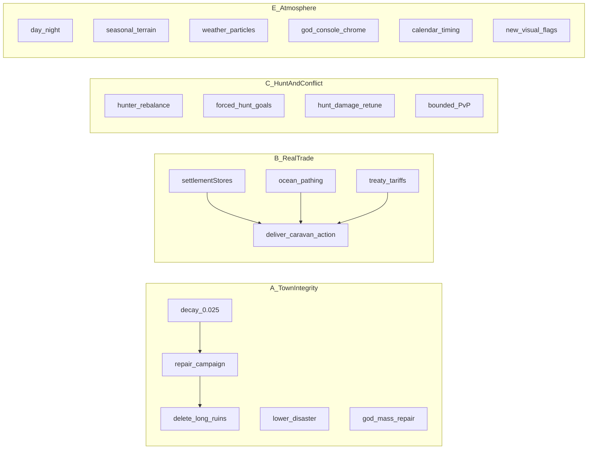
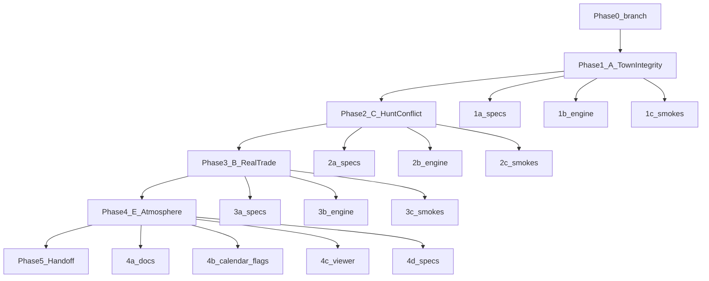

# Four Sim Breakthroughs: A / B / C / E (expanded scope)

User selection: **A, B, C, E**. Plan-level exclusions only: **D** God Compiler Phase 8; **F** `ALWAYS_ON_MODULES` / PIANO re-soak.

Former per-breakthrough “out of scope” items are **now in scope** (user request).



**Delivery order:** A → C → B → E (see phased execution below).

---

## Execution: branch, phases, and subagents

### Branch (required before any implementation)

All work lands on a **new feature branch** — never directly on `main`.

- **Branch name:** `feature/four-breakthroughs-ace` (A/C/E + B trade)
- **Phase 0 (orchestrator only):** from clean `main`, create and check out the branch. No implementer dispatch until the branch exists.
- **Commits:** one focused commit per sub-phase step where practical (specs before code per SDD). Do not commit `state.db`, `simulation/logs/`, or credentials.
- **Merge:** branch stays open until all phases pass verification; user decides when to merge/PR.

### Model policy (required)

Per [CLAUDE.md](CLAUDE.md) and `.cursor/rules/simulation-model-policy.mdc`:

- **Orchestrator (this session):** plans, splits phases, dispatches subagents, reviews diffs/smokes — **does not write substantive multi-file implementation**.
- **Implementers:** every code/spec/doc edit is dispatched via `Task` with `subagent_type: "implementer"` and `model: "composer-2.5-fast"`.
- **One subagent per step** below unless two steps are trivially coupled (e.g. spec+engine for a tiny change — prefer still splitting spec then code).
- **Sequential phases:** do not start Phase N+1 until Phase N’s smokes pass and orchestrator reviews the diff.
- **Usage-limit rule:** if a subagent hits a limit mid-step, pause all dispatches until the partial step is reviewed and resumed.

### Phased breakdown



| Phase | Breakthrough | Subagent steps | Gate before next |
|---|---|---|---|
| **0** | Branch setup | Orchestrator: `git checkout -b feature/four-breakthroughs-ace` | Branch exists |
| **1** | **A** Town integrity | **1a** specs (08/02/04/12) → **1b** engine + God routes/console hooks → **1c** smokes + `god_mode_smoke.py` | A smokes green |
| **2** | **C** Hunt + conflict | **2a** specs (06/07/08/09) → **2b** engine + `server.py` action-sync for `confront_agent` → **2c** smokes | C smokes + action-sync green |
| **3** | **B** Real trade | **3a** specs (10/08/07/05/04; fix caravan line cite) → **3b** engine + `deliver_caravan` action-sync → **3c** `path1_smoke` | B smokes + action-sync green |
| **4** | **E** Atmosphere | **4a** author `plan-visual-1/2` docs → **4b** calendar retune + visual flags in `sim_engine.py` → **4c** viewer (`index.html`, `sprites.js`, God chrome) → **4d** specs 11/01/02/12 | Browser QA + flags off fallback |
| **5** | Handoff | **5** update `docs/HANDOFF.md`; orchestrator runs `sid_parity_smoke.py`, `path1_smoke.py`, `god_mode_smoke.py` on branch | All smokes green |

**Subagent dispatch template (each step):**

```
Task(subagent_type: "implementer", model: "composer-2.5-fast", prompt: "
  Branch: feature/four-breakthroughs-ace
  Phase: <N><letter> — <title>
  Read: <this plan section + owning specs>
  Do: <single step scope only>
  SDD: edit specs first, then code, same commit where paired
  Verify: <listed smokes/commands>
  Do not: touch state.db, commit logs, start server unless step requires it
")
```

**Orchestrator review checklist (after each step):** diff matches plan scope; specs synced; no unrelated edits; step smokes pass; for server-touching steps, single `simserver` instance rule observed.

---

## A — Town integrity (decay, repair, cull, disaster, God repair)

### Scope (all in)

- Slow structure decay (`0.05` → `0.025`)
- Autonomous `repair_campaign` goals + widened `_maybe_repair_critical`
- **In-sim ruin deletion** (replace offline `prune_ruins.py` for routine bloat)
- **Retune disaster** probability/damage downward
- **God mass-repair** operator escape (batch structure_condition / clear-ruins divine commands)

### Problem
Decay still outruns repair under soak; ruins accumulate; rare disasters spike damage; operators only have offline prune or single-structure miracles.

### Approach

**Spec first:** [`specs/08-systems-economy.md`](specs/08-systems-economy.md), [`specs/02-engine-core.md`](specs/02-engine-core.md), God routes in [`specs/04-http-api.md`](specs/04-http-api.md) / [`specs/12-ops.md`](specs/12-ops.md).

**Engine** ([`simulation/sim_engine.py`](simulation/sim_engine.py)):

1. **Decay:** `STRUCTURE_DECAY_PER_GOODS_TICK = 0.025` (~23.3h to disrepair, ~33.3h to ruin). Update comments + specs/08. Keep disrepair threshold 30 and restore 50.
2. **Repair campaigns:** `REPAIR_CAMPAIGN_RUIN_RATIO = 0.15`, `WORKING_FRAC = 0.5`, `MAX_ASSIGN = 2`; `_village_repair_pressure`, `_maybe_repair_campaign`, goal execution → `repair_structure`; widen `_maybe_repair_critical` for low working fraction.
3. **Ruin deletion (was out):** deterministic `_maybe_cull_ruins()` in the fixed batch when `ruin_ratio > REPAIR_CAMPAIGN_RUIN_RATIO` **and** the worst ruin has been ruined for ≥ `RUIN_CULL_AGE_FRAMES` (new constant, ~1 sim day) **and** rebuild remains unaffordable village-wide. Remove structure from `civilization["structures"]`, clear `homeStructureId` / reorg tasks referencing it (same cleanup as [`scripts/prune_ruins.py`](scripts/prune_ruins.py)), activity + `structure_health` benchmark. Cap culls per call (e.g. 1–3). Prefer culling non-critical types before the last house/market/etc.
4. **Disaster retune (was out):** lower `DISASTER_PROB` (e.g. `0.005` → `0.002`) and/or soften `DISASTER_DAMAGE` range so spikes no longer dominate overnight ruin growth. Document expected frequency in specs/08.
5. **God mass-repair (was out):** add authenticated God commands (preview/apply, same divine kernel):
   - `repair_structures` — batch `condition` restore / un-ruin for allowlisted ids or “all critical” / “all in district”, magnitude capped
   - `clear_ruins` — delete selected or aged ruins (mirrors engine cull, audited in `divine.jsonl`)
   Wire Divine Console controls; mark run `intervened`. Reuse existing structure condition helpers.
   **Contract amendment (explicit):** this reverses two documented invariants in [`specs/02-engine-core.md`](specs/02-engine-core.md) — “repair through this miracle can never recreate a destroyed structure” and “a structure … is never removed from `civilization["structures"]`.” The spec text must be amended in the same commit, and the `scripts/god_mode_smoke.py` cases asserting ruin-rejection must be updated to cover the new un-ruin/clear paths instead.

### Verification
Decay math smoke; campaign recovers funded damage; cull removes aged unaffordable ruins; disaster rate sample matches new expectation; God batch repair + clear_ruins smokes via `god_mode_smoke.py`.

---

## B — Real inter-settlement trade (delivery, stores, water, action, tariffs)

### Scope (all in)

- Authoritative caravan goods delivery + enriched `caravanLog` / shipment visuals
- **Per-settlement stockpiles** (`settlementStores`)
- **Ocean/water pathing** for inter-settlement caravan travel when transit unlocked
- **New `DECISION_ACTIONS` entry** for starting/completing caravan delivery (full action-sync)
- **Treaty tariffs** on delivered goods

### Problem
Caravans log theater only; one shared village stockpile; no water travel; no LLM-selectable trade action; treaties do not affect goods.

### Approach

**Spec first:** [`specs/10-path1.md`](specs/10-path1.md), [`specs/08-systems-economy.md`](specs/08-systems-economy.md), [`specs/07-actions.md`](specs/07-actions.md), [`specs/05-world.md`](specs/05-world.md) movement, action-sync across server/engine/viewer.

**Engine / cognition:**

1. **`settlementStores` (was out):** `civilization["settlementStores"][sid] = {resource: qty}`. Migrate empty on `restore_state`. Local gather overflow / caravan credits prefer the agent’s current settlement store; local repair/craft funding draws own store then village `stockpile` fallback. Viewer/prompt show per-settlement stores.
2. **Delivery:** `_caravan_trade_bundle` + `_deliver_caravan` debit traveler, credit dest `settlementStores` (then agents if needed); `_emit_shipment` after transfer; log `goods`/`from`/`to`.
3. **Water pathing (was out):** when `TRANSIT_ENABLED` and ocean transit unlocked, caravan goals crossing settlement boundaries use an ocean corridor path (dock/shipyard district → dest dock/district) instead of pretending road-only arrival. Consume transit cost via existing `_consume_ocean_transit`. No free-swim everywhere — bounded to caravan/transit use.
   **Non-goal reversal (explicit):** [`specs/10-path1.md`](specs/10-path1.md) currently states transit “does not add water pathing or vehicle entities.” That sentence must be replaced with the new bounded water-corridor rule in the same commit; movement rules land in specs 05/10. Also fix specs/10’s stale `_maybe_caravan_goal` citation (`sim_engine.py:4256` → ~5749) while editing that section.
4. **New action (was out):** add `deliver_caravan` (or `start_caravan`) to `DECISION_ACTIONS` / `DECISION_SCHEMA` / `SYSTEM_PROMPT`, `apply_decision` + `available_actions`, `ACTION_LABELS`. LLM can opt into a caravan run; goal still completes delivery on arrival. Full action-sync invariant.
5. **Treaty tariffs (was out):** enacted `kind: "treaty"` rules gain optional `tariff` fraction (0–0.25 default 0). On delivery, tariff share of bundle goes to source settlement store (or village stockpile if unset); remainder to dest. Prompt/council can propose tariff field through existing treaty propose/vote if schema already allows extension — otherwise extend treaty proposal payload in specs/09 + 10.

### Verification
`path1_smoke`: stores isolate; delivery moves goods; ocean path used when transit up; `deliver_caravan` in schema/available_actions; tariff splits bundle. Action-sync checklist green.

---

## C — Hunt survival + conflict

### Scope (all in)

- Wildlife-aware hunter/meat survival specialization
- **Hunt damage table retune**
- **Forced hunt goals** when starving with prey in range
- **Bounded agent PvP / combat**

### Problem
Hunter is already reachable by the survival rebalance — `EDIBLE_RESOURCES` includes `meat` and hunter’s `roles.json` specialty maps into the `food_roles` loop (`_village_needed_role` ~9459–9473), so when farmer and fisher are filled and hunter is not, hunter is returned today. The actual gaps are narrower:

- Precedence is fixed-order (farmer → fisher → hunter), not stock-aware or wildlife-aware — an unfilled farmer always wins even when farms are barren and prey is abundant.
- The ecology-scarcity branch (~9475+) reads `districtStocks`; meat has `gatherZone: None`, so meat scarcity never registers there.
- Hunting is opt-in LLM behavior; there is no need-driven forced hunt, no agent conflict, and damage constants (`HUNT_DAMAGE = 1`, `HUNT_DAMAGE_HUNTER = 2`) have never been tuned against real prey HP.

### Approach

**Spec first:** [`specs/06-agents.md`](specs/06-agents.md), [`specs/07-actions.md`](specs/07-actions.md), [`specs/08-systems-economy.md`](specs/08-systems-economy.md), [`specs/09-systems-society.md`](specs/09-systems-society.md).

**Engine / cognition:**

1. **Hunter rebalance:** make the starving precedence stock-aware and wildlife-aware — farmer if food scarce+unfilled; fisher if fish scarce+unfilled; hunter promoted **ahead of** unfilled farmer/fisher when wildlife is present, hunter is unfilled, and meat (or total edible) is scarce while farm/fish gathering is failing; else the existing first-unfilled fallback. Also let the ecology branch register meat scarcity despite `gatherZone: None` (village meat totals instead of `districtStocks`). No autoswitch change needed: hunter is not in `AUTOSWITCH_PROTECTED_ROLES` (`{"elder", "builder", "healer"}`) and `_is_flexible_role` constrains the candidate’s current role, not the target — switching **to** hunter already works.
2. **Hunt damage retune (was out):** revisit `HUNT_DAMAGE_HUNTER` / base damage / flee thresholds so hunters clear common prey in a small number of hits without trivializing wildlife. Document new numbers in specs/08; keep role bonus.
3. **Forced hunt goals (was out):** when agent hunger ≤ `STARVING_HUNGER`, `prey_in_range`, and edible personal+accessible stock below reserve, assign `goal = {"kind": "hunt", "target": wildlife_id, "ttl": ...}` (patterned on `seek_shelter`). Goal synthesizes `hunt_wildlife` until kill, flee, or TTL. Applies to any living non-incapacitated agent (not only hunters); hunters preferred when assigning among candidates.
   **Precedence vs. existing starvation reflex:** `STARVING_HUNGER = 10` already triggers a deterministic “seek nearest food zone” reflex. Define ordering explicitly: if any edible is obtainable from a food zone / stockpile, the existing reflex wins; the forced hunt goal fires only when no gatherable edible source is reachable but prey is. Document both branches together in specs/08 so the two deterministic systems never assign conflicting goals in the same tick.
4. **Bounded PvP (was out):** new action `confront_agent` (full action-sync) — only vs living agent in contact range; requires rivalry / hostile social tie or Path-1 pressure context; resolves deterministic HP damage (small), possible steal of 1 edible, cooldown per pair; cannot kill Sage; death only via existing incapacitation/lifecycle paths if HP hits 0 (or clamp to incapacitate without forced death if safer — **prefer damage + steal + flee, lethal only if already at critical health**). Log activity + relationship hit. No free-for-all raids.

### Verification
Precedence smoke must test the **new** behavior, not the existing fallback: farmer and fisher *unfilled* but their stocks failing + wildlife present + meat scarce → hunter returned ahead of them (the old code would return farmer). Also: forced hunt goal kills/yields meat only when no gatherable edible is reachable; damage table assertions; PvP smoke for allowed confront and rejected friendly confront; action-sync for `confront_agent`.

---

## E — Full atmosphere pack

### Scope (all in)

- Day/night lighting upgrade + seasonal terrain grading (author missing plan docs)
- **Weather particle redesign**
- **God console chrome** polish
- **Calendar timing** retune
- **New visual feature flags**

### Problem
Atmosphere is subtle; weather particles are basic; Divine Console chrome is utilitarian; day length / season pacing may feel wrong; visual work is under-flagged.

### Approach

1. **Author plans:** `docs/plan-visual-1-day-night-lighting.md`, `docs/plan-visual-2-seasonal-terrain-grading.md`, plus short notes in those docs (or a sibling) for weather particles, God chrome, calendar, flags.

2. **Lighting + seasonal terrain:** stronger dusk/dawn; lit radial night pushback; terrain-kind seasonal palettes; winter snow accents; compose with ecology stages.

3. **Weather particles (was out):** redesign rain/snow/storm particle passes in [`simulation/index.html`](simulation/index.html) for readability and density keyed by weather state; keep viewer-only; no new sim weather states required.

4. **God console chrome (was out):** polish `#divineBar` / Divine Console layout, hierarchy, and preview/apply affordances in the viewer (still thin-client; no new divine powers beyond what A adds). Specs/11 + 12.

5. **Calendar timing (was out):** retune the calendar as a **system**, not a lone constant. `DAY_FRAMES = 13500` (~7.5 min real) feeds `YEAR_FRAMES` (defined as exactly 24 day/night cycles), `SEASON_FRAMES = YEAR_FRAMES // 4` (~45 min, 6 days/season), nightly shelter penalties (run every `DAY_FRAMES`), agent aging/lifecycle, `SEASON_REGROW_MULT` ecology pacing, and the season-scaled weather storminess math. Any retune must pick new values that keep the “year = whole number of days, season = quarter year” identities, re-derive the dependent comments/spec numbers, and document before/after real-time lengths in specs/02. Keep existing calendar fields in `/state` unchanged in shape.

6. **New visual flags (was out):** introduce gated flags echoed in `config.flags`. All four default **on**; turning a flag off falls back to the current (pre-this-plan) rendering path:
   - `VISUAL_LIGHTING_V2_ENABLED`
   - `VISUAL_SEASONAL_TERRAIN_ENABLED`
   - `WEATHER_PARTICLES_V2_ENABLED`
   - `GOD_CONSOLE_CHROME_V2_ENABLED`  
   Flag index in specs/01; semantics in specs/11. Old path when flag off.

### Verification
Browser QA: day/night/seasons; weather particle modes; God chrome; clock/season pacing; each new flag off → clean fallback.

---

## Delivery order and ownership

| Order | Phase | ID | Breakthrough | Notes |
|---|---|---|---|---|
| 0 | 0 | — | Branch | `feature/four-breakthroughs-ace` |
| 1 | 1 | A | Town integrity | Decay, campaigns, cull, disaster, God mass-repair |
| 2 | 2 | C | Hunt + conflict | Specialization, forced hunt, damage, bounded PvP |
| 3 | 3 | B | Real trade | Stores, delivery action, water pathing, tariffs |
| 4 | 4 | E | Atmosphere pack | Lighting, terrain, weather FX, God chrome, calendar, flags |
| 5 | 5 | — | Handoff | Docs + full smoke regression on branch |

**Implementation policy:** orchestrator only plans/dispatches/reviews; Composer 2.5 `implementer` subagents edit specs/docs then code (SDD), one step per dispatch. Action-sync required for `deliver_caravan` and `confront_agent`. God additions stay off the agent decision catalog.

**Still excluded at plan level:** D God Compiler Phase 8; F `ALWAYS_ON_MODULES` / PIANO re-soak.
