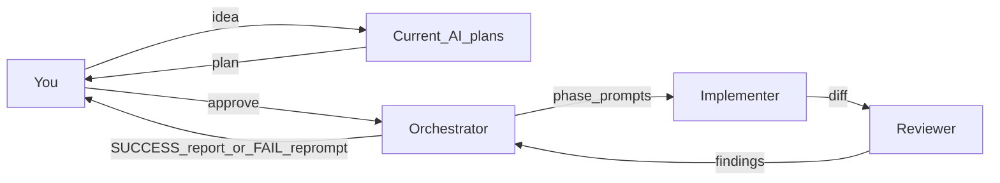

# AGENTS.md

This file is the **single AI development source of truth** for this repo. All AI-driven changes the user requests must follow the development loop below. Product and architecture truth live in [`specs/`](specs/00-overview.md). The loop can also be started manually via the `loop-in-devs` skill (see [Manual start](#manual-start)).

## KISS

Keep It Simple. Prefer the smallest change that satisfies the approved plan and owning specs. No speculative refactors, no extra abstractions, no out-of-scope edits unless the user explicitly approves.

## No hallucinations, unproven theories, or AI slop

Applies to every role (plan agent, orchestrator, implementer, reviewer):

- **No hallucinations:** do not invent APIs, files, flags, behavior, log findings, or “fixes” that are not grounded in the repo, specs, or verified runtime evidence.
- **No unproven theories:** do not treat guesses, speculation, or unverified mental models as fact. If uncertain, escalate to the orchestrator (who asks the user) or verify before acting.
- **No AI slop:** no padded prose, fake certainty, decorative refactors, drive-by “improvements,” filler comments, or overbuilt solutions not required by the approved plan and owning specs.
- Prefer citeable evidence: owning `specs/` file, concrete code paths, smoke/log results. Reviewers must flag invented claims and unproven explanations as FAIL material.

## Spec-driven development

This repo follows **spec-driven development**. [`specs/`](specs/) is the source of truth for behavior.

- For every change: **update owning spec(s) first (or in the same change), then code** — specs must never drift.
- Find ownership via the index and “Canonical for” lines in the 13 specs (`00`–`12`): [`specs/00-overview.md`](specs/00-overview.md).
- Action changes must also keep `server.py` / `sim_engine.py` / `viewer.js` / `specs/07-actions.md` in sync ([`specs/01-architecture.md`](specs/01-architecture.md)).

## Development loop

**This loop applies to all changes the user requests.** Do not skip any step. Do not invent a side path.

1. **User** submits an idea to the current AI agent → that agent **creates a plan**.
2. **User** decides to proceed with the plan.
3. The AI agent **becomes the orchestrator** (read-only for code edits).
4. Orchestrator splits the approved plan into **phases** with **concrete prompts** for implementers.
5. Orchestrator dispatches each phase prompt to an **implementer**.
6. Implementer makes the changes (specs + code) inside that prompt’s scope.
7. Implementer submits the work to a **reviewer**.
8. Reviewer checks accuracy, plan fit, and code/PR/app security; sends findings to the orchestrator.
9. Orchestrator reports **SUCCESS** to the user, or on **FAIL** writes a new implementer prompt/instructions and re-enters step 5.

## Subagents

| Role | Access | Model | Duty |
|---|---|---|---|
| **Orchestrator** | Read-only for repo edits; directs work only | Same model as the current AI session that holds the plan | Break large plans into smaller phase plans + implementer prompts; dispatch; receive reviewer findings; report SUCCESS/FAIL to the user; **only agent that asks the user questions** |
| **Implementer** | Full read/write | **Cursor: Composer 2.5 only.** Claude Code: Sonnet 5 | Implement only under orchestrator rules/prompt; update specs + code; no re-planning; **all doubts/questions go back to orchestrator** (never to the user directly, never invent answers) |
| **Reviewer** | Read (and review tooling); no drive-by implementation | Medium: Claude Sonnet 5, or Cursor Composer 2.5 Fast | Verify implementer work is accurate, matches the plan/specs, works as expected; code + PR + application security review; send findings to orchestrator; coordinate via orchestrator if issues |

Hard rules:

- **Only the implementer may make changes**, and only under orchestrator-issued prompts.
- Orchestrator **must** use implementer subagents for any write work.
- Complex projects: orchestrator **must** split into smaller phase plans and attach a **copy-pasteable prompt** per phase (goal, owning specs, in-scope files, out-of-scope, acceptance checks, SDD reminder).
- Reviewer FAIL → orchestrator produces a **new implementer prompt** from findings; default is re-dispatch implementer (reviewer does not silently fix unless the user later approves that exception).
- Any doubts or questions from implementer/reviewer go to the **orchestrator**, who asks the **user**. Never leave questions unanswered by inventing facts.

## Manual start

Manually start or re-enter the loop by invoking the project skill **`loop-in-devs`** (`.cursor/skills/loop-in-devs/`). That skill is an entry point only; this file remains the workflow contract. Cursor rules under `.cursor/rules/` reinforce this file; Claude agents live in `.claude/agents/`.

## How to verify

- Run: `uv sync` then `uv run python simulation/server.py` → `http://127.0.0.1:5001`
- Verify via browser + `simulation/logs/<timestamp>/` (esp. `llm.jsonl`); smokes: `scripts/sid_parity_smoke.py`, `scripts/path1_smoke.py`
- Do not commit credentials, `simulation/logs/`, or `simulation/state.db`
- Deep detail: [`specs/`](specs/), resume context [`docs/HANDOFF.md`](docs/HANDOFF.md), router [`docs/REFERENCE.md`](docs/REFERENCE.md)

## Constraints

**MUST:**

- Follow the full development loop for every user-requested change.
- Treat [`specs/`](specs/) as the behavior source of truth; update owning specs for every behavior change.
- Split complex work into phase prompts for implementers.
- Escalate doubts to the orchestrator so the orchestrator can ask the user.
- Follow KISS.
- Ground claims in specs, code, or verified evidence.

**MUST NOT:**

- Skip any step of the loop or invent an alternate workflow.
- Leave questions unanswered or invent unfactual answers.
- Hallucinate APIs, files, flags, behavior, logs, or fixes.
- Advance unproven theories as fact.
- Produce AI slop (padded prose, fake certainty, decorative/drive-by changes, overengineering).
- Touch out-of-scope items unless the user approves.
- Have the orchestrator make repo edits — only implementers write.
- Have implementers or reviewers ask the user directly.
