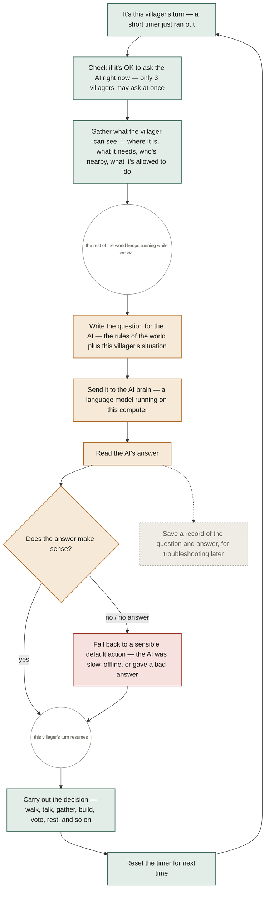

# Fix LLM fallback root causes: sprite-upgrade constraint, stuck design turns, council race, bounded retry

## Context

Two evidence docs at the repo root (`llm-fallback-default-actions.md`, `llm-fallback-rejection-evidence.md`) documented 9 logged Pattern-2 rejections (model answered, `normalize_decision()` rejected it, engine substituted a role fallback). Investigation traced the failures to engine-side causes, not model quality. All code claims below were verified by reading the current source.

**Evidence caveat that shapes this plan.** Of the 6 sprite rejections, only **2** (S4, S6) were `sprite grid must be 4-14 rows` — the impossible-constraint bug. The other **4** (S1, S2, S3, S5) were `sprite must be an object with palette and grid`, meaning the `sprite` key was missing or not a dict. That is *not* fixed by any size-rule change, and its true cause is unknown because `SIM_LLM_LOG_FULL` was off (240-char previews only). Plausible causes are truncated JSON or the model omitting the block after long reasoning. **Phase 0 below closes this gap before we over-invest in the wrong fix.**

Root causes confirmed in code:

1. **Impossible sprite-upgrade constraint.** `_upgrade_structure()` (`sim_engine.py:5559-5567`) stores `minRows`/`minCols` straight from the structure's current sprite dimensions. `validate_sprite_block()` (`server.py:2007-2043`) hard-caps grids at 4-14 (literals at lines 2023, 2027) *and* requires strictly-greater than the mins (2035-2040). Once a sprite reaches 14×14, "beat 14" is unsatisfiable inside a 4-14 cap.

2. **Rejected sprite design turns never clear — the actual infinite loop.** `_apply_structure_sprite()` (`sim_engine.py:5578-5610`) clears `agent["spriteDesignTurn"]` only on success (5602) or missing structure (5583). On rejection (5592-5594, 5595-5600) it sets `lastSpriteRejection` and returns, leaving `spriteDesignTurn` set — so the agent is re-prompted for the same design every think cycle, forever, with no attempt limit. This is what `high_stakes_reason: "repeated_rejections"` is reacting to, and it would persist even with #1 fixed.

3. **Council pre-check race.** `normalize_decision()` (`server.py:2577-2585`) enters the council branch on `action in council_actions or council_turn`, then rejects on the compound guard `if not council_turn or action not in council_actions`. `council_turn`/`council_seated` are snapshotted in `_build_think_payload()` *before* the multi-second Ollama call; council phase/seating can advance while the model thinks. The `not council_turn` half of that guard is the racy one. `apply_decision()` already re-checks live via `_daily_council_actor()` and rejects non-fatally, so the pre-check is a stale duplicate.

4. **No same-turn retry.** `run_agent_decision()` (`server.py:3973-4183`) calls Ollama, extracts JSON, calls `normalize_decision()` once; any bad answer goes straight to a canned fallback. The existing `behavior_nudge` feedback is cross-turn (written after apply, read on the *next* cycle).

**Latency constraint discovered during review:** `run_agent_decision()` can already fire up to **3** Ollama calls in one turn — initial (4053), format-degrade retry (4082), and context-overflow slim retry (4134). Any new retry must count against a shared budget, or a single agent could hold one of only `MAX_CONCURRENT_LLM = 3` slots for 5 sequential calls.

Per CLAUDE.md, specs/ must stay in sync (SDD), and there is no test suite — verification is by running the server and reading `llm.jsonl`, plus the two deterministic smokes.

---

## Phase 0 (gate): close the evidence gap before building on assumptions

Do this **first**, as its own short step — it costs one session and decides how much of Fix 4 is warranted.

- Restart the server with `SIM_LLM_LOG_FULL=1` so `llm.jsonl` records full response bodies instead of 240-char previews.
- Drive at least one structure to a sprite-design turn and capture several `submit_structure_sprite` responses.
- Inspect the 4-of-6 `sprite must be an object with palette and grid` class specifically: is the JSON **truncated** mid-object (a generation-length problem — raise `num_predict`, or shorten the required reasoning), or is `sprite` **genuinely absent** while the model narrates (a prompt problem — Fix 1's prompt rewrite plus Fix 4's retry address it)?
- Record the finding in the evidence doc. If truncation dominates, add a token-budget adjustment to the work; if omission dominates, Fixes 1 and 4 already cover it.

Fixes 1-3 are justified by verified code defects and can proceed in parallel with Phase 0. **Fix 4/5 sizing should wait for Phase 0's answer.**

---

## Fix 1: Never request an unsatisfiable sprite size

**Fix location:** `_upgrade_structure()` in `sim_engine.py` — the one place that manufactures the constraint. Fixing here automatically corrects both enforcement sites (`server.py:2690-2694` and `sim_engine.py:5588-5589`), which merely enforce whatever mins they are handed.

Crucially, `validate_sprite_block()` already treats **0 as "no requirement"** (`if min_rows and ...` at 2035, `if min_cols and ...` at 2038). We use that existing semantic rather than inventing new signalling.

1. **`server.py`** — add named constants near the sprite regexes (~line 1974):
   ```python
   SPRITE_GRID_MIN = 4
   SPRITE_GRID_MAX = 14
   ```
   Replace the bare literals at lines 2023 and 2027 with them. Add both to `_ENGINE_DEPS` (~4258, beside `validate_sprite_block`) so `sim_engine.py` reads one source of truth via `self.d[...]` instead of re-declaring `14`.

2. **`sim_engine.py`**, in `_upgrade_structure()` (replacing lines 5559-5567) — decide per dimension, and skip the design turn entirely when there is nothing left to grow:
   ```python
   sprite_max = int(self.d.get("SPRITE_GRID_MAX") or 14)
   rows, cols = self._sprite_dimensions(s.get("sprite"))
   rows_at_cap = rows >= sprite_max
   cols_at_cap = cols >= sprite_max
   if rows_at_cap and cols_at_cap:
       # Already at the validator's hard cap in both dimensions: asking for a
       # bigger sprite is unsatisfiable, and asking for a same-size redraw
       # burns an LLM turn for no visual change. The procedural tier sprite
       # from _apply_visual_tier stands.
       agent["spriteDesignTurn"] = None
   else:
       agent["spriteDesignTurn"] = {
           "structureId": s["id"],
           "tier": new_tier,
           "minRows": 0 if rows_at_cap else rows,   # 0 = no growth required
           "minCols": 0 if cols_at_cap else cols,
           "structureName": name,
           "structureType": s.get("type"),
       }
   ```
   Below cap this is byte-for-byte today's behavior. At cap in one dimension, growth is required only in the other. At cap in both, no design turn is issued at all.

   *Why not clamp to `SPRITE_GRID_MAX - 1`:* that was the earlier draft. It forces "beat 13" → exactly 14×14, i.e. the same size the sprite already is — a satisfiable but meaningless "upgrade" that still spends an LLM call. Skipping is both correct and cheaper.

3. **Prompt truthfulness** — `build_sprite_upgrade_prompt()` (`server.py:3508-3519`) currently does `int(ctx.get("minRows") or 4)`, which silently rewrites a **0 into 4**. With Fix 1 emitting 0 for "no requirement," that `or 4` would tell the model to beat 4 rows when the validator requires nothing — misleading, though not fatal. Change it to render per-dimension text: state a floor only for dimensions with a non-zero min, and always state the `SPRITE_GRID_MAX` ceiling. Mirror the ceiling in `SPRITE_UPGRADE_SYSTEM_PROMPT` rule 4 (`server.py:3458-3471`), which today says "STRICTLY BIGGER... more rows AND more columns" unconditionally.

4. **specs/ sync** — `specs/07-actions.md` (`submit_structure_sprite`) and `specs/05-world.md` (levels/upgrades): grid is bounded by `SPRITE_GRID_MIN`/`SPRITE_GRID_MAX`; a per-dimension min of 0 means no growth requirement; a structure at cap in both dimensions gets no design turn.

---

## Fix 2: Stop rejected sprite design turns from looping forever

Independent of Fix 1 and required regardless: any sprite rejection currently re-arms the same design turn indefinitely.

1. **`sim_engine.py`**, in `_apply_structure_sprite()` — track attempts on the design turn itself and give up cleanly:
   - On rejection (both the `validate` failure at 5592 and the degenerate check at 5595), increment `turn["attempts"] = int(turn.get("attempts") or 0) + 1` and write it back to `agent["spriteDesignTurn"]` alongside the existing `lastSpriteRejection`.
   - When `attempts >= SPRITE_DESIGN_MAX_ATTEMPTS` (new module-level constant, suggest **3**), clear `agent["spriteDesignTurn"] = None`, leave the structure's existing procedural sprite in place, and push an activity line so the give-up is visible (e.g. `"<name> gave up refining the sprite for the <structure>"`).
   - Keep `lastSpriteRejection` behavior unchanged so the existing cross-turn `behavior_nudge` still feeds the next attempt within the budget.

2. **Note on redundancy (no change required):** `validate_sprite_block()` already rejects degenerate sprites (2041), so the separate degenerate check at 5595-5600 is unreachable when `validate` is present. Leave it as defence-in-depth for the `validate is None` path, but the attempt counter must be incremented in **both** branches so neither can loop.

3. **specs/ sync** — `specs/07-actions.md`: sprite design turns expire after `SPRITE_DESIGN_MAX_ATTEMPTS` rejections.

---

## Fix 3: Remove only the racy half of the council pre-check

**Approach:** the *live* authority is `apply_decision()` → `_daily_council_actor()`, which re-checks attendees/seats/phase against current state and rejects non-fatally. `normalize_decision()` should keep checks that cannot go stale (shape, and "is there a council session at all") and drop the ones that can (per-turn seating, per-phase eligibility).

**Correcting the earlier draft:** it said "keep the outer guard at 2580." That guard is `if not council_turn or action not in council_actions` — the `not council_turn` disjunct *is* the race. Only the second disjunct should survive.

1. **`server.py`**, in `normalize_decision()` (2577-2652):
   - Keep the `council_turn and action not in council_actions` case → fallback. That is a genuine "agent ignored its designated council turn," not a timing artifact.
   - **Add a coarse session-existence check** to replace the racy one: if `action in council_actions` but there is no council session at all (`council` empty / no `phase`), return the fallback with a note. A session's existence is slow-changing, so this is not racy — and without it, a model that spuriously emits `council_speak` on an ordinary turn would sail through to `apply_decision`, be rejected live, and **waste the entire turn doing nothing**. This closes the regression the earlier draft would have introduced.
   - Within an existing session, **drop the phase gates**: the `phase != "discussion" and not elder_verdict` check (2590-2592), the `phase != "voting"` half of 2613, and the `phase != "proposal"` check (2617).
   - **Keep every shape check**: `message` non-empty (2596), `valid_vote` (2607-2612, now tested independently of phase), and the per-`kind` checks for idea/rule/blueprint (2621-2651). These catch real formatting errors and cannot go stale.

2. **Missing-message case** (Nova/Dex, already non-fatal): no engine change. Tighten `COUNCIL_SYSTEM_PROMPT` in `prompts.py` (line 334) to state `message` is REQUIRED and must be a non-empty string.

3. **specs/ sync** — `specs/07-actions.md` (~72, ~99-104): phase/seating is authoritative at apply-time in `_daily_council_actor()`; `normalize_decision()` enforces shape plus session existence only.

---

## Fix 4: Bounded same-turn retry, inside a hard per-turn call budget

**Scope:** answer-quality failures only. Network-level failures (`llm offline`, `llm timeout`, `compute_error`, `server_error`, `model_not_found`) must never retry — `server.py:4040-4045` documents that Ollama does not cancel orphaned generations, so a retry there compounds queue pressure.

### 4a. A hard budget first (prerequisite)

Because up to 3 calls can already fire per turn, add a per-invocation counter in `run_agent_decision()` before adding anything:

```python
LLM_CALLS_PER_TURN_MAX = 4        # module-level; covers ALL call sites in one turn
```
Wrap every `requests.post(OLLAMA_CHAT_URL, ...)` in this function behind a single helper that increments a local counter and refuses to fire when the budget is spent (returning "budget exhausted" so the caller takes its existing fallback path). This bounds worst case at 4 calls — today's 3 plus one — rather than 5.

### 4b. Detecting "this was rejected" reliably

The earlier draft keyed the retry on `sprite_rejection_note`/`council_rejection_note`. That is **incorrect and incomplete**: `normalize_decision()` also returns fallbacks with no note at all (e.g. the non-dict guard at 2568) and with other note keys (`terraform_rejection_note` at 2660), so many rejections would silently skip the retry.

Correct approach — a single explicit sentinel:
- In `role_fallback_action()`, stamp every returned decision with `decision["_fallback"] = True` (set once at each `return`, or by wrapping the function's exits).
- `run_agent_decision()` then tests `normalize_decision(...)`'s raw result for `_fallback` **before** it is passed through `score_belief_pitch_decision()` / `synthesize_divine_response()` (currently one nested expression at 4174-4177 — split it so the raw normalize result is inspectable).
- The extra key is inert for `apply_decision()` (which reads named fields) and is genuinely useful in `llm.jsonl`.

### 4c. The retry itself

At the two answer-quality failure points — unparseable JSON (4170-4172) and `_fallback` detected after normalize — retry **once**, budget permitting:
- Rebuild the payload with a new `retry_feedback=None` kwarg on `build_decision_payload()` (3813), following the existing `slim` kwarg precedent; thread the same optional param through `build_user_prompt` and the sprite/council prompt variants.
- Feedback text is the concrete reason: the specific `*_rejection_note` when present, otherwise "your previous reply could not be parsed as JSON; reply with only the JSON decision object."
- Re-POST, re-extract, re-normalize. If the second attempt also fails, take the existing fallback path.

**Logging interaction to respect:** `log_lm()` (4005-4030) reads `payload` *at log time*, deliberately, so the context-overflow retry's slim payload is what gets logged. A retry that reassigns `payload` inherits that behavior — the logged request will be the retry's prompt. That is acceptable and consistent, but the implementer must not "fix" it into per-attempt logging; add `decision_retries: <int>` to the record instead so retry frequency stays measurable without changing log shape.

---

## Fix 5: Let the AI choose among safe options at the terminal fallback, and log it

Applies only when Fix 4's retry is exhausted with no usable decision **and** the failure was answer-quality (Ollama is responding, just badly). Network failures skip this entirely.

1. **`server.py`** — add `role_fallback_candidates(role, agent_data, limit=3)` as a **separate function** rather than a `collect=True` kwarg on `role_fallback_action()`. A function whose return type changes between dict and list based on a flag is a footgun in a repo with no tests; a distinct name keeps every existing call site provably unchanged. Factor the ladder's branch conditions so both functions share them (first-match for the existing one, accumulate-up-to-`limit` for the new one), preserving the current priority order.

2. **Realistic expectations (from reviewing the ladder):** many branches are mutually exclusive by construction — 10a "wrong zone → move" vs 10b "in zone → collect" cannot both fire; 7a/7b require "no active project" while 8 requires holding a needed resource. In many states only **one** candidate exists, so the AI call simply won't happen. That is fine and expected; it is not a reason to loosen the conditions into contradictory candidates.

3. **Priority is preserved, not discarded:** candidates are collected in existing priority order, and the highest-priority candidate remains the default. The AI's pick is accepted only when it names one of the offered options; anything else falls back to that first candidate. This keeps the ladder's ordering meaningful instead of letting a catch-all outrank an urgent branch.

4. **The choice call:** if ≥2 candidates and budget remains (4a), issue one minimal prompt listing them ("A / B / C — reply with one letter"), not the full decision schema. Never retried. On failure/timeout/unparseable → use the first (highest-priority) candidate.

5. **Logging (this scenario specifically)** — additive fields on the existing single record, absent on ordinary turns:
   - `fallback_triggered: true`
   - `fallback_candidate_count: <n>`
   - `fallback_selection_method: "single_candidate" | "ai_choice" | "priority_default"`
   - `fallback_candidates: [{"action": ..., "target": ...}, ...]`
   - `fallback_ai_latency_ms: <n>` (only when the choice call was attempted)

6. **specs/ sync** — `specs/03-cognition.md`: retry, budget, terminal choice step, network exclusion, and the new `llm.jsonl` fields.

---

## Feature flags (repo convention)

CLAUDE.md documents ~30 module-level flags as this repo's convention for behavior changes. Fixes 4 and 5 add LLM calls and must be independently disable-able without a code edit:

- `DECISION_RETRY_ENABLED` (default on) — Fix 4c
- `FALLBACK_AI_CHOICE_ENABLED` (default on) — Fix 5
- `SPRITE_DESIGN_MAX_ATTEMPTS` (default 3) — Fix 2
- `LLM_CALLS_PER_TURN_MAX` (default 4) — Fix 4a

These live in `server.py` beside the existing `_structured_output_enabled` / `_model_routing_enabled` session globals (cognition is server-side; they are not part of the `sim_engine.py` flag index). With both feature flags off, behavior is exactly today's minus the Fix 1-3 corrections. Document them in `specs/03-cognition.md` and, if any is surfaced to the viewer, in `specs/01-architecture.md`'s flag index.

---

## Flowcharts: old vs. new think-cycle

Existing plain-language flowchart source recovered from `docs/How a Villager Thinks.mhtml` (a Claude Artifact export; not a tracked source file in the repo).

### Old (current)



Problems: **G** is a single check using a snapshot taken back at **C**, so it cannot tell "badly-formed answer" from "the world moved on while we waited" — and for building redraws it may be judging against a target that was impossible from the start. On "no / no answer" there is no second chance and no variety: the same situation always yields the same canned default. Not visible here at all: a rejected drawing is re-requested every turn forever, because nothing ever cancels the request.

### New (all fixes)

```mermaid
flowchart TD
  A["It's this villager's turn — a short timer just ran out"]:::lockNode
  B["Check if it's OK to ask the AI right now — only 3 villagers may ask at once"]:::lockNode
  C["Gather what the villager can see — where it is, what it needs, who's nearby, what it's allowed to do"]:::lockNode
  C2["If redrawing a building: only ask for growth that's actually possible — and if it's already as big as allowed, don't ask at all"]:::fixNode
  BUDGET["Set a hard limit on how many times we may ask the AI this turn"]:::fixNode
  RELEASE(("the rest of the world keeps running while we wait")):::hinge
  D["Write the question for the AI — the rules of the world plus this villager's situation"]:::netNode
  E["Send it to the AI brain — a language model running on this computer"]:::netNode
  F["Read the AI's answer"]:::netNode
  G{"Is the answer well-formed? (has a message, a valid choice, a drawing that fits the size rules)"}:::netNode
  RETRY{"Any asks left in this turn's budget?"}:::fixNode
  D2["Ask again — this time, say exactly what was wrong with the last answer"]:::fixNode
  H["Save a record of the question and answer, for troubleshooting later"]:::logNode
  INET["No response at all (offline / timed out) — take a safe default immediately, ask nothing further"]:::fallbackNode
  I["Still no usable answer"]:::fallbackNode
  IPICK{"More than one safe option fits this situation?"}:::fixNode
  IASK["One short question: 'which of these fits best — A, B, or C?'"]:::fixNode
  IRESULT{"Did it name one of the offered options?"}:::fixNode
  IDEFAULT["Use the highest-priority safe option"]:::fixNode
  ILOG["Log that this happened: the options offered, how the pick was made, what was chosen"]:::logNode
  REACQUIRE(("this villager's turn resumes")):::hinge
  J["Carry out the decision — walk, talk, gather, build, vote, rest, and so on"]:::lockNode
  J2{"Council business? Re-check against what's actually happening right now"}:::fixNode
  L["Council moved on while we waited — sit this turn out quietly, no penalty"]:::fixNode
  SPR{"Was this a rejected drawing?"}:::fixNode
  SPRGIVE["Tried too many times — cancel the request and keep the current drawing"]:::fixNode
  K["Reset the timer for next time"]:::lockNode

  A --> B --> C --> C2 --> BUDGET --> RELEASE
  RELEASE --> D --> E --> F --> G
  F -.-> H
  G -- "yes" --> REACQUIRE
  G -- "no response at all" --> INET --> REACQUIRE
  G -- "badly-formed answer" --> RETRY
  RETRY -- "yes, ask once more" --> D2 --> E
  RETRY -- "budget spent" --> I --> IPICK
  IPICK -- "just one" --> ILOG
  IPICK -- "a few" --> IASK --> IRESULT
  IRESULT -- "yes" --> ILOG
  IRESULT -- "no / no answer" --> IDEFAULT --> ILOG
  ILOG --> REACQUIRE
  REACQUIRE --> J --> J2
  J2 -- "not council business" --> SPR
  J2 -- "still valid now" --> SPR
  J2 -- "world moved on while we waited" --> L --> SPR
  SPR -- "no" --> K
  SPR -- "yes, under the attempt limit" --> K
  SPR -- "yes, over the attempt limit" --> SPRGIVE --> K
  K --> A

  classDef lockNode fill:#e3ede8,stroke:#3f6b5e,stroke-width:1.5px,color:#1c1d1a;
  classDef netNode fill:#f6e9d8,stroke:#b3702e,stroke-width:1.5px,color:#1c1d1a;
  classDef fallbackNode fill:#f6e1df,stroke:#a1433d,stroke-width:1.5px,color:#1c1d1a;
  classDef logNode fill:#eeece4,stroke:#8a8a82,stroke-width:1px,color:#5c5d55,stroke-dasharray: 3 3;
  classDef hinge fill:#00000000,stroke:#8a8a82,stroke-width:1px,color:#5c5d55,font-size:11px;
  classDef fixNode fill:#e6eef7,stroke:#31587e,stroke-width:1.5px,color:#1c1d1a;
```



**What changed, in plain language:**
- **C2** — a villager is only asked to draw a bigger building when bigger is actually possible; at the maximum size the request is skipped entirely instead of being asked for and rejected. (Fix 1)
- **BUDGET / RETRY** — one hard cap on how many times the AI may be asked in a single turn, covering the two retry paths that already existed plus the new one, so one struggling villager can't hog a slot. A badly-formed answer now gets one more try, told exactly what was wrong. (Fix 4)
- **INET** — no response at all still means take a safe default immediately; we never re-ask a system that isn't answering. (Fix 4 scope guard)
- **J2 / L** — council validity is re-checked live, right before acting, instead of against a snapshot from before the wait; if the council genuinely moved on, the turn is skipped quietly. Answers that were never plausible (no council in session at all) are still caught early so a turn isn't wasted. (Fix 3)
- **IPICK / IASK / IRESULT / IDEFAULT / ILOG** — when there's still no usable answer, if several safe options fit, the AI gets one short multiple-choice question; otherwise, or if it doesn't name a valid option, the highest-priority option is used. Either way it's written to the log. (Fix 5)
- **SPR / SPRGIVE** — a rejected drawing is now counted, and after a few tries the request is cancelled so the villager stops re-attempting it forever. (Fix 2)

Once implemented, regenerate `docs/How a Villager Thinks.mhtml` from the new source, or keep the existing file as a historical "before" and publish the "after" alongside it.

---

## Execution plan: phases & subagents

**Model policy (CLAUDE.md).**

| Role | Model | Responsibility |
|---|---|---|
| **Orchestrator** | **Opus 5** (`claude-opus-5`) | Plans, dispatches, reviews every diff, and performs **all** server runs/validation. Writes no implementation code beyond trivial one-line fixes. |
| **Investigation** | **Opus 5** — `Explore` dispatched with `model: "opus"` | Read-only log/code analysis (Phase 0 classification, Phase 8 log review). No server access. |
| Implementation | **Sonnet 5** via the `implementer` subagent | Every code-writing phase. `.claude/agents/implementer.md` is pinned to `model: sonnet`, so no override is passed. |

This keeps CLAUDE.md's "implementation is delegated to Sonnet 5 or lower" rule intact while putting Opus 5 on both the orchestration and the diagnostic work. The reasoning is deliberate: Phase 0's job is to classify an *unexplained* failure class from raw model output (truncation vs omission), and Phase 8 interprets whether the fixes actually changed behavior — both are judgment calls on ambiguous evidence, exactly where the stronger model earns its cost. Code-writing phases have a precise spec to follow and stay on Sonnet 5.

**Dispatch detail:** `Explore` inherits the parent model by default, so the orchestrator must pass `model: "opus"` explicitly on those Agent calls. The `implementer` agent's pinned `model: sonnet` frontmatter wins over inheritance, so no override is needed (and none should be passed) for implementation phases.

**Before execution starts:** this planning session is currently running Sonnet 5. Switch the session model to Opus 5 (via `/model claude-opus-5`, or the app's model selector) before Phase 0 is dispatched, so the orchestrating context is Opus for the whole run.

**Usage-limit rule (CLAUDE.md):** if a limit is hit mid-phase, **pause immediately** — do not push through, retry, or hand off to a different tier to finish the phase. Resume only after confirming the last completed phase's diff and smoke result.

**Two concurrency rules that constrain the phase graph:**
1. **No two agents may edit the same file concurrently.** `server.py` is touched by most fixes, so server.py phases are strictly sequential.
2. **Only the orchestrator ever starts, restarts, or stops the server — no exceptions.** This is the single-instance rule from CLAUDE.md: concurrent `simulation/server.py` processes fight over port 5001 and `state.db`. No subagent launches the server, drives it, or validates against a live instance; every runtime validation run in this plan is performed by the orchestrator itself, at a phase boundary, followed by the single-instance check. Subagents verify only by reading code and running the deterministic smokes (`sid_parity_smoke.py`, `path1_smoke.py`), which need no server and no Ollama. Any agent prompt dispatched from this plan must state this restriction explicitly.

| Phase | Owner / model | Files owned | Depends on | Work |
|---|---|---|---|---|
| **0** — Evidence gate | **Orchestrator** runs the session; `Explore` (Opus 5) analyzes; `implementer` (Sonnet 5) records | evidence doc | — | **Orchestrator** restarts the server with `SIM_LLM_LOG_FULL=1` and drives it until sprite-design turns are captured, then stops it and confirms single-instance. `Explore` reads the resulting `llm.jsonl` (no server access) and classifies the 4 unexplained `sprite must be an object` rejections as **truncation** vs **omission**; `implementer` writes the finding into the evidence doc. Gates Phase 5/6 sizing. |
| **1** — Sprite constants & prompts | `implementer` (Sonnet 5) | `server.py` | — | `SPRITE_GRID_MIN`/`SPRITE_GRID_MAX`; use them in `validate_sprite_block` (2023, 2027); export both via `_ENGINE_DEPS`; fix `build_sprite_upgrade_prompt`'s `or 4` zero-collapse; state the ceiling in `SPRITE_UPGRADE_SYSTEM_PROMPT`. |
| **2** — Engine sprite fixes | `implementer` (Sonnet 5) | `sim_engine.py` | 1 | Per-dimension mins + skip-at-cap in `_upgrade_structure`; `SPRITE_DESIGN_MAX_ATTEMPTS`; attempt counter + give-up in `_apply_structure_sprite` (**both** rejection branches). |
| **3** — Council fix | `implementer` (Sonnet 5) | `server.py`, `prompts.py` | 1 | `normalize_decision` surgery: drop `not council_turn` + the three phase gates, add session-existence check, keep every shape check; `COUNCIL_SYSTEM_PROMPT` message-required wording. |
| **4** — Call budget & sentinel | `implementer` (Sonnet 5) | `server.py` | 3 | `LLM_CALLS_PER_TURN_MAX`; route **all** `requests.post` in `run_agent_decision` through one budget helper; `_fallback` sentinel on every `role_fallback_action` return; split the nested normalize/score/synthesize expression (4174-4177). |
| **5** — Same-turn retry | `implementer` (Sonnet 5) | `server.py` | 4, 0 | `retry_feedback` kwarg through `build_decision_payload`/`build_user_prompt`/prompt variants; the bounded retry at both failure points; `decision_retries` log field; `DECISION_RETRY_ENABLED`. |
| **6** — Terminal AI choice | `implementer` (Sonnet 5) | `server.py` | 5 | `role_fallback_candidates()` as a separate function sharing branch conditions; the constrained A/B/C call; `fallback_*` log fields; `FALLBACK_AI_CHOICE_ENABLED`. |
| **7** — specs/ sync | `implementer` (Sonnet 5) | `specs/*.md` | 2, 6 | `specs/03-cognition.md`, `specs/07-actions.md`, `specs/05-world.md`, + `specs/01-architecture.md` if any flag is surfaced. SDD rule. |
| **8** — Verification | **Orchestrator** (all live runs); `Explore` (Opus 5) for log analysis only | — | 7 | Orchestrator performs every server restart, god-mode scenario drive, and flag-toggle run in the verification section below, then confirms exactly one instance is running. `Explore` may only read the produced JSONL logs. |

**Parallelism:** Phase 0 runs alongside Phases 1-4 (it gates only 5/6). **Phases 2 and 3 run in parallel** — disjoint files (`sim_engine.py` vs `server.py`+`prompts.py`) — once Phase 1 lands. Everything else is sequential because it shares `server.py`.

```
0 ─────────────────────────────────┐ (gates 5)
1 ──┬── 2 ──┐                      │
    └── 3 ──┴── 4 ── 5 ── 6 ── 7 ── 8
```

**Stop-and-review gates.** The orchestrator reviews the diff after every phase before dispatching the next. Two hard gates, both validated by **the orchestrator running the server itself** (never a subagent): after **Phase 2** — restart once and confirm the sprite loop is broken before building retry machinery on top — and after **Phase 4** — confirm the call budget actually holds, since Phases 5-6 both spend from it. Each such run ends with the single-instance check (`Get-CimInstance Win32_Process ... 'simulation.server'`) before the next dispatch.

**Dispatch note for each agent:** the relevant "Fix N" section above is the spec — hand the agent that section verbatim plus the verified line references, and require it to re-read the target function before editing (line numbers in this plan are from a snapshot and will drift as earlier phases land).

## Critical files

- `simulation/server.py` — `validate_sprite_block`, `SPRITE_UPGRADE_*` + `build_sprite_upgrade_prompt`, `_ENGINE_DEPS`, `normalize_decision` council branch, `role_fallback_action`, new `role_fallback_candidates`, `run_agent_decision`, `build_decision_payload`, `log_lm`
- `simulation/sim_engine.py` — `_upgrade_structure`, `_sprite_dimensions`, `_apply_structure_sprite`
- `simulation/prompts.py` — `COUNCIL_SYSTEM_PROMPT`
- `specs/03-cognition.md`, `specs/07-actions.md`, `specs/05-world.md`, `specs/01-architecture.md`

## Verification

**All runtime validation below is performed by the orchestrator.** No subagent starts, restarts, drives, or inspects a live server — subagents may only read the JSONL logs the orchestrator produced, or run the two server-free smokes. Restart per CLAUDE.md (titled `cmd` window; single-instance check as the final step of every run). Use the Divine Console / god-mode intervention controls to force the scenarios below rather than waiting for them to occur naturally; where god mode can't reach, drive `run_agent_decision` from a scratch script under the scratchpad directory with hand-written responses (this needs no server instance).

- **Fix 1:** upgrade a structure whose sprite is at 14×14 — confirm no `spriteDesignTurn` is issued (no sprite-design LLM call at all) and no `sprite must be taller/wider` note appears. Upgrade one at, say, 14×10 — confirm only column growth is demanded. Upgrade one well below cap — confirm mins are unchanged from today (pure regression check).
- **Fix 2:** force three consecutive sprite rejections — confirm the attempt counter increments, the give-up activity line appears on the third, `spriteDesignTurn` clears, and the agent stops being re-prompted on subsequent turns.
- **Fix 3:** during a live council, confirm `"not a seated active council turn"` and `"...is not valid in this phase"` no longer originate from `normalize_decision`; a raced answer should surface as `agent["lastCouncilRejection"]` from the live check. Separately, confirm a `council_speak` emitted with **no** council in session is still caught early (session-existence check) so the turn isn't wasted. Confirm a genuinely malformed `council_speak` (blank `message`) still gets its shape rejection.
- **Fix 4:** confirm `decision_retries` is `0` on the common path and `1` when a retry fires, and that a retried record's response actually addresses the stated reason. Confirm the budget holds: force format-degrade + context-overflow + retry together and verify no more than `LLM_CALLS_PER_TURN_MAX` posts occur. Confirm `llm offline`/`llm timeout`/`compute_error`/`server_error` records never carry a retry.
- **Fix 5:** in a state with ≥2 qualifying candidates, confirm `fallback_triggered`, `fallback_candidate_count`, `fallback_selection_method: "ai_choice"`, and that the applied action is one of the logged `fallback_candidates`. Make the choice call fail and confirm `"priority_default"` with the highest-priority candidate. In a single-candidate state confirm `"single_candidate"` and no extra call. Confirm offline turns carry no `fallback_*` fields.
- **Flags:** with `DECISION_RETRY_ENABLED` and `FALLBACK_AI_CHOICE_ENABLED` off, confirm behavior matches today's apart from Fixes 1-3.
- **Smokes:** `uv run python scripts/sid_parity_smoke.py` and `uv run python scripts/path1_smoke.py`. Note these exercise `apply_decision`/`normalize_decision` generally but cover neither sprite validation nor the council race — they are import/signature regression checks here, not proof these fixes work.
