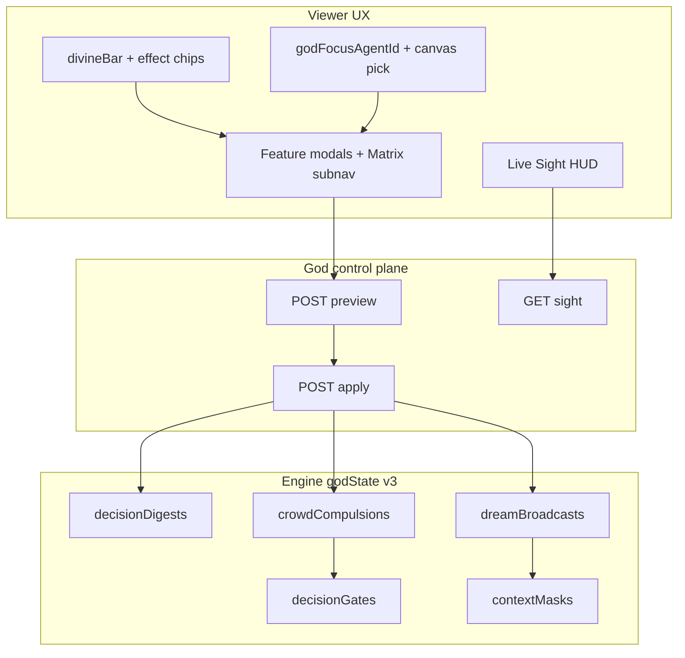

# Divine Console Improvements — Implementation Plan

**Status:** Implemented — draft PR [#9](https://github.com/dbrito1231/simulation/pull/9) into `feature/god-mode`.  
**Branch:** `feature/divine-console-improvements` (from **latest** `origin/feature/god-mode`; Matrix already merged via PR #8).  
**PR target:** `feature/god-mode` (not `main`).  
**Scope lock:** 1A (new branch) + 2A (full stack: all UX + Déjà Vu, village pulse, crowd compulsion, dream broadcast, compiler promotion).

### Prerequisite — latest God mode before branching

Never create or reset `feature/divine-console-improvements` from a stale local `feature/god-mode`. Always:

```powershell
git fetch origin feature/god-mode
git checkout feature/god-mode
git merge --ff-only origin/feature/god-mode
git rev-parse HEAD origin/feature/god-mode   # must match
git checkout -b feature/divine-console-improvements
# If the branch already exists and only has plan/docs commits:
#   git checkout feature/divine-console-improvements
#   git rebase origin/feature/god-mode
```

If `origin/feature/god-mode` moves while this work is in flight, rebase this branch onto it before opening/updating the PR.

**Phase 0 verification (2026-08-01):** `git fetch origin feature/god-mode` — local `feature/god-mode`, `origin/feature/god-mode`, and `feature/divine-console-improvements` base all tip at `89aac707` (`Merge pull request #8: Divine Matrix interventions + Voice binding`).

## Goal / non-goals

**Goal:** Make the Divine bottom bar the operator’s primary HUD — faster targeting, clearer Matrix IA, live Sight, History power tools — and extend the God control plane with Déjà Vu digests, crowd compulsion, dream broadcast, and a Sight village pulse, while promoting the compiler UX after the existing measurement protocol.

**Non-goals:**
- No God kinds in `DECISION_ACTIONS` / `DECISION_SCHEMA` / `SYSTEM_PROMPT` / `apply_decision` / `ACTION_LABELS`
- No avatar God / multiplayer God session sync
- No treating intervened runs as comparable to untouched autonomous runs
- No committing credentials, `simulation/logs/`, or live `state.db`

## Invariants (unchanged)

- Mutations only via `/control/god/{preview,apply,cancel,compile}`; Apply body is `{previewId, requestId}` only.
- Private maps never appear in `/state` god allowlist; Sight may show status summaries without secret text.
- Token: memory / optional `sessionStorage` only; never `localStorage`; escape all dynamic HTML; never render `normalizedCommand` raw.
- SDD: owning spec updated in the same phase before code. Ownership: viewer → `specs/11-viewer.md`; engine/godState → `02` (+ `01` version note); routes → `04`; cognition hooks → `03`; ops/compiler → `12`.

## Locked design choices

| Topic | Decision |
|---|---|
| Matrix IA | Keep **one** Matrix bar button; sticky **category chip nav** inside the modal scrolling to existing `.divine-matrix-section` blocks (Mind / Memory / Distortion / Will / Covenant / Form / Place / Time) |
| Agent focus | Viewer `godFocusAgentId`; seed from `selectedAgentId`; canvas click (God mode on) sets both; agent `<select>`s prefer focus via `godAgentOptionsHtml(selectedId)` |
| Active effects | Viewer-only bar chips from Sight + `/state` public god fields; click opens owning feature |
| Favorites | Up to 4 shortcuts in `sessionStorage` (open feature + scroll-to fieldset) |
| Wider modals | Matrix / Story / Laws / Compile: `min(960px, 96vw)`; others stay ~680px |
| Village pulse | **Ephemeral** aggregate on Sight — no persisted ring |
| Crowd / dream | Parent maps in `godState` (cancel-all) → **`GOD_STATE_VERSION` 3** |
| Déjà Vu | Persisted bounded `decisionDigests` ring + applyable `deja_vu_replay` → version **3** |
| Compiler | `SIM_GOD_COMPILER` stays default **off**; run measurement protocol; improve draft→Story UX; document as supported-experimental if green |



## Extension points (reuse)

| Hook | Location |
|---|---|
| Modal open/close / reparent | `viewer.js` `openDivineModal` / `closeDivineModal` |
| Preview→Apply | `wireDivineForm`, sticky `#divinePreviewStrip` |
| Agent options | `godAgentOptionsHtml(selectedId)`, `populateGodAgentSelects` |
| Hit-test | `clientToWorld`, `agentAtWorldPoint` (canvas select to be added) |
| Parent-batch pattern | `whisper_campaign` → `whisperCampaigns` |
| Mask / gate runtime | `_apply_context_mask`, `_apply_gated_decision` |
| Sight | `SimEngine.god_sight()` |
| Déjà Vu stub | `deja_vu_replay` validate stub + `GOD_DEJA_VU_REPLAY` flag |
| Smokes | `scripts/god_mode_smoke.py` |

---

## Phase 0 — Branch + this plan

- [x] `git fetch origin feature/god-mode` and fast-forward local `feature/god-mode` to match (verified tip `89aac707`)
- [x] Branch `feature/divine-console-improvements` from that tip (not a stale local god-mode)
- [x] Land this plan doc (includes the “latest God mode before branching” prerequisite)
- [x] Point `docs/HANDOFF.md` at this plan when execution starts
- Before Phase 12 PR: re-fetch `origin/feature/god-mode` and rebase if it advanced

## Phase 1 — Matrix IA + modal chrome (viewer)

**Spec first:** `specs/11-viewer.md`

- [x] Sticky category chips in `#divineTab-matrix` targeting existing `.divine-matrix-section` / `.divine-section-title` blocks.
- [x] CSS: feature-specific wider modal class; sticky chips; `scroll-margin-top` on sections.
- [x] `openDivineModal` applies wide class for matrix / story / laws / compile.

**Files:** `simulation/index.html`, `simulation/viewer.css`, `simulation/viewer.js`, `specs/11-viewer.md`

## Phase 2 — Operator context + speed (viewer)

**Spec first:** `specs/11-viewer.md`

- [x] `godFocusAgentId` + sync into `populateGodAgentSelects` (prefer focus; preserve open dropdown values).
- [x] Canvas `click` → `agentAtWorldPoint` → set `selectedAgentId` + `godFocusAgentId` when `GOD_MODE_ENABLED_FLAG`.
- [x] Seconds-first duration UI: display seconds, convert `×30` in preview builders; payloads remain frames.
- [x] Keyboard when modal open: `1–9` features, `/` agent filter/combobox focus, `S` Sight refresh; keep Ctrl/Cmd+Enter Apply.
- [x] Favorites row on bar (`sessionStorage`, max 4).
- [x] Irreversible confirm: hold Apply ~400ms or type agent name for `.divine-fieldset-irreversible`.

## Phase 3 — Bar situational awareness (viewer)

**Spec first:** `specs/11-viewer.md`

- [x] `#divineBarEffects` chips: providence, omen count, active laws/events, gates/possessions, zones, sampling (Sight when authorized + public `/state` otherwise).
- [x] Status pips on feature buttons.
- [x] Bar pulse when `recentPublicInterventions` gains a new id (edge-detect like public banner).

## Phase 4 — Sight HUD (viewer + Sight shape)

**Spec first:** `11-viewer.md`; `04-http-api.md` / `02-engine-core.md` if Sight JSON grows.

- [x] Soft-refresh Sight while Sight (or Voice adherence) modal open on existing poll cadence.
- [x] Client-side diff vs previous Sight snapshot (vitals, lastAction, gate, divineHold).
- [x] One-click intervene on Sight rows → `openDivineModal` + focus agent + scroll to fieldset.
- [x] Canvas overlays while any divine modal open: focus highlight, architect zones, limbo holds, anointed markers (Sight/public data only).

## Phase 5 — Voice QoL

**Spec first:** `11-viewer.md`; presentation field also `02` / `04` if engine-backed.

- [x] Template library (`sessionStorage`): proclamation / omen / providence presets.
- [x] Adherence timeline from existing `recentDivineResponses` / adherence Sight data.
- [x] Stage direction: optional `presentation` enum (`soft` \| `thunder`) on proclamation/providence — cosmetic Chronicle/banner class only; cognition text unchanged; audited in `divine.jsonl`.
- [x] Reply inbox: last-N `divine_response` reasons beside adherence list.

## Phase 6 — History power tools (viewer)

**Spec first:** `specs/11-viewer.md`

- [x] Filter/search: kind, agent, public flag, frame range over public ring (+ full Sight ring when authorized).
- [x] Re-run: rebuild form fields from typed History/Sight keys only → Preview (never raw `normalizedCommand` into DOM).
- [x] Soft undo: pin-row “Revoke last cancellable” → `POST /control/god/cancel`.
- [x] Narrative export: download Markdown of public interventions.

## Phase 7 — Miracles / Story / Laws QoL

**Spec first:** `11-viewer.md`; preview `warnings[]` in `04` + engine validate if needed.

- [x] Canvas structure pick for Miracles/Story targets.
- [x] Law conflict warnings: non-fatal `warnings` on preview when modifier keys fight; strip shows warning; Apply still allowed.
- [x] Story recipes: named bundles (capabilities-served or client constants) expanding into validated primitive lists before Preview.

## Phase 8 — `GOD_STATE_VERSION` 3 + Déjà Vu (engine)

**Spec first:** `01-architecture.md`, `02-engine-core.md`, `04-http-api.md`, `11-viewer.md`, `12-ops.md`

- [x] Bump `GOD_STATE_VERSION` → `3`; `_default_god_state` / `_normalize_god_state` add:
  - `decisionDigests` — bounded ring `{frameTick, agentId, action, reasoningHash?}`
  - setdefault placeholders: `crowdCompulsions`, `dreamBroadcasts`
- [x] Capture digests on gated decision apply path (cheap; no full payload dump).
- [x] **`deja_vu_replay` semantics:** digest ring visible in Sight; apply creates a cancellable parent that sequences `decision_compulsion` for one target from last K stored actions (bounds `K` + session cap in `02`). Flag `GOD_DEJA_VU_REPLAY` gates applyable capability; enable `#godDejaVuFieldset` when on.
- [x] Extend `scripts/god_mode_smoke.py`.

## Phase 9 — Crowd compulsion + dream broadcast (engine + Matrix UI)

**Spec first:** `02`, `03`, `04`, `11`

- [x] Kind `crowd_compulsion`: `{theme?, durationFrames|remainingTurns, targets:[{targetId, pinnedDecision}]}` max 12; parent `crowdCompulsions`; fan-out gates; cancel parent clears children (mirror whisper campaign).
- [x] Kind `dream_broadcast`: `{durationFrames, dreamSnapshot, targetIds[]}` max 12; parent `dreamBroadcasts`; fan-out `context_mask` mode `dream`; `public: false`; cancel parent.
- [x] Capabilities + Matrix forms + privacy smokes (no dream text in `/state`).

## Phase 10 — Village pulse (Sight aggregate)

**Spec first:** `04`, `11`, briefly `02` `god_sight`

- [x] Extend `god_sight()` with `pulse`: crisis agents, stockpile totals, open projects count, Sage status, weather, active event titles, providence summary — derived only.
- [x] Sight UI: pulse card at top of Sight output.

## Phase 11 — Compiler promotion

**Spec first:** `12-ops.md` measurement protocol; `11` Compile chrome

- [x] Spec: measurement status **not run / deferred**; UX marked supported-experimental when flag on (`12-ops.md`, `11-viewer.md`)
- [x] UX: compile draft → Story fields + sticky preview strip (`acceptServerPreview` handoff)
- [x] UX: solid Compile bar chrome when `capabilities.compiler.enabled` (removed dashed border)
- [x] Help text: experimental + `SIM_GOD_COMPILER=1` (not “dark until contention”)
- [ ] Full A/B contention protocol — **deferred** (see measurement note below)
- Default stays **off** via env (`GOD_COMPILER_ENABLED` unchanged)

**Measurement note (2026-08-01):** Full A/B protocol in `specs/12-ops.md` **not run / deferred**. Lightweight Ollama sanity: one live compile (`compileOk: true`, ~11s) — see `docs/HANDOFF.md` Phase 11. Do not claim green contention results.

## Phase 12 — Verify, HANDOFF, PR

- [x] `uv run python scripts/god_mode_smoke.py` (coverage extended each engine phase)
- [x] `uv run python scripts/sid_parity_smoke.py`
- [x] `uv run python scripts/path1_smoke.py`
- [x] `node --check simulation/viewer.js`
- [ ] Manual: titled `simserver` on port 5001; single `simulation/server.py` process; Divine bar walkthrough; tail `divine.jsonl`
- [x] Update `docs/HANDOFF.md`
- [x] Open draft PR [#9](https://github.com/dbrito1231/simulation/pull/9) into `feature/god-mode`

## Implementation discipline

- Orchestrator plans/reviews; **Composer 2.5** implements via `implementer` Task agents.
- Specs before code each phase.
- Prefer extending `wireDivineForm`, `godApiFetch`, `god_sight`, whisper-campaign parent pattern — do not invent a second control plane.

## `GOD_STATE_VERSION` cheat sheet

| Change | Bump? |
|---|---|
| Phases 1–7 viewer-mostly | No (unless preview `warnings` / presentation field — no version bump) |
| Phase 8 digests + Phase 9 parent maps | **Yes → 3** |
| Village pulse ephemeral | No |
| Compiler enable / UX | No |
