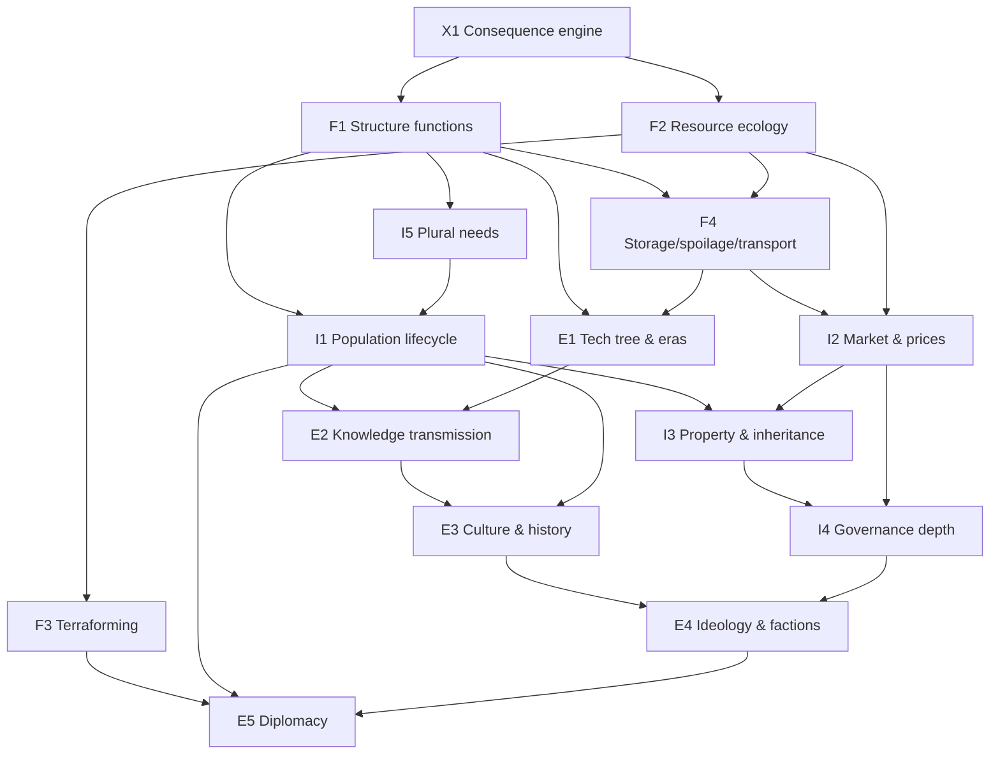

# The Living Civilization Plan

*An analysis of the simulation as a civilization, an inventory of its missing
subsystems, a dependency graph, and a phased implementation cycle that repeats
until the village behaves like an evolving society.*

Companion to [project-sid-parity-roadmap.md](project-sid-parity-roadmap.md).
That roadmap targets **agent cognition** (memory, roles, voting, memes) and is
largely implemented. This plan targets the other half, which is currently the
binding constraint: **the world has no physics of progress**. Smarter agents
cannot build a civilization inside a world where nothing they build does
anything.

---

## Part 1 — Diagnosis: the civilization as it exists today

Walk through the village at frame 1.4M (the 2026-07-02 twelve-hour session,
level 36, 106 structures) and ask what is actually *happening*:

- Agents gather four base resources forever. The forest never thins, the mine
  never empties, the farm never has a bad season. **Matter is infinite and
  uniform**, so no resource is ever worth more than another, no territory is
  worth defending, and no innovation in *production* is ever needed.
- 106 structures stand on the map. Exactly **three types do anything**
  (farm_plot: +gather yield; house: +population cap; workshop: crafting gate
  and +craft output). The other ~100 — Botanical Gardens, Tanneries, Water
  Purifiers, Advanced Storage Vaults — are **paintings**: names with sprites.
- Invention (the blueprint flow) therefore adds *nouns*, never *verbs*. A new
  blueprint means "another thing to fund and place," not "a new capability."
  This is why the model invents "Advanced Botanical Lab" after "Botanical
  Lab": with no functional dimension, novelty can only be lexical. **The
  duplicates you see are the symptom, not the disease.**
- The economy is a straight pipe: gather → contribute → build. Gold exists but
  buys nothing; trade_resource is barter with no price signal; there is no
  storage, no spoilage, no scarcity, no property. Nothing to plan around.
- The population is 8–12 named agents defined at compile time. Nobody is born,
  ages, or dies permanently; a "newcomer" is an unused roster slot moving in.
  There are no generations, so nothing needs to be *passed down*.
- Governance is one rule kind (`resource_tax`) plus a hardcoded immortal
  autocrat. There is nothing to govern because there are no conflicts:
  infinite resources + no property + no scarcity = no politics.
- Culture is one seeded meme spreading by proximity. There is no history: the
  civilization cannot tell you what happened last week, because nothing that
  happened last week changed anything.

**The one-sentence diagnosis:** the simulation has a *construction loop* but no
*consequence loop*. Civilization is compound interest on capabilities — each
layer must produce inputs the next layer consumes. Today every layer produces
only points (level 36 means "106 structures were funded").

### Direct answers to the three questions

**"If there's a botanical garden, what comes out of there?"**
Nothing. It has no registry entry in the effects system — only farm_plot,
house, and workshop have effects (`sim_engine.py` `STRUCTURE_EFFECTS`
constants). The fix is Phase A below: no structure may exist without a
declared function (produce / unlock / boost / store / house). A botanical
garden should, e.g., produce `herbs` on a tick, or boost healer effectiveness,
or unlock two food-recipe slots.

**"If there's an advanced workshop, will it be used to build more complex
structures?"**
No. "Advanced" is purely a name; the workshop check is binary (≥1 exists →
crafting allowed). The fix is Phase D (technology tiers): structures and
recipes get a `tier`, tier-N stations unlock tier-N+1 blueprints/recipes, and
"advanced" becomes a mechanical claim the validator enforces. This is also the
road to your "cars": a vehicle is a tier-3+ *mobile structure* (see Phase D),
reachable only through a real chain (wood → planks → wheel → cart → …), which
gives the LLM a reason to invent intermediate goods instead of a fifth granary.

**"With all of these resources, should there be more rules?"**
Yes, but rules only matter when they bind on scarcity. `RULE_KINDS` is
`{resource_tax, custom}` and `custom` is inert. Once resources deplete
(Phase B) and goods have prices (Phase E), rule kinds like harvest quotas,
land zoning, rationing, tariffs, and inheritance have real consequences — and
the existing propose/vote/enact scaffold can carry them. Adding rule kinds
before adding scarcity would produce more dead text.

---

## Part 2 — Missing-subsystem inventory

Grouped by stratum. ✅ = exists, 🟡 = exists as a stub/label, ❌ = missing.

### Foundational (the world)
| # | Subsystem | Status | What's missing |
|---|-----------|--------|----------------|
| F1 | **Structure function registry** | 🟡 (registry + validation; legacy saves grandfathered) | Every structure type declares effects: `produces`, `unlocks`, `boosts`, `stores`, `houses`. Blueprints must declare a function to validate. |
| F2 | **Resource ecology** | 🟡 (district stocks, depletion, regrowth) | Per-district resource *stocks* that deplete with gathering and regenerate on a curve; overharvest → local exhaustion; seasons/weather as slow modifiers. |
| F3 | **Terraforming / world mutation** | 🟡 (start_terraform projects) | Agent-driven land change: clear forest → field, drain/expand beach, dig canal, plant grove. "Expanding the beach" is exactly this: projects whose output is *terrain*, not a building. |
| F4 | **Physical goods** | ❌ | Stockpiles live in agent pockets and a tax pool. Needed: storage structures with capacity (F1 gives them a function), spoilage for edibles, and transport (goods must be *moved*, making roads and carts matter). |

### Intermediate (the society)
| # | Subsystem | Status | What's missing |
|---|-----------|--------|----------------|
| I1 | **Population lifecycle** | 🟡 (cap + newcomers) | Birth (paired agents + food surplus + housing), aging, natural death, LLM-generated newborn personas, inheritance of goods/beliefs. Generations are what make knowledge transmission *necessary*. |
| I2 | **Economy with prices** | 🟡 (barter, unused gold) | A market structure (F1) posts exchange rates from actual scarcity (F2); gold becomes the medium; agents see prices in prompts and arbitrage; wealth inequality becomes measurable. |
| I3 | **Property & claims** | ❌ | Agents/families claim plots, homes, stockpiles. Property is the precondition for theft, disputes, law, and inheritance. |
| I4 | **Governance depth** | 🟡 (tax + autocrat) | New bindable rule kinds (quota, zoning, rationing, tariff, office); elder mortality (I1) forces succession — inherited, elected (votes exist), or seized. |
| I5 | **Needs beyond hunger** | 🟡 (hunger/health) | Warmth/shelter (ties to houses), rest, and a social need — so consumption is plural and structures serve needs, closing the loop with F1. |

### Emergent (the civilization)
| # | Subsystem | Status | What's missing |
|---|-----------|--------|----------------|
| E1 | **Technology tree** | ❌ | Tiers on recipes/structures; stations unlock the next tier; *eras* (camp → village → town → …) computed from capabilities held, not structures counted. Replaces the hollow `level 36`. |
| E2 | **Knowledge & transmission** | 🟡 (memory store) | Skills learned by doing, taught by talking (apprenticeship), stored in structures (library = skill books survive their author's death — makes I1 death matter without cruelty). |
| E3 | **Culture & history** | 🟡 (1 meme, benchmarks) | Event chronicle ("the famine of frame 2.1M"), agent-authored lore, rituals at structures (F1 again), meme *mutation* rather than one seeded belief. |
| E4 | **Ideology & factions** | ❌ | Belief clusters → factions with preferences over rules (I4); disagreement expressed through votes, migration, or schism. |
| E5 | **Diplomacy & the Other** | ❌ | Requires a second settlement (F3 founds it, I1 populates it): trade treaties, borders, rivalry. Meaningless until there are two of something. |

### Cross-cutting
| # | Subsystem | Status | What's missing |
|---|-----------|--------|----------------|
| X1 | **Consequence engine** | 🟡 (produces tick + query-time boosts/unlocks/houses) | One generic tick-time effects framework (`produces/consumes/modifies` with district scoping) that F1–E5 all register into, instead of new special cases per feature. Build first. |
| X2 | **Observability per subsystem** | 🟡 (benchmarks.jsonl) | Each new subsystem ships with its own benchmark metric + activity events, or it can't be audited in Part 5's loop. |
| X3 | **LLM budget discipline** | ✅ pattern exists | Keep the USE_GOALS split: physics/economy/ecology fully deterministic; the LLM only *chooses*. New systems must not add per-tick LLM calls. |

---

## Part 3 — Dependency graph

Reading the graph:
- **X1 is the root.** Every arrow out of it is why it must be first: a single
  registry of "thing → effect on world per tick" that later systems plug into.
- **F1+F2 are the keystone pair.** Function gives building a *point*; scarcity
  gives choosing a *cost*. Every intermediate system consumes one or both.
- **I1 (mortality/birth) is the keystone of everything emergent.** Death
  forces succession (I4), inheritance (I3), and knowledge transmission (E2);
  birth forces culture to reproduce itself (E3).
- **E5 is deliberately last.** Diplomacy without two real economies is a
  chatbot exchange.

---

## Part 4 — Phased implementation (each phase ends in a running, observable sim)

Phases map to graph layers. Each lists scope, the *civilization test* (an
observable behavior, not a unit test — read from the JSONL logs), and its
feature flag (preserving the A/B pattern).

### Phase A — Consequence engine + universal structure functions (X1, F1)
Every structure type (seed and blueprint) registers effects; a tick applies
them. Blueprint schema gains a required `function` block; `validate_blueprint`
rejects functionless proposals — and *rejects effect-duplicates*, which ends
lexical duplication ("Advanced Botanical Lab") far better than name checks.
The invention prompt asks "what problem does it solve?" instead of "name a
building."
**Test:** the botanical garden question has an answer in `activity.jsonl`
("Botanical Garden produced 2 herbs"). No two custom blueprints with identical
effect vectors get approved.
**Flag:** extends `STRUCTURE_EFFECTS_ENABLED`.

**Implementation log (2026-07-03):** Consequence engine landed on
`feat/server-authoritative-engine`. Generic registry in `sim_engine.py`
(`SEED_STRUCTURE_FUNCTIONS`, `_get_structure_function`, `_tick_structure_effects`);
hardcoded farm/house/workshop effects refactored into seed function blocks; wall
and granary gained tick-time `produces`. Blueprint schema requires `function`;
`validate_blueprint` / `validate_function_block` / `canonical_effect_vector` in
`server.py` reject functionless and duplicate-effect proposals with surfaced
`rejection_note`. Invention prompt reframed around problem-solving. Observability:
`activity.jsonl` lines like `"Botanical Garden produced 5 herbs"`, benchmark
`structure_effect_throughput`. **Verification:** py_compile clean; ~90s session on
resumed level-36 save — 15 structure types logged produces on first effect tick;
benchmark throughput 15; deterministic validation tests pass for functionless /
duplicate / unique blueprints. **Note for Part 2:** pre-Phase-A customs in old
saves share a legacy default produce vector until re-invented with distinct
functions; new approvals are blocked from duplicating any resolved vector.

**Audit verdict (2026-07-03, session `2026-07-03T13-35-24`, ~7.4h fresh-world
soak): PASS — Phase B may proceed.** Evidence: 0 LLM errors/overflows; every
built structure type visibly functional (Wall produced stone ×330 on schedule,
farm-plot gather boost ×603, workshop craft boost ×172); blueprint function
requirement held — only 3 invalid proposals all session (vs 1,344 silent
rejections pre-fix), each with a surfaced reason (`unknown produce resource:
tannin`, `need amount must be 1-5`, `duplicate blueprint id`); invention
quality shifted from lexical to functional (first fresh-world custom:
**Waterwheel Mill**, not an "Advanced X"); invention nags 18 (vs 3,144);
villager speech 212 vs 639 directives (was 19 vs 1,556). Newly discovered
gaps, added per the Part 5 loop:
- **Approved-but-unbuilt inventions stall without saturation pressure.** The
  Waterwheel Mill was approved at frame 70,984 and never got a project in the
  remaining ~520k frames: the custom-project bias in `_start_project_for`
  only fires when a role's default project *kind* matches, and the invention
  gate never arms in a young world. Fix candidate (small, next session): when
  an approved custom is unbuilt for N frames, add a prompt nudge + let the
  elder direct a `start_project` for it. Owner: Phase B recon.
- **The granary chain still doesn't close.** 189 crafts happened, 2 granary
  projects started, 0 granaries completed in 7.4h — crafted goods are being
  produced but contributions keep flowing to cheap seed projects (16 farm
  plots built). Watch under Phase B scarcity; if it persists, it's an
  economy-routing problem for Phase C/E, not a crafting problem.
- **Produced goods accumulate in `civilization["stockpile"]`, which nothing
  consumes** (pre-existing; 330+ stone banked this run). Phase C is the
  designed consumer — until then this is accepted dead weight, tracked here
  so it isn't forgotten.

### Phase B — Resource ecology (F2) and terraforming (F3)
District resource stocks, depletion, regrowth curves; gather yield scales with
stock. Terraform project type: output is a terrain/district mutation (field
cleared, **beach extended**, grove planted) using the existing
district/frontier machinery.
**Test:** a forest is overharvested → gathers fail locally → agents either
migrate, plant a grove, or propose a quota. Scarcity appears in prompts and in
decisions.
**Flag:** `ECOLOGY_ENABLED`.

**Implementation log (2026-07-03):** Phase A audit carry-over: `_stalled_approved_customs`,
prompt nudge + `_maybe_start_approved_custom` elder backstop (live session logged
"Elder Sage directs the village to build the approved Waterwheel Mill"). Ecology:
`districtStocks` per district/kind, `_perform_gather` depletes + scales yield,
`_tick_ecology_regrow`, `lastGatherRejection` surfaced in prompts. Terraform:
`start_terraform` + `TERRAFORM_TEMPLATES`/`TERRAFORM_FUNCTIONS` (`plant_grove`,
`clear_field`, `extend_beach`); completion via `_complete_terraform` (stock
restore + optional beach district founding). Prompt adds `Local resource stocks`
and terraform targets (~150 tokens). Observability: depletion/regrowth/completion
activity lines; benchmark `ecology_scarcity_index`. **Verification:** py_compile
clean; deterministic tests pass (depletion message, terraform end-to-end, approved-
custom backstop, ECOLOGY_ENABLED=False gate); live ~90s session shows approved-custom
backstop + ecology benchmark. Restored saves without stocks initialize to full.

**Audit verdict (2026-07-04, session `2026-07-03T21-21-13`, ~12h soak on the
restored fresh-world save): FAIL — Phase B loops back; Phase C blocked.**
The civilization test could not run: scarcity never appeared (0 depletion
events, 0 gather failures, 0 terraform starts, every prompt read `ok` for 12
hours) AND the build pipeline deadlocked (0 structures built; 3,402
`could not start` failures). Findings, in causal order:
1. **Village-district squatting deadlock (design, worst).** Both village-kind
   districts are occupied by two parallel `granary` projects that need
   crafted goods that never arrive (Phase A audit finding #2, now causal).
   There is NO project-abandonment path, so they squat forever; every
   village-kind `start_project` (houses, the approved Waterwheel Mill) fails.
   `_maybe_start_approved_custom` retried every 600 frames for 12h (1,653
   fires) with no escalation — a gate with no deterministic escape, the exact
   invariant the plan forbids. `_maybe_found_district` never opened new
   village land (60 frontier plots free) because squatted-by-stalled-project
   doesn't register as capacity pressure.
2. **Ecology can't bind (tuning).** Regrowth (+2 per 150-frame tick ≈
   16/min/resource/district) far outpaces gathering; stocks never left `ok`.
3. **Stock overfill bug.** Deposits (`_add_district_stock`, incl. structure
   produces) don't clamp at `STOCK_DEFAULT_MAX`; the scarcity index — meant
   to be 0–1 — read **3.7** (stocks at ~370% of max), pushing depletion even
   further out of reach.
Required fixes for the loop-back (in order): project abandonment (a project
with no contribution progress for ~3× STALL_THRESHOLD is cancelled, refunded,
district freed, logged); no duplicate active project of the same type;
`_maybe_start_approved_custom` escalates on repeated failure (found a
district of the needed kind, else back off with one log) instead of retrying
blind; stalled-squatted districts count as capacity pressure in
`_maybe_found_district`; clamp all stock writes to max; fix the index; slow
regrowth (~+1 per 600 frames) and deplete ≥2× gathered amount so overharvest
is reachable. Ecology re-verification must include a forced-depletion check.

**Loop-back (2026-07-04):** Implemented all six audit fixes on
`feat/server-authoritative-engine`. `_maybe_abandon_stalled_projects` cancels
projects with no contribution progress for `PROJECT_ABANDON_THRESHOLD`
(3× `STALL_THRESHOLD` = 1800 frames), refunds to stockpile, logs + surfaces
`lastProjectAbandonment`. `_start_project_for` rejects duplicate active types
(`lastProjectRejection`). `_maybe_start_approved_custom` escalates (found
district of needed kind, else one log + `APPROVED_CUSTOM_BACKOFF_FRAMES`
cooldown). Squatted districts count as full in `_kind_at_capacity` /
`_district_counts_as_full`. Stock writes clamp to max; scarcity index ratios
clamped to 1.0. Ecology: `ECOLOGY_REGROW_FRAMES=600`, `STOCK_REGROW_PER_TICK=1`,
`STOCK_DEPLETE_MULTIPLIER=2`. **Verification (restored stuck-granary
`state.json`, session `2026-07-04T09-34-27`):** both granaries abandoned @
frame 1604100; Waterwheel Mill started in `village_east` with contributions;
duplicate-granary rejections logged; forced depletion/regrow/clamp tests pass;
`ECOLOGY_ENABLED=False` gate unchanged. Phase B civilization test remains for
the next soak audit.

**Audit verdict (2026-07-05, session `2026-07-04T10-19-58`, ~14.5h soak):
FAIL — second loop-back. Scarcity now binds (4,959 depletions, 3,457 failed
gathers with surfaced reasons, 1,501 recoveries) and the deadlock machinery
works (the Waterwheel Mill was finally built via the escalation chain; no
permanent squatting). But the RESPONSE layer failed — the test's causal chain
stops at "gathers fail":**
1. **Zero terraforms in 14.5h — an interface bug, not a model limitation.**
   All 39 `start_terraform` attempts were rejected as invalid targets: the
   model passes district ids ("farm_north") or resources as `target` because
   it thinks of terraforming a *place*; the schema wants a template id. Fix:
   normalize must infer the template from a district target's kind
   (farm→clear_field, forest→plant_grove, beach→extend_beach), fuzzy-match
   names, and surface rejections into the next prompt (same promotion
   pattern move_to_district already has for target_district).
2. **The "try another district" nudge turned the village nomadic:** 85% of
   ALL decisions (9,968/11,672) were move_to_district; contribute collapsed
   to 110, and projects starved. The prompt-only response to scarcity does
   not work at this model size — the village needs a deterministic scarcity
   reflex (same lesson as the original start_project stall): on a depleted
   gather, route to (a) contribute to a matching active terraform, else
   (b) start the right terraform here if fundable, else (c) move to the
   best-stocked district for that resource — as goal/backstop, not model
   roulette.
3. **Abandonment churned: 510 cancellations, 1 build.** With scarcity
   slowing funding, PROJECT_ABANDON_THRESHOLD (1800 frames ≈ 1 min) cancels
   everything before completion. Raise to ≥10× STALL_THRESHOLD and extend
   further for projects needing crafted goods.
No quota rules were proposed (nothing survived long enough to govern). LM
errors: 14/11,672 (healthy). Phase C remains blocked.

**Loop-back #2 (2026-07-05):** Three response-layer fixes on
`feat/server-authoritative-engine`. **(1) Terraform target inference**
(`server.py` `normalize_decision` / `_infer_terraform_decision`): district ids
and resource names promote to template ids (farm→`clear_field`, forest→
`plant_grove`, beach→`extend_beach`); fuzzy display names; failures surface
`lastTerraformRejection`. **(2) Deterministic scarcity reflex**
(`_scarcity_reflex_on_depletion` in `_perform_gather`): on depletion, contribute
to matching active terraform → else start terraform in-place → else route to
highest-stock district; gather nudge softened (terraform before migrate).
**(3) Abandonment tuning:** `PROJECT_ABANDON_THRESHOLD` = 10× `STALL_THRESHOLD`
(6000 frames); crafted-needs projects use 20× (12000). **Verification (session
`2026-07-05T00-59-23`, restored `state.json`):** Sage `start_terraform` with
district id → "started Clear Field terraform in farm_north"; scarcity reflex
lines for Colt/Mia contributing to that terraform; 0 abandons over 6500
deterministic ticks; `ECOLOGY_ENABLED=False` gate unchanged. Phase B
civilization test remains for next soak (terraform completions must restore
stocks and village stabilizes).

**Audit verdict (2026-07-05, session `2026-07-05T01-03-08`, ~10h soak): FAIL
— third loop-back, scope narrowed to the build economy. Terraform now works
end-to-end (107 Clear Field starts, 22 completions; the reflex + target
inference from loop-back #2 landed) and scarcity remains healthy. But ZERO
structures were built. The causal chain:**
1. **Craft-input starvation:** 1,247 `lacks X to craft` failures vs 69
   successful crafts. Ecology rate-limits wood/stone, and nothing routes a
   crafter to gather its missing inputs — it just retries blind, wasting
   ~16% of all LLM turns. Fix: extend the scarcity reflex — a failed craft
   sets a deterministic gather goal for the missing input.
2. **Abandonment destroys progress:** all 69 crafted planks were contributed
   (routing works!), but 162 abandonments refunded materials into the
   consumer-less stockpile and the next granary attempt started from zero —
   68 restarts, Sisyphus. Fix: when a project starts, auto-seed it from
   matching stockpile materials (gives the stockpile its first consumer and
   makes abandonment lossless).
3. **Granary monoculture:** the Granary was the ONLY project type started
   all session (everything else saturated in this world; granary is the one
   approved-unbuilt custom, so `_invention_required` stays False and no new
   blueprints get demanded). One unbuildable project froze all progress.
   Fix: after K consecutive abandonments of the same type, defer it for a
   long cooldown and let `_invention_required` treat a deferred custom as
   non-blocking so the village pursues invention meanwhile.

**Loop-back #3 (2026-07-05):** Build-economy fixes on
`feat/server-authoritative-engine`. **(1) Craft-input reflex:**
`_craft_input_reflex` on missing inputs sets a `craft_gather` goal (or scarcity
reflex if depleted); `lastCraftRejection` surfaced in prompts. **(2) Stockpile
seeds projects:** `_seed_project_from_stockpile` on every new build/terraform
start — abandonment refunds become lossless. **(3) Serial-abandonment deferral:**
`projectAbandonStreak` / `deferredProjectTypes` (K=3, cooldown 20×
`STALL_THRESHOLD`); `_start_project_for`, elder backstops, and role defaults skip
deferred types; `_invention_required()` ignores deferred unbuilt customs; cleared
on successful build or cooldown expiry. **Verification (restored `state.json`,
session `2026-07-05T11-16-04` + deterministic ticks):** craft reflex lines;
stockpile supplied toward Granary/Clear Field; after simulated granary deferral
`invention_required` False and House starts; 6 structures built over 8000 ticks
with stockpile-seeded Workshop. Phase B civilization test remains for next soak.

**Audit verdict (2026-07-05, morning stage, first automated-cycle run):
INCONCLUSIVE — no soak data to audit; Phase B neither cleared nor sent back.**
This was the first invocation of the Part 8 automation (`overnight-cycle.json`
still showed `iteration: 0`, `lastReviewedCommit: 1d03b00` with the note that
the pending review of `1d03b00..HEAD` had not happened yet). What actually
happened before this stage ran, reconstructed from timestamps: two admin
commits landed at 12:47/12:50 (`4cfcd63` Part 8 doc, `99a951f` gitignore for a
stray `archive/state.json`) — no `sim_engine.py`/`server.py` changes, so the
pending review is of docs/gitignore only — then the server was started and
restarted several times in quick succession (`simulation/logs/` shows session
folders at `11:16`, `11:20`, `11:22`, and `12:53`, each 1–90 minutes, not one
continuous run) with the newest containing only **~1.6 minutes** of data at
the moment this audit ran, and no folder anywhere near the 8h+ the civilization
test needs. Per the audit's own skip rule (newest session under ~30 min ⇒
report, don't fabricate a verdict), no PASS/FAIL is recorded and Phase C stays
blocked. Supplementary signal from the longest available fragment
(`2026-07-05T11-22-15`, ~87 min, 1,144 decisions, 0 LLM errors): loop-back #3
appears to be holding — 4 Workshops, 2 Walls, 2 Waterwheel Mills built, 5
Clear Field terraforms completed, no granary-monoculture freeze — but
`move_to_district` was still 58% of actions (667/1,144), down from the 85%
that failed loop-back #1's audit but well above a healthy mix; not
conclusive at this sample size. **Required for a real audit:** the night
stage must (1) actually perform the still-pending review of `1d03b00..HEAD`
and advance `lastReviewedCommit`, and (2) start the soak once and leave the
server running untouched for 8h+ — no restarts — so one session folder
accumulates enough data to grep. No code defect was found, so no loop-back
fix prompt was written; `.cursor/next-prompt.md` is intentionally left absent
(soak-only night, per Part 8's "absent = nothing to implement" rule).

### Phase C — Physical goods & plural needs (F4, I5)
Granaries/vaults get real capacity (from Phase A functions); edibles spoil
outside storage; goods must be carried (a cart — the first *vehicle* — is a
craftable that raises carry capacity). Warmth/shelter need makes houses
consumed nightly, not just population math.
**Test:** winter (B) + no granary → visible hardship; the village builds
storage *because it needs it*, not because a nudge said so.
**Flag:** `GOODS_ENABLED`.

### Phase D — Technology tiers & eras (E1)
`tier` on recipes/structures/blueprints; stations unlock the next tier;
blueprint validator requires tier-appropriate prerequisites; era computed from
capability set (has metallurgy, has writing, …) and displayed instead of raw
level. **This is the "cars" phase:** vehicle = mobile structure with a
movement/carry function, tier-gated behind wheel + metallurgy chains, so it
can only be *reached*, never named into existence.
**Test:** the sim logs a chain: workshop → forge blueprint → metal tools →
tier-3 "wagon" — with each step consuming the previous one's output.
**Flag:** `TECH_TREE_ENABLED`.

### Phase E — Market & property (I2, I3)
Market structure posts prices from district stocks and stockpile levels; gold
mediates; plots/homes claimable; inheritance recorded.
**Test:** a price spike after a shortage changes what agents gather next tick;
`benchmarks.jsonl` gains a wealth-Gini metric that moves.
**Flag:** `ECONOMY_ENABLED`.

### Phase F — Population lifecycle (I1) & governance depth (I4)
Births (surplus + housing + paired agents), aging, natural death (elder
included — with succession by inheritance/election using the existing vote
machinery), LLM-authored newborn personas, generational inheritance of goods
(I3) and beliefs (E3). New rule kinds that bind on B/C/E systems: quota,
zoning, rationing, tariff.
**Test:** Sage dies of old age; the village holds a succession without
deadlocking; a generation later, someone who never met Sage cites a rule he
enacted.
**Flag:** `LIFECYCLE_ENABLED`.

### Phase G — Knowledge, culture, factions, diplomacy (E2–E5)
Skills by practice + teaching; library/school structures persist knowledge
past death; event chronicle + agent-authored lore; meme mutation; belief
clusters → factions with rule preferences; then a second settlement (founded
via F3+I1 migration) and inter-village trade/treaties/rivalry.
**Test:** the two villages develop measurably different cultures (meme sets,
rules, tech paths) from identical starting conditions.
**Flags:** `CULTURE_ENABLED`, `DIPLOMACY_ENABLED`.

---

## Part 5 — The re-analysis loop (run after every phase)

This plan is the *first iteration* of the cycle the whole effort follows:

1. **Run** a long session (8h+) with the new phase enabled.
2. **Audit** the logs against the phase's civilization test, plus the standing
   audit questions:
   - Does every noun have a verb? (any structure/resource/rule with no
     consequence this session → it's decorative → fix or cut)
   - What did the LLM *stop* being asked to do? (deterministic systems should
     be absorbing mechanics, freeing the LLM for choices)
   - What new scarcity/conflict appeared, and did any existing system
     (rules, market, talk) absorb it? If nothing absorbed it → that's the
     next missing subsystem.
   - Which backstop fired most? (the busiest backstop marks the next design
     gap — exactly how the invention-deadlock was found)
3. **Amend** Parts 2–4 of this document: new subsystems discovered by the
   audit get rows in the inventory and nodes in the graph.
4. **Repeat.** Stop condition: two consecutive audits where the novel events
   in the logs were *not anticipated by the plan* — i.e., the simulation is
   generating its own history faster than we can enumerate it. That is the
   operational definition of "approaching an evolving civilization."

## Part 6 — Model strategy (and how the agent verifies it)

**Decision: one model, upgraded over time — never two at once on this card.**
The 2026-07-02 measurement settled the split question: llama-3.2-3b as a fast
tier beside gemma spilled to CPU on the 12 GB card and was both dumber (95%
`move_to_district`) and slower. Keep the `MODEL_SMART`/`MODEL_FAST` routing as
plumbing with both ids pointing at the same model. Revisit only with ≥24 GB
VRAM or a second GPU.

**Capability staging.** gemma-4-e4b (E4B-class, ~7.5B) is sufficient for
Phases A–C: those phases *reduce* inference burden by turning vibes into
prompt facts ("forest stock 12/100"), and every hard mechanic is
deterministic. The upgrade trigger is **Phase D** (blueprint authoring with
function blocks and tier prerequisites — structured generation under long
prompts). Preferred class: a dense 8–14B at Q4 that fits in 12 GB with 2×3,400
tokens of slot context. `qwen/qwen3.5-9b` (6.55 GB) is already on disk and is
the first candidate to benchmark.

**Switching is decided by replay, not vibes.** `lm_studio.jsonl` stores every
real request/response pair. Before any model change: replay 50–100 logged
decision prompts (mix of routine turns, invention-only turns, elder turns)
against the candidate and score, versus gemma's logged results:
action diversity, JSON validity rate, blueprint-validation pass rate, and
latency. The same method that disqualified llama-3.2-3b.

**Agent verification via the LM Studio CLI.** `lms` is installed
(`C:\Users\dbadmin\.lmstudio\bin\lms.exe`). During every Part 5 audit — and
before/after any model change — the implementing agent should check, using the
CLI where applicable (fall back to `GET http://localhost:1234/v1/models` if
`lms` is unavailable):

1. `lms ps` — what is actually loaded, its context length, parallel slots,
   and that it sits on GPU (`DEVICE`), not CPU. **Slot math check:**
   `context ÷ parallel ≥ 3,400`, else expect context-overflow bursts.
   *Finding at time of writing: gemma is loaded with context 8192 and
   parallel 4 → ~2,048/slot. Set parallel to 2 (matching
   `MAX_CONCURRENT_LLM = 2`) or raise context.*
2. `lms ls` — candidate models already on disk before downloading anything.
3. `lms load <model> --context-length <N>` / `lms unload` — apply the sizing
   above when swapping models for a replay benchmark; confirm with `lms ps`
   that the load didn't fall back to CPU or shrink context.
4. After a swap, confirm the server sees the new id (`GET /v1/models`) and
   that it matches `MODEL_SMART`/`MODEL_FAST` in `server.py` — otherwise
   `run_agent_decision` silently degrades to `"local-model"` routing.
5. Watch `~\.lmstudio\server-logs\` for context/slot errors in the first hour
   after any change (that log shows per-slot token checkpoints that
   `lm_studio.jsonl` doesn't).

## Part 7 — Implementation via subagents

Each phase is delivered by a small team of scoped subagents rather than one
long monolithic session. Rationale: each phase touches the same two hot files
(`sim_engine.py`, `server.py`), so context discipline matters more than
parallelism — every agent gets one job, its own verification duty, and a
narrow contract. Phases remain **sequential** (the dependency graph forbids
parallel phases); the split is *within* a phase.

Per phase, run this relay:

1. **Recon agent** (read-only; Explore-type). Input: this plan + the phase
   letter. Re-derives the current state of every file the phase touches,
   confirms the dependency phases actually landed (flags on, effects visible
   in a fresh session's logs), and produces a file/line-level change map.
   Output: a short brief the implementer can act on without re-searching.
2. **Implementation agent** (working directly on `feat/server-authoritative-engine`
   — no worktrees, no side branches). Input: the recon brief +
   the phase's scope from Part 4. Implements behind the phase's feature flag,
   keeps prompt growth within the ~200-token budget, adds the phase's
   benchmark metric + activity events in the same change (X2 is a
   deliverable, not a follow-up). Must not touch other phases' flags.
3. **Simulation-audit agent** (separate session, after a soak run). Input:
   the phase's civilization test from Part 4 + the session's JSONL logs.
   Runs the Part 5 audit questions against real log data — the same
   grep-the-logs methodology that found the invention deadlock — and writes
   the audit verdict + newly discovered subsystems back into Parts 2–4 of
   this document. This agent must NOT be the implementation agent: fresh
   eyes on logs, no attachment to the code.
4. **Model-check agent** (only when Part 6 says so — Phase D approach, or
   after any model/config change). Runs the `lms` CLI checklist and, when a
   swap is on the table, builds/runs the replay benchmark from
   `lm_studio.jsonl` and reports the comparison table.
5. **Review pass** (`/code-review` or equivalent) on the phase diff before
   merge, focused on the two invariants that have bitten before: no silent
   rejection paths (every refusal must surface a reason to the agent's next
   prompt), and no unbounded loops/caps without a deterministic escape hatch
   (the MAX_APPROVED_CUSTOM lesson).

Handoff rules:
- **All work happens on `feat/server-authoritative-engine`.** No worktrees,
  no feature branches per phase; feature flags are the isolation mechanism,
  and each phase is a commit (or small series) on that branch.
- The **user starts and stops the server** between stages (see the standing
  practice: the implementing agent kills the server and confirms port 5001 is
  free when its work is done; the user restarts it for soak runs).
- Every agent's final report lands in the phase's plan entry (Part 4 gains a
  per-phase log: recon date, implementation commit, audit verdict), so the
  next phase's recon agent starts from documents, not archaeology.
- If the audit agent's verdict is "civilization test failed," the phase loops
  back to step 1 with the audit findings as the new recon input — the phase
  does not advance, and no next-phase work starts.

## Part 8 — The automated overnight cycle

The Part 7 relay, automated. Two scheduled Claude Code sessions per day drive
one full iteration; the human checkpoint is reading the morning summary and
the commits (the loop never pushes, never leaves
`feat/server-authoritative-engine`).

State lives in two files:
- `.cursor/next-prompt.md` — the pending implementation prompt (written by
  the morning stage; consumed by the night stage; absent = nothing to
  implement, soak-only night).
- `.claude/overnight-cycle.json` — `{ "lastReviewedCommit": "<sha>",
  "iteration": N, "phase": "B" }`, updated by whichever stage acts.

**NIGHT stage (~22:30):**
1. Preflight: repo on `feat/server-authoritative-engine`, working tree clean
   (commit strays with a note if not); LM Studio up (`lms ps`; context ÷
   parallel ≥ 3,400); port 5001 free.
2. If `.cursor/next-prompt.md` exists: spawn a general-purpose subagent with
   its contents (the implementer — subagent context keeps it separate from
   this session's reviewer role). Subagent implements + commits, then delete
   the prompt file.
3. Review pass (this session, fresh eyes): diff `lastReviewedCommit..HEAD`
   against the phase's scope and the two invariants (no silent rejections;
   no gate without a deterministic escape). Small fixes committed directly;
   large problems → write a corrective prompt back to `.cursor/next-prompt.md`
   and end WITHOUT starting the server (the morning stage will report it).
   Update `lastReviewedCommit`.
4. Start the soak: launch the server in the background
   (`uv run python simulation/server.py`), confirm `http://127.0.0.1:5001`
   responds and a new `simulation/logs/<ts>/` folder is writing, then end
   the session (the server keeps running detached).

**MORNING stage (~07:30):**
1. Stop the server; confirm port 5001 free.
2. Part 5 audit of the newest session folder against the current phase's
   civilization test + standing questions. Append the verdict to the
   phase's Part 4 log (PASS → next phase; FAIL → findings, causally ordered).
3. Write the next implementation prompt to `.cursor/next-prompt.md`
   (loop-back fixes on FAIL; the next phase's relay prompt on PASS), using
   the same template as previous iterations (git rules, hard rules, VERIFY,
   RECORD sections).
4. Commit the plan-doc update (and cycle-state bump) with message
   `Overnight cycle N: <verdict summary>`.
5. Leave a concise summary as the session's final message (and a
   notification if available): verdict, key numbers, what tonight will do.

Guardrails:
- The cycle only ever *pauses itself*: any preflight failure, LM Studio
  outage, or review-stage rejection ends the stage with a report instead of
  proceeding — nothing forces a soak on a bad build.
- Phase advancement still requires a PASS verdict written by the audit; the
  night stage never starts next-phase work on its own.
- Disable the two scheduled tasks to fall back to the manual Part 7 relay at
  any time; the state files make manual and automated iterations
  interchangeable.

## Constraints that shape everything above

- **One LLM, ~6.5s/decision, 2 slots** (gemma-4-e4b on a 12GB card). All new
  subsystems are deterministic tick mechanics; the LLM's role stays *choice
  under constraint* — same architecture as USE_GOALS. No phase adds per-tick
  LLM calls. Prompt growth per phase must be bounded (~200 tokens each,
  watching the ~3,400-token slot ceiling in CLAUDE.md).
- **Feature flags per phase**, as with SURVIVAL/CRAFTING/GOALS, so behavior
  stays A/B comparable and any phase can be bisected out.
- **Observability is a deliverable**: every phase adds its benchmark metric
  and activity events *in the same PR*, or the Part 5 loop cannot run.
- **No test suite exists**; verification stays "run it and read the JSONL" —
  which the civilization tests above are written for.
