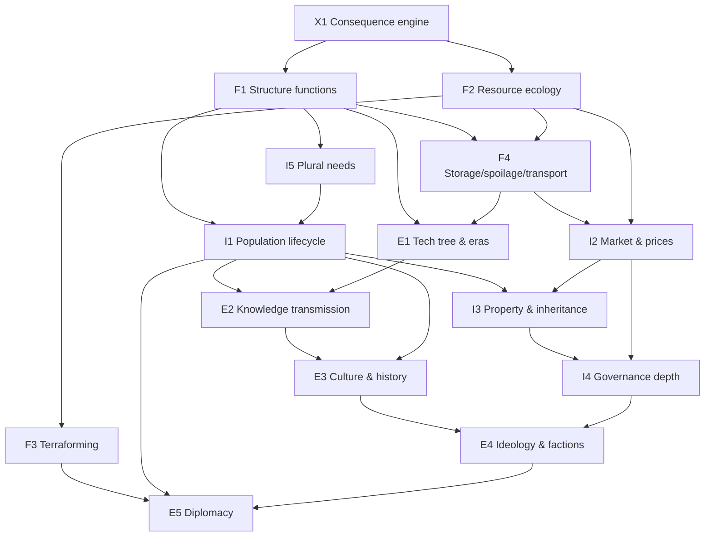

# The Living Civilization Plan

*An analysis of the simulation as a civilization, an inventory of its missing
subsystems, a dependency graph, and a phased implementation cycle that repeats
until the village behaves like an evolving society.*

Companion to [project-sid-parity-roadmap.md](project-sid-parity-roadmap.md).
That roadmap targets **agent cognition** (memory, roles, voting, memes) and is
largely implemented. This plan targets the other half, which is currently the
binding constraint: **the world has no physics of progress**. Smarter agents
cannot build a civilization inside a world where nothing they build does
anything.

---

## Part 1 — Diagnosis: the civilization as it exists today

Walk through the village at frame 1.4M (the 2026-07-02 twelve-hour session,
level 36, 106 structures) and ask what is actually *happening*:

- Agents gather four base resources forever. The forest never thins, the mine
  never empties, the farm never has a bad season. **Matter is infinite and
  uniform**, so no resource is ever worth more than another, no territory is
  worth defending, and no innovation in *production* is ever needed.
- 106 structures stand on the map. Exactly **three types do anything**
  (farm_plot: +gather yield; house: +population cap; workshop: crafting gate
  and +craft output). The other ~100 — Botanical Gardens, Tanneries, Water
  Purifiers, Advanced Storage Vaults — are **paintings**: names with sprites.
- Invention (the blueprint flow) therefore adds *nouns*, never *verbs*. A new
  blueprint means "another thing to fund and place," not "a new capability."
  This is why the model invents "Advanced Botanical Lab" after "Botanical
  Lab": with no functional dimension, novelty can only be lexical. **The
  duplicates you see are the symptom, not the disease.**
- The economy is a straight pipe: gather → contribute → build. Gold exists but
  buys nothing; trade_resource is barter with no price signal; there is no
  storage, no spoilage, no scarcity, no property. Nothing to plan around.
- The population is 8–12 named agents defined at compile time. Nobody is born,
  ages, or dies permanently; a "newcomer" is an unused roster slot moving in.
  There are no generations, so nothing needs to be *passed down*.
- Governance is one rule kind (`resource_tax`) plus a hardcoded immortal
  autocrat. There is nothing to govern because there are no conflicts:
  infinite resources + no property + no scarcity = no politics.
- Culture is one seeded meme spreading by proximity. There is no history: the
  civilization cannot tell you what happened last week, because nothing that
  happened last week changed anything.

**The one-sentence diagnosis:** the simulation has a *construction loop* but no
*consequence loop*. Civilization is compound interest on capabilities — each
layer must produce inputs the next layer consumes. Today every layer produces
only points (level 36 means "106 structures were funded").

### Direct answers to the three questions

**"If there's a botanical garden, what comes out of there?"**
Nothing. It has no registry entry in the effects system — only farm_plot,
house, and workshop have effects (`sim_engine.py` `STRUCTURE_EFFECTS`
constants). The fix is Phase A below: no structure may exist without a
declared function (produce / unlock / boost / store / house). A botanical
garden should, e.g., produce `herbs` on a tick, or boost healer effectiveness,
or unlock two food-recipe slots.

**"If there's an advanced workshop, will it be used to build more complex
structures?"**
No. "Advanced" is purely a name; the workshop check is binary (≥1 exists →
crafting allowed). The fix is Phase D (technology tiers): structures and
recipes get a `tier`, tier-N stations unlock tier-N+1 blueprints/recipes, and
"advanced" becomes a mechanical claim the validator enforces. This is also the
road to your "cars": a vehicle is a tier-3+ *mobile structure* (see Phase D),
reachable only through a real chain (wood → planks → wheel → cart → …), which
gives the LLM a reason to invent intermediate goods instead of a fifth granary.

**"With all of these resources, should there be more rules?"**
Yes, but rules only matter when they bind on scarcity. `RULE_KINDS` is
`{resource_tax, custom}` and `custom` is inert. Once resources deplete
(Phase B) and goods have prices (Phase E), rule kinds like harvest quotas,
land zoning, rationing, tariffs, and inheritance have real consequences — and
the existing propose/vote/enact scaffold can carry them. Adding rule kinds
before adding scarcity would produce more dead text.

---

## Part 2 — Missing-subsystem inventory

Grouped by stratum. ✅ = exists, 🟡 = exists as a stub/label, ❌ = missing.

### Foundational (the world)
| # | Subsystem | Status | What's missing |
|---|-----------|--------|----------------|
| F1 | **Structure function registry** | 🟡 (registry + validation; legacy saves grandfathered) | Every structure type declares effects: `produces`, `unlocks`, `boosts`, `stores`, `houses`. Blueprints must declare a function to validate. |
| F2 | **Resource ecology** | 🟡 (district stocks, depletion, regrowth) | Per-district resource *stocks* that deplete with gathering and regenerate on a curve; overharvest → local exhaustion; seasons/weather as slow modifiers. |
| F3 | **Terraforming / world mutation** | 🟡 (start_terraform projects) | Agent-driven land change: clear forest → field, drain/expand beach, dig canal, plant grove. "Expanding the beach" is exactly this: projects whose output is *terrain*, not a building. |
| F4 | **Physical goods** | ❌ | Stockpiles live in agent pockets and a tax pool. Needed: storage structures with capacity (F1 gives them a function), spoilage for edibles, and transport (goods must be *moved*, making roads and carts matter). |

### Intermediate (the society)
| # | Subsystem | Status | What's missing |
|---|-----------|--------|----------------|
| I1 | **Population lifecycle** | 🟡 (cap + newcomers) | Birth (paired agents + food surplus + housing), aging, natural death, LLM-generated newborn personas, inheritance of goods/beliefs. Generations are what make knowledge transmission *necessary*. |
| I2 | **Economy with prices** | 🟡 (barter, unused gold) | A market structure (F1) posts exchange rates from actual scarcity (F2); gold becomes the medium; agents see prices in prompts and arbitrage; wealth inequality becomes measurable. |
| I3 | **Property & claims** | ❌ | Agents/families claim plots, homes, stockpiles. Property is the precondition for theft, disputes, law, and inheritance. |
| I4 | **Governance depth** | 🟡 (tax + autocrat) | New bindable rule kinds (quota, zoning, rationing, tariff, office); elder mortality (I1) forces succession — inherited, elected (votes exist), or seized. |
| I5 | **Needs beyond hunger** | 🟡 (hunger/health) | Warmth/shelter (ties to houses), rest, and a social need — so consumption is plural and structures serve needs, closing the loop with F1. |

### Emergent (the civilization)
| # | Subsystem | Status | What's missing |
|---|-----------|--------|----------------|
| E1 | **Technology tree** | ❌ | Tiers on recipes/structures; stations unlock the next tier; *eras* (camp → village → town → …) computed from capabilities held, not structures counted. Replaces the hollow `level 36`. |
| E2 | **Knowledge & transmission** | 🟡 (memory store) | Skills learned by doing, taught by talking (apprenticeship), stored in structures (library = skill books survive their author's death — makes I1 death matter without cruelty). |
| E3 | **Culture & history** | 🟡 (1 meme, benchmarks) | Event chronicle ("the famine of frame 2.1M"), agent-authored lore, rituals at structures (F1 again), meme *mutation* rather than one seeded belief. |
| E4 | **Ideology & factions** | ❌ | Belief clusters → factions with preferences over rules (I4); disagreement expressed through votes, migration, or schism. |
| E5 | **Diplomacy & the Other** | ❌ | Requires a second settlement (F3 founds it, I1 populates it): trade treaties, borders, rivalry. Meaningless until there are two of something. |

### Cross-cutting
| # | Subsystem | Status | What's missing |
|---|-----------|--------|----------------|
| X1 | **Consequence engine** | 🟡 (produces tick + query-time boosts/unlocks/houses) | One generic tick-time effects framework (`produces/consumes/modifies` with district scoping) that F1–E5 all register into, instead of new special cases per feature. Build first. |
| X2 | **Observability per subsystem** | 🟡 (benchmarks.jsonl) | Each new subsystem ships with its own benchmark metric + activity events, or it can't be audited in Part 5's loop. |
| X3 | **LLM budget discipline** | ✅ pattern exists | Keep the USE_GOALS split: physics/economy/ecology fully deterministic; the LLM only *chooses*. New systems must not add per-tick LLM calls. |

---

## Part 3 — Dependency graph



Reading the graph:
- **X1 is the root.** Every arrow out of it is why it must be first: a single
  registry of "thing → effect on world per tick" that later systems plug into.
- **F1+F2 are the keystone pair.** Function gives building a *point*; scarcity
  gives choosing a *cost*. Every intermediate system consumes one or both.
- **I1 (mortality/birth) is the keystone of everything emergent.** Death
  forces succession (I4), inheritance (I3), and knowledge transmission (E2);
  birth forces culture to reproduce itself (E3).
- **E5 is deliberately last.** Diplomacy without two real economies is a
  chatbot exchange.

---

## Part 4 — Phased implementation (each phase ends in a running, observable sim)

Phases map to graph layers. Each lists scope, the *civilization test* (an
observable behavior, not a unit test — read from the JSONL logs), and its
feature flag (preserving the A/B pattern).

### Phase A — Consequence engine + universal structure functions (X1, F1)
Every structure type (seed and blueprint) registers effects; a tick applies
them. Blueprint schema gains a required `function` block; `validate_blueprint`
rejects functionless proposals — and *rejects effect-duplicates*, which ends
lexical duplication ("Advanced Botanical Lab") far better than name checks.
The invention prompt asks "what problem does it solve?" instead of "name a
building."
**Test:** the botanical garden question has an answer in `activity.jsonl`
("Botanical Garden produced 2 herbs"). No two custom blueprints with identical
effect vectors get approved.
**Flag:** extends `STRUCTURE_EFFECTS_ENABLED`.

**Implementation log (2026-07-03):** Consequence engine landed on
`feat/server-authoritative-engine`. Generic registry in `sim_engine.py`
(`SEED_STRUCTURE_FUNCTIONS`, `_get_structure_function`, `_tick_structure_effects`);
hardcoded farm/house/workshop effects refactored into seed function blocks; wall
and granary gained tick-time `produces`. Blueprint schema requires `function`;
`validate_blueprint` / `validate_function_block` / `canonical_effect_vector` in
`server.py` reject functionless and duplicate-effect proposals with surfaced
`rejection_note`. Invention prompt reframed around problem-solving. Observability:
`activity.jsonl` lines like `"Botanical Garden produced 5 herbs"`, benchmark
`structure_effect_throughput`. **Verification:** py_compile clean; ~90s session on
resumed level-36 save — 15 structure types logged produces on first effect tick;
benchmark throughput 15; deterministic validation tests pass for functionless /
duplicate / unique blueprints. **Note for Part 2:** pre-Phase-A customs in old
saves share a legacy default produce vector until re-invented with distinct
functions; new approvals are blocked from duplicating any resolved vector.

**Audit verdict (2026-07-03, session `2026-07-03T13-35-24`, ~7.4h fresh-world
soak): PASS — Phase B may proceed.** Evidence: 0 LLM errors/overflows; every
built structure type visibly functional (Wall produced stone ×330 on schedule,
farm-plot gather boost ×603, workshop craft boost ×172); blueprint function
requirement held — only 3 invalid proposals all session (vs 1,344 silent
rejections pre-fix), each with a surfaced reason (`unknown produce resource:
tannin`, `need amount must be 1-5`, `duplicate blueprint id`); invention
quality shifted from lexical to functional (first fresh-world custom:
**Waterwheel Mill**, not an "Advanced X"); invention nags 18 (vs 3,144);
villager speech 212 vs 639 directives (was 19 vs 1,556). Newly discovered
gaps, added per the Part 5 loop:
- **Approved-but-unbuilt inventions stall without saturation pressure.** The
  Waterwheel Mill was approved at frame 70,984 and never got a project in the
  remaining ~520k frames: the custom-project bias in `_start_project_for`
  only fires when a role's default project *kind* matches, and the invention
  gate never arms in a young world. Fix candidate (small, next session): when
  an approved custom is unbuilt for N frames, add a prompt nudge + let the
  elder direct a `start_project` for it. Owner: Phase B recon.
- **The granary chain still doesn't close.** 189 crafts happened, 2 granary
  projects started, 0 granaries completed in 7.4h — crafted goods are being
  produced but contributions keep flowing to cheap seed projects (16 farm
  plots built). Watch under Phase B scarcity; if it persists, it's an
  economy-routing problem for Phase C/E, not a crafting problem.
- **Produced goods accumulate in `civilization["stockpile"]`, which nothing
  consumes** (pre-existing; 330+ stone banked this run). Phase C is the
  designed consumer — until then this is accepted dead weight, tracked here
  so it isn't forgotten.

### Phase B — Resource ecology (F2) and terraforming (F3)
District resource stocks, depletion, regrowth curves; gather yield scales with
stock. Terraform project type: output is a terrain/district mutation (field
cleared, **beach extended**, grove planted) using the existing
district/frontier machinery.
**Test:** a forest is overharvested → gathers fail locally → agents either
migrate, plant a grove, or propose a quota. Scarcity appears in prompts and in
decisions.
**Flag:** `ECOLOGY_ENABLED`.

**Implementation log (2026-07-03):** Phase A audit carry-over: `_stalled_approved_customs`,
prompt nudge + `_maybe_start_approved_custom` elder backstop (live session logged
"Elder Sage directs the village to build the approved Waterwheel Mill"). Ecology:
`districtStocks` per district/kind, `_perform_gather` depletes + scales yield,
`_tick_ecology_regrow`, `lastGatherRejection` surfaced in prompts. Terraform:
`start_terraform` + `TERRAFORM_TEMPLATES`/`TERRAFORM_FUNCTIONS` (`plant_grove`,
`clear_field`, `extend_beach`); completion via `_complete_terraform` (stock
restore + optional beach district founding). Prompt adds `Local resource stocks`
and terraform targets (~150 tokens). Observability: depletion/regrowth/completion
activity lines; benchmark `ecology_scarcity_index`. **Verification:** py_compile
clean; deterministic tests pass (depletion message, terraform end-to-end, approved-
custom backstop, ECOLOGY_ENABLED=False gate); live ~90s session shows approved-custom
backstop + ecology benchmark. Restored saves without stocks initialize to full.

**Audit verdict (2026-07-04, session `2026-07-03T21-21-13`, ~12h soak on the
restored fresh-world save): FAIL — Phase B loops back; Phase C blocked.**
The civilization test could not run: scarcity never appeared (0 depletion
events, 0 gather failures, 0 terraform starts, every prompt read `ok` for 12
hours) AND the build pipeline deadlocked (0 structures built; 3,402
`could not start` failures). Findings, in causal order:
1. **Village-district squatting deadlock (design, worst).** Both village-kind
   districts are occupied by two parallel `granary` projects that need
   crafted goods that never arrive (Phase A audit finding #2, now causal).
   There is NO project-abandonment path, so they squat forever; every
   village-kind `start_project` (houses, the approved Waterwheel Mill) fails.
   `_maybe_start_approved_custom` retried every 600 frames for 12h (1,653
   fires) with no escalation — a gate with no deterministic escape, the exact
   invariant the plan forbids. `_maybe_found_district` never opened new
   village land (60 frontier plots free) because squatted-by-stalled-project
   doesn't register as capacity pressure.
2. **Ecology can't bind (tuning).** Regrowth (+2 per 150-frame tick ≈
   16/min/resource/district) far outpaces gathering; stocks never left `ok`.
3. **Stock overfill bug.** Deposits (`_add_district_stock`, incl. structure
   produces) don't clamp at `STOCK_DEFAULT_MAX`; the scarcity index — meant
   to be 0–1 — read **3.7** (stocks at ~370% of max), pushing depletion even
   further out of reach.
Required fixes for the loop-back (in order): project abandonment (a project
with no contribution progress for ~3× STALL_THRESHOLD is cancelled, refunded,
district freed, logged); no duplicate active project of the same type;
`_maybe_start_approved_custom` escalates on repeated failure (found a
district of the needed kind, else back off with one log) instead of retrying
blind; stalled-squatted districts count as capacity pressure in
`_maybe_found_district`; clamp all stock writes to max; fix the index; slow
regrowth (~+1 per 600 frames) and deplete ≥2× gathered amount so overharvest
is reachable. Ecology re-verification must include a forced-depletion check.

**Loop-back (2026-07-04):** Implemented all six audit fixes on
`feat/server-authoritative-engine`. `_maybe_abandon_stalled_projects` cancels
projects with no contribution progress for `PROJECT_ABANDON_THRESHOLD`
(3× `STALL_THRESHOLD` = 1800 frames), refunds to stockpile, logs + surfaces
`lastProjectAbandonment`. `_start_project_for` rejects duplicate active types
(`lastProjectRejection`). `_maybe_start_approved_custom` escalates (found
district of needed kind, else one log + `APPROVED_CUSTOM_BACKOFF_FRAMES`
cooldown). Squatted districts count as full in `_kind_at_capacity` /
`_district_counts_as_full`. Stock writes clamp to max; scarcity index ratios
clamped to 1.0. Ecology: `ECOLOGY_REGROW_FRAMES=600`, `STOCK_REGROW_PER_TICK=1`,
`STOCK_DEPLETE_MULTIPLIER=2`. **Verification (restored stuck-granary
`state.json`, session `2026-07-04T09-34-27`):** both granaries abandoned @
frame 1604100; Waterwheel Mill started in `village_east` with contributions;
duplicate-granary rejections logged; forced depletion/regrow/clamp tests pass;
`ECOLOGY_ENABLED=False` gate unchanged. Phase B civilization test remains for
the next soak audit.

**Audit verdict (2026-07-05, session `2026-07-04T10-19-58`, ~14.5h soak):
FAIL — second loop-back. Scarcity now binds (4,959 depletions, 3,457 failed
gathers with surfaced reasons, 1,501 recoveries) and the deadlock machinery
works (the Waterwheel Mill was finally built via the escalation chain; no
permanent squatting). But the RESPONSE layer failed — the test's causal chain
stops at "gathers fail":**
1. **Zero terraforms in 14.5h — an interface bug, not a model limitation.**
   All 39 `start_terraform` attempts were rejected as invalid targets: the
   model passes district ids ("farm_north") or resources as `target` because
   it thinks of terraforming a *place*; the schema wants a template id. Fix:
   normalize must infer the template from a district target's kind
   (farm→clear_field, forest→plant_grove, beach→extend_beach), fuzzy-match
   names, and surface rejections into the next prompt (same promotion
   pattern move_to_district already has for target_district).
2. **The "try another district" nudge turned the village nomadic:** 85% of
   ALL decisions (9,968/11,672) were move_to_district; contribute collapsed
   to 110, and projects starved. The prompt-only response to scarcity does
   not work at this model size — the village needs a deterministic scarcity
   reflex (same lesson as the original start_project stall): on a depleted
   gather, route to (a) contribute to a matching active terraform, else
   (b) start the right terraform here if fundable, else (c) move to the
   best-stocked district for that resource — as goal/backstop, not model
   roulette.
3. **Abandonment churned: 510 cancellations, 1 build.** With scarcity
   slowing funding, PROJECT_ABANDON_THRESHOLD (1800 frames ≈ 1 min) cancels
   everything before completion. Raise to ≥10× STALL_THRESHOLD and extend
   further for projects needing crafted goods.
No quota rules were proposed (nothing survived long enough to govern). LM
errors: 14/11,672 (healthy). Phase C remains blocked.

**Loop-back #2 (2026-07-05):** Three response-layer fixes on
`feat/server-authoritative-engine`. **(1) Terraform target inference**
(`server.py` `normalize_decision` / `_infer_terraform_decision`): district ids
and resource names promote to template ids (farm→`clear_field`, forest→
`plant_grove`, beach→`extend_beach`); fuzzy display names; failures surface
`lastTerraformRejection`. **(2) Deterministic scarcity reflex**
(`_scarcity_reflex_on_depletion` in `_perform_gather`): on depletion, contribute
to matching active terraform → else start terraform in-place → else route to
highest-stock district; gather nudge softened (terraform before migrate).
**(3) Abandonment tuning:** `PROJECT_ABANDON_THRESHOLD` = 10× `STALL_THRESHOLD`
(6000 frames); crafted-needs projects use 20× (12000). **Verification (session
`2026-07-05T00-59-23`, restored `state.json`):** Sage `start_terraform` with
district id → "started Clear Field terraform in farm_north"; scarcity reflex
lines for Colt/Mia contributing to that terraform; 0 abandons over 6500
deterministic ticks; `ECOLOGY_ENABLED=False` gate unchanged. Phase B
civilization test remains for next soak (terraform completions must restore
stocks and village stabilizes).

**Audit verdict (2026-07-05, session `2026-07-05T01-03-08`, ~10h soak): FAIL
— third loop-back, scope narrowed to the build economy. Terraform now works
end-to-end (107 Clear Field starts, 22 completions; the reflex + target
inference from loop-back #2 landed) and scarcity remains healthy. But ZERO
structures were built. The causal chain:**
1. **Craft-input starvation:** 1,247 `lacks X to craft` failures vs 69
   successful crafts. Ecology rate-limits wood/stone, and nothing routes a
   crafter to gather its missing inputs — it just retries blind, wasting
   ~16% of all LLM turns. Fix: extend the scarcity reflex — a failed craft
   sets a deterministic gather goal for the missing input.
2. **Abandonment destroys progress:** all 69 crafted planks were contributed
   (routing works!), but 162 abandonments refunded materials into the
   consumer-less stockpile and the next granary attempt started from zero —
   68 restarts, Sisyphus. Fix: when a project starts, auto-seed it from
   matching stockpile materials (gives the stockpile its first consumer and
   makes abandonment lossless).
3. **Granary monoculture:** the Granary was the ONLY project type started
   all session (everything else saturated in this world; granary is the one
   approved-unbuilt custom, so `_invention_required` stays False and no new
   blueprints get demanded). One unbuildable project froze all progress.
   Fix: after K consecutive abandonments of the same type, defer it for a
   long cooldown and let `_invention_required` treat a deferred custom as
   non-blocking so the village pursues invention meanwhile.

**Loop-back #3 (2026-07-05):** Build-economy fixes on
`feat/server-authoritative-engine`. **(1) Craft-input reflex:**
`_craft_input_reflex` on missing inputs sets a `craft_gather` goal (or scarcity
reflex if depleted); `lastCraftRejection` surfaced in prompts. **(2) Stockpile
seeds projects:** `_seed_project_from_stockpile` on every new build/terraform
start — abandonment refunds become lossless. **(3) Serial-abandonment deferral:**
`projectAbandonStreak` / `deferredProjectTypes` (K=3, cooldown 20×
`STALL_THRESHOLD`); `_start_project_for`, elder backstops, and role defaults skip
deferred types; `_invention_required()` ignores deferred unbuilt customs; cleared
on successful build or cooldown expiry. **Verification (restored `state.json`,
session `2026-07-05T11-16-04` + deterministic ticks):** craft reflex lines;
stockpile supplied toward Granary/Clear Field; after simulated granary deferral
`invention_required` False and House starts; 6 structures built over 8000 ticks
with stockpile-seeded Workshop. Phase B civilization test remains for next soak.

**Audit verdict (2026-07-05, morning stage, first automated-cycle run):
INCONCLUSIVE — no soak data to audit; Phase B neither cleared nor sent back.**
This was the first invocation of the Part 8 automation (`overnight-cycle.json`
still showed `iteration: 0`, `lastReviewedCommit: 1d03b00` with the note that
the pending review of `1d03b00..HEAD` had not happened yet). What actually
happened before this stage ran, reconstructed from timestamps: two admin
commits landed at 12:47/12:50 (`4cfcd63` Part 8 doc, `99a951f` gitignore for a
stray `archive/state.json`) — no `sim_engine.py`/`server.py` changes, so the
pending review is of docs/gitignore only — then the server was started and
restarted several times in quick succession (`simulation/logs/` shows session
folders at `11:16`, `11:20`, `11:22`, and `12:53`, each 1–90 minutes, not one
continuous run) with the newest containing only **~1.6 minutes** of data at
the moment this audit ran, and no folder anywhere near the 8h+ the civilization
test needs. Per the audit's own skip rule (newest session under ~30 min ⇒
report, don't fabricate a verdict), no PASS/FAIL is recorded and Phase C stays
blocked. Supplementary signal from the longest available fragment
(`2026-07-05T11-22-15`, ~87 min, 1,144 decisions, 0 LLM errors): loop-back #3
appears to be holding — 4 Workshops, 2 Walls, 2 Waterwheel Mills built, 5
Clear Field terraforms completed, no granary-monoculture freeze — but
`move_to_district` was still 58% of actions (667/1,144), down from the 85%
that failed loop-back #1's audit but well above a healthy mix; not
conclusive at this sample size. **Required for a real audit:** the night
stage must (1) actually perform the still-pending review of `1d03b00..HEAD`
and advance `lastReviewedCommit`, and (2) start the soak once and leave the
server running untouched for 8h+ — no restarts — so one session folder
accumulates enough data to grep. No code defect was found, so no loop-back
fix prompt was written; `.cursor/next-prompt.md` is intentionally left absent
(soak-only night, per Part 8's "absent = nothing to implement" rule).

**Audit verdict (2026-07-05, evening slot, session `2026-07-05T16-41-19`,
4h54m soak, 3,858 decisions, 18 LLM errors, 0 context overflows): ECOLOGY
PASS / build-economy FAIL — hot-fixed in-session (`c6e1bbc`); Phase B
conditional on the morning slot confirming the fix.** Note: the soak ended
early because the server was stopped manually at 21:35 (a `git pull` was run
in its window — the PR #1 merge); the standing 24/7 rule was briefly broken
outside the automation. Judged per-flag:
- **`STRUCTURE_EFFECTS_ENABLED` (Phase A): PASS, no regression.** Produces
  fired all session (Waterwheel Mills 12+3 planks/period, Wall 10 stone),
  saturation caps bound and steered role defaults.
- **`ECOLOGY_ENABLED` (Phase B core test): PASS.** The full causal chain of
  the civilization test ran without prompting: farm_north depleted (28
  depletion events, 13 surfaced local gather failures), the scarcity reflex
  answered (21 Clear Field terraform starts, several reflex-initiated, ~20
  completions restoring the land), stocks regrew (26 recoveries), the
  scarcity index stayed bounded (max 0.956), and migration occurred without
  the loop-back #1 nomadism (move_to_district 45.9% vs 85%). No quota rule
  was proposed — acceptable, the test is migrate OR terraform OR quota.
- **Build economy (loop-back #3 scope): FAIL — zero structures built
  in-session, zero blueprint proposals in 3,858 decisions.** Not a model
  failure: three precise gate bugs. (1) `_invention_required()` was
  **inverted** by the abcc158 refactor (dropped the `not` on
  `_unbuilt_customs_blocking_invention()`), so once the village finished
  building everything — the state this soak ended in: all 5 seed types +
  both customs built, 44 structures — invention went permanently False.
  (2) `_seed_exhausted()` had no deferral clause: loop-back #3's craft
  reflex made crafting healthy (45 crafts vs 29 fails, vs 69/1,247 last
  soak), which kept the granary's craft-stall escape False while the
  granary cycled abandon→defer (25 abandons, ~8 deferral cycles), holding
  the gate shut with nothing buildable. (3) The saturation nudge named the
  deferred Granary as the alternative 471 times → 535 deterministic
  rejections — agents rammed a wall the engine itself had closed.
  **Hot-fix (same session, per compressed-cadence hot-fix authority):**
  restored the negation, deferred types count as exhausted, nudge skips
  deferred/duplicate-active types. Forced smoke test on the restored
  `state.json` (the exact deadlocked world): gate True when fully built,
  False with a pending approved custom, True when that custom is deferred,
  nudge demands invention. The overnight soak validates live invention
  (proposals → elder approval → new project types); the morning slot
  confirms before Phase C starts.

**Audit verdict (2026-07-06, morning slot, session `2026-07-05T22-24-13`,
9h16m soak, 4,716 decisions, 7 transient LM-offline errors, 0 context
overflows — first full soak on qwen3.5-9b): PASS on all three flags.
Phase B is COMPLETE; Phase C unblocked.** Judged per-flag:
- **`STRUCTURE_EFFECTS_ENABLED` (Phase A): PASS, no regression.** 39,277
  produce events; effect throughput 31 structure types/period (was 15 at
  Phase A landing); the duplicate-effect-vector guard fired live (9
  rejections, each with a surfaced reason).
- **`ECOLOGY_ENABLED` (Phase B core): PASS, no regression.** 36 district
  depletion events (forest wood, farm_north food) plus per-agent failed
  gathers with surfaced reasons; the scarcity reflex answered with 13
  terraform starts (Plant Grove, Clear Field — most reflex-initiated);
  recoveries logged (31 "recovering"/"regrown" lines); scarcity index
  bounded [0.849, 1.0], mean 0.975.
- **Build economy / live invention (the c6e1bbc confirmation): PASS —
  the fix holds.** The full loop ran all night on the fully-built world
  where invention is the only growth path: invention gate armed → elder
  delegated proposals (and took over himself 32× per
  `INVENTION_ELDER_TAKEOVER`) → 32 `propose_blueprint` decisions → ~30
  distinct blueprints approved (Watchtower, Observatory family, Library,
  Market Hall, Greenhouse, a water-infrastructure family…) → 80
  `start_project` + 204 `build_structure` decisions → **283 structures
  built**, all new types placed. No monoculture freeze, no silent
  rejections (301 `rejection_note`s, every one with a reason).
  `move_to_district` collapsed to **14.1%** (665/4,716; was 85% at
  loop-back #1, 45.9% last soak) — the qwen switch + honest nudges
  compound. 13 distinct actions chosen.

Newly discovered gaps (Part 5 loop), none blocking:
1. **Busiest rejection: `too many custom resources` ×137.** The custom-
   resource cap has no expiry/retirement analogue — same shape as the
   MAX_APPROVED_CUSTOM deadlock, not yet blocking (structure invention
   flowed around it). Fix bundled into the Day-2 C3 amnesty item (both
   are "cap needs an expiry" fixes).
2. **Expansion sprawl without demand:** 9 new village districts founded
   and 283 builds in 9h16m — the same approved customs rebuilt up to
   16-20× each (16 Observatories). Nothing consumes structures or makes
   the marginal build costly; Phase C decay/upkeep/storage is the
   designed consumer (watch the build rate bend down under
   `GOODS_ENABLED`), Phase F population the designed demand.
3. LM Studio blipped offline for 7 decisions, self-recovered; `lms ps`
   confirms context 13000 / parallel 2 (6,500 per slot, above the 3,400
   floor).

### Phase C — Physical goods, plural needs & consequence (F4, I5)
Granaries/vaults get real capacity (from Phase A functions); edibles spoil
outside storage; goods must be carried (a cart — the first *vehicle* — is a
craftable that raises carry capacity). Warmth/shelter need makes houses
consumed nightly, not just population math. Adopted from the copilot audit
([response doc](copilot-audit-response.md) C1/C6-B): **structure decay** —
structures gain a condition stat, degrade without upkeep, get a repair verb,
and rare disasters can damage them (with the standard escape hatch: anything
lost is rebuildable); and **seasons** as slow multipliers on district stock
regrowth (winter bites, closing the loop with spoilage/storage).
**Test:** winter (B) + no granary → visible hardship; the village builds
storage *because it needs it*, not because a nudge said so — and repairs a
decaying structure before it collapses.
**Flag:** `GOODS_ENABLED`.

**Implementation log (2026-07-06, Day-2 morning batch):** All six scope items
landed behind `GOODS_ENABLED` in `sim_engine.py`, one slow goods gate
(`GOODS_TICK_FRAMES` ~30s) + a nightly gate (`DAY_FRAMES` ~7.5 min), all
deterministic. (1) Storage: `_storage_capacity` = `BASE_STORAGE_CAPACITY` (25)
+ working structures' Phase A `stores` entries; the seed granary gains
`stores` food 40/fish 20 (flag-gated so the flag-off effect vector is
unchanged). (2) Spoilage: `_tick_spoilage` rots 25% (min 1) of edible overflow
per tick — stockpile first, then largest holders, never below
`EDIBLE_RESERVE`; surfaced via the `lastSpoilage` nudge. (3) Cart: seed
`cart` recipe (workshop, planks 2 + wood 2); `_carry_cap` = `COLLECT_CAP` +20
while holding one (query-time, all six COLLECT_CAP gather sites routed
through it). (4) Shelter: `_tick_shelter` nightly — each working house beds
`HOUSE_SHELTER_OCCUPANTS` (2), nearest first; the unsheltered lose 6 hunger
(floored at 20 — a nudge, never a collapse path), surfaced via
`lastShelterNote`. (5) Decay/repair: `condition` 100 at build, −0.5/goods
tick (~70 min to disrepair, ~100 min to ruin — sized in-code as the consumer
for the 30-builds/hour sprawl); below 30 the structure stops
producing/boosting/housing/unlocking (`_working_structure_count`; saturation
still counts totals so decayed ≠ rebuild-more); at 0 → ruin; new
`repair_structure` action (synced server `DECISION_ACTIONS`/`SYSTEM_PROMPT`
rules 19–20, engine `apply_decision`, viewer `ACTION_LABELS`) restores +50
for 1 primary material, rebuilds a ruin for half the original needs (the
deterministic escape); `DISASTER_PROB` 0.005/tick random damage, logged
dramatically; refusals surface via `lastRepairRejection` + an in-district
disrepair/ruin nudge. (6) Seasons: frameTick-derived clock
(`SEASON_FRAMES` ~30 min/season), `SEASON_REGROW_MULT` spring 2×/winter 0× on
ecology regrowth, one `Season:` prompt line rendered only when the flag is on
(flag-off prompts byte-identical; ~180 tokens total prompt growth incl. the
two SYSTEM_PROMPT rules). Observability in-commit: activity lines for
spoilage/season turns/disrepair/collapse/disaster/night + benchmarks
`storage_utilization` (with spoiled-per-period), `structure_condition`
(ruins/disrepair counts), `season_turn`, `disaster_damage`,
`structure_repaired`. Back-compat: civ/agent nudge fields setdefault'd;
structure `condition`/`isRuin` read via `.get` defaults (pre-C saves need no
migration). **Verification:** py_compile clean; 10 deterministic offline
checks pass (storage math incl. disrepair-granary, spoilage + reserve floor,
decay thresholds, repair rejection/normal/ruin-rebuild half-cost, forced
disaster, shelter floor + full-roof path, cart cap, winter-0×/spring-2×
regrowth, season prompt line on/off, both benchmarks); a dedicated
GOODS_ENABLED=False run asserts Phase B equivalence (no cart, no stores, no
decay/spoilage/season line, carry cap unchanged, repair refused with reason).
**Forced live smoke (session `2026-07-06T08-06-53`, 331-structure restored
world, temp constants: goods tick 2s, day 15s, season 30s, decay 6, disaster
0.3):** 15 spoilage events (51 units in one benchmark period,
`storage_utilization` 1.28 → capacity pressure visible), 4 season turns with
`Season: winter — stocks do not regrow; rely on stored food` reaching live
prompts, 329 disrepair + 327 ruin collapses, 10 disasters, 6 nights, both new
benchmarks streaming; disrepair/ruin/spoilage nudges confirmed in
`lm_studio.jsonl` prompts — and the elder responded to spoilage by directing
a "Storage Hub" build unprompted. The model chose `repair_structure` live
(Zara, on a ruined Farm Plot) and the refusal surfaced its reason ("Zara
lacks food, herbs to repair the Farm Plot" — no silent rejection); the
success paths (repair +50, ruin rebuild at half cost) are covered by the
deterministic offline checks through the same engine code. Temp constants
reverted before commit.

**Audit verdict (2026-07-07, evening slot — cycle 3.evening, session
`2026-07-06T20-07-19`, 5h03m, 1,987 decisions, all six flags on):**
`GOODS_ENABLED` **FAIL — balance/interface, hot-fixed in this slot.** Every
Phase C mechanic fired and logged: 160 spoilage events, 7 season turns
(~30 min cadence, winter 0× regrowth reaching prompts), 26 shelterless-night
events, 2 disasters, `storage_utilization`/`structure_condition` streaming
with detail, 0 silent rejections, 0 context overflows, 0 fallbacks. But decay
ate the town: **409/416 structures were ruins by 01:00**,
`structure_effect_throughput` 0, 0 working houses — and the escape hatch was
economically unreachable: 282 `repair_structure` decisions (14.2% of ALL
turns — the model heard the nudges and did the right thing) produced only 17
successes against ~320 honest "lacks materials" refusals. Three precise
causes, all fixed in-session: (1) repair paid from the agent's personal
inventory only, while the village stockpile held 29,521 planks — the
gather→contribute loop could never fund the escape; now agent-first-then-
stockpile (activity line when the stockpile pays; refusal only when both fall
short, still surfaced); (2) `_find_repair_target`'s plain `min(condition)`
always chose a ruin (multi-resource half-rebuild) over cheap 1-unit upkeep of
a standing structure — now standing-damaged first, ruins as fallback (the
civ test says "before it collapses"); (3) decay 0.5/goods-tick = ruin in
~100 min, so 416 structures needed ~4 successful repairs per 30 s
village-wide — arithmetically unpayable by 12 agents; retuned to **0.1**
(~5.8 h to disrepair, ~8.3 h to ruin: a structure survives an unattended
overnight soak, sprawl still decays across days). 5 offline checks through
the real engine code pass; py_compile clean. Storage/spoilage/seasons/
shelter/cart sub-mechanics individually PASS. The flag re-soaks tonight as a
**recovery-arc test**: the world resumes at 409 ruins + a full stockpile, so
half-cost rebuilds are now fundable — the escape hatch at scale. Secondary
observations for the morning slot: (a) the elder took **40% of all LLM
turns** (793/1,987; 591 `assign_task`) — consider an assign-cadence cap;
(b) invention fully dormant (0 proposals, 0 invention-only turns in 5 h), so
the new council code path got **zero live exercise** — council verdict
INCONCLUSIVE, must be provoked or observed in the Phase D soak; (c) ecology
held (scarcity reflexes firing, 16 terraform starts, honest depletion
messages — Phase B verdict unchanged). Slot hygiene note: the server was
found DOWN at slot start (process exited ~01:10 with a clean state flush;
~20 h of soak lost) and both the 2.evening and 3.morning scheduled slots
never ran — the 5 h window above is all the data there was.

### Phase D — Technology tiers & eras (E1)
`tier` on recipes/structures/blueprints; stations unlock the next tier;
blueprint validator requires tier-appropriate prerequisites; era computed from
capability set (has metallurgy, has writing, …) and displayed instead of raw
level. **This is the "cars" phase:** vehicle = mobile structure with a
movement/carry function, tier-gated behind wheel + metallurgy chains, so it
can only be *reached*, never named into existence.
**Test:** the sim logs a chain: workshop → forge blueprint → metal tools →
tier-3 "wagon" — with each step consuming the previous one's output.
**Flag:** `TECH_TREE_ENABLED`.

**Implementation log (2026-07-07, morning batch — landed the Night 2 item
carried over from cycle 3.evening):** Found already implemented, uncommitted,
in the working tree at slot start — a prior session had built the full scope
of `.cursor/next-prompt.md` behind `TECH_TREE_ENABLED` but ended before
committing, leaving `simulation/state.json.phaseD.bak` /
`.recovery_hold` backups and a reset-to-fresh live `state.json` (frameTick
10,643, 5 structures) from its own forced smoke test. Tiers/unlocks/eras/wagon
land per spec: `_type_tier_locked` gates tier-N recipes/blueprints behind a
built tier-(N-1) station with a surfaced reason ("requires a forge (tier 2)
first"); Forge is a normal tier-1 build (the deterministic escape — nothing
gates the gate); `_village_tech_tier`/`_craft_station_unlocked` are tier-aware;
era is computed from capability set (Craftsman → Forge → Wagon Era) and
replaces the vanity level in prompts/UI (`level` kept for back-compat, unused);
wagon is the cart's tier-2 upgrade (consumes the cart, crafted at the Forge),
with both carry-cap and movement-speed bonuses wired at query time. The
diegetic invention council (added to scope 2026-07-06) also landed: 2–3 idle
villagers fan out parallel proposals (no added LLM volume — replaces their
normal turn), the elder's judgment is comparative (side-by-side needs/function
summary, approve-one + reject-the-rest-with-reasons in one call), verdicts log
as village events ("Elder Sage chose the Windmill over fish_smokery: ..."),
`civilization["councilLog"]`/`councilActive` are served over `GET /state` and
rendered by a new thin-viewer-only Council sidebar panel (winner highlighted,
losers greyed with reasons, collapsible history) plus a live
"Council in session" banner — index.html holds no new simulation logic.
Model-experiment hook (`INVENTION_TEMPERATURE`/`INVENTION_MAX_TOKENS` in
server.py) defaults to current behavior, ready for the Part 6 replay to flip.
**Review finding (this slot):** the implementer had left a
`POST /debug/exec` route in server.py — an unauthenticated arbitrary-`exec()`
endpoint added as a forced-condition injector for its own smoke test, marked
"REMOVED BEFORE COMMIT" but not actually removed. Deleted before commit;
flagged as a process gap (implementer subagents must not ship debug scaffolding,
smoke-test harnesses belong in a throwaway script/session, never a live route).
**Forced live smoke (sessions `2026-07-07T01-41-36` through `01-48-49`, run
against a fresh throwaway world after backing up the real save):** tier-2
blueprint rejected pre-Forge with the surfaced reason, then accepted once the
Forge stood; Craftsman → Forge → Wagon Era transitions all logged; a wagon was
crafted from a cart; council convened multiple times with 2 proposals side by
side and a comparative verdict logged with reasons both ways. Two follow-ups
for the next slot: (1) one early smoke attempt logged a same-frame
"council disperses without a verdict" — traced to the now-deleted
`/debug/exec` harness driving the engine outside its normal tick loop
(`frame_tick 0`, empty `lm_studio.jsonl` for that session), not reproducible
via the real tick gates by static reread; worth a quiet eye on `councilLog`
during the real soak rather than fully closed. (2) the recovery-arc soak this
slot was supposed to audit (queued at the end of cycle 3.evening, hot-fix
793c598) never ran — the server was redirected to Phase D smoke testing ~10
minutes after the hot-fix commit and was found DOWN at this slot's start;
zero hours of recovery-arc data exist. Real state.json (6,484,775 frames,
416 structures, 410 ruins) restored from backup for tonight's soak, which
must now serve BOTH still-open tests: the Phase C recovery-arc escape hatch
AND live Phase D exercise (tier gate, era transitions, council) on the same
run. py_compile clean; committed together as one change.

**Audit verdict (2026-07-07, evening slot — cycle 4.evening, session
`2026-07-07T07-48-29`, only 44 min — the server was found UP and correctly
continuing the restored world at slot start, but the morning slot's own
restart left less than an hour before this slot fired; PROVISIONAL only per
the compressed-cadence <4h rule).** Recovery-arc (`GOODS_ENABLED`
repair-funding hot-fix, commit 793c598) **provisional PASS**: 13
`repair_structure` successes vs. 36 honest "lacks wood" refusals (up from
17/282 = 6% pre-fix to 13/49 = 27% this slot), stockpile-funded repairs
firing repeatedly ("The village stockpile supplied 1.0 wood for ...'s
repair"), one full ruin rebuilt at half-cost (Market Hall, village_5),
`structure_condition` benchmark moved the right direction (ruins 410→409,
disrepair 2→0, avg condition 0.7→1.6). Recovery pace is slow by design (409
ruins remain; at this rate full recovery is a multi-day arc, matching the
plan's "sprawl still decays across days" intent) — needs a longer soak to
confirm the trend holds rather than plateaus, but the escape hatch is
unambiguously reachable now, which was the FAIL being fixed. Standing
invariants held: 0 fallbacks, 0 context overflows over 293 decisions, elder
`assign_task` share down to 27% (78/293, vs. 40% flagged Cycle 3.evening —
provisional improvement, small sample). Seasons ticked correctly (spring→
summer transition logged, reaching prompts).
Phase D (`TECH_TREE_ENABLED`) live exercise: **still zero organic
tier-gate/era/wagon/council events this slot** (0 mentions of any), a second
consecutive soak with no live firing (5h Cycle-3.evening + 44min tonight).
Investigated the reachability concern flagged this morning by reading
`_invention_required()`/`_maybe_invention_backstop()` and the persisted
state: `inventionRequiredStreak` and `inventionBackstopFires` are both 0,
confirming `_invention_required()` correctly stayed False the whole slot —
**not a bug**. Of 14 approved custom blueprints, 12 are built; the remaining
two are `trade_hub` (an active project underway in village_13 — legitimately
still being pursued, the precondition `_unbuilt_customs_blocking_invention`
is doing its job) and `fishery` (deferred, cooldown expires frame 6,544,650,
~7,650 frames after this slot ended). The invention/council path is
reachable and unblocked in principle; it simply hasn't had a slot where the
precondition (all seeds exhausted AND no unbuilt/in-progress custom) held
long enough to fire. Verdict: Phase D core mechanics remain PASS (per Cycle
4.morning's forced live smoke — tier rejection/acceptance, era transitions,
wagon craft, council convening with a comparative verdict, all demonstrated
against the real engine code); the *organic* council/tier-gate exercise
stays OPEN, expected to trigger once `trade_hub` completes and `fishery`'s
cooldown lapses (both plausible within the next slot's soak window) — not a
blocker for batch progression since the mechanics themselves are proven.
Given both open tests are PASS/provisional-PASS with no design-level FAIL,
proceeding to the Day-3 batch item, **Phase E** (market & property), per the
Part 8 schedule.

**Bug found and fixed interactively (2026-07-07): invention-turn HTTP timeout.**
The user reported seeing the "Council in session" banner but never any
proposal cards. Root cause, found by comparing latency distributions in the
live session's `lm_studio.jsonl`: invention-only calls (bigger prompt —
function-block schema, tier rules, sprite instructions + few-shot example)
measured median 32.0s / p90 32.1s / max 33.6s, just over the flat 30s
`requests.post(..., timeout=30)` used for every decision call. Result: 159 of
223 invention-only calls (71%) timed out, were logged as "LM Studio offline",
and silently fell back to a non-propose action — so councils kept convening
(`councilActive` correctly showed 3 proposers) but 10 of 12 recorded debates
dissolved with zero proposals before `COUNCIL_TTL_FRAMES` expired. The GUI
(banner + panel, both from the 2026-07-06 session) was rendering correctly
the whole time — it had nothing to render because proposals never arrived.
Fix: `server.py` now computes `request_timeout` per call — `INVENTION_TIMEOUT_S`
(75s) when `invention_only`, `DEFAULT_TIMEOUT_S` (30s, unchanged) otherwise —
threaded through all four `requests.post` call sites inside
`run_agent_decision` (the initial call and its three retry paths); the
unrelated `lm_complete` background-cognition path keeps its own 30s.
`COUNCIL_TTL_FRAMES` raised from ×10 to ×20 `STALL_THRESHOLD` (~3.3 min →
~6.7 min) since the old TTL was sized around calls that mostly failed fast
rather than the ~75s a real invention turn can now take to complete, times
up to 3 members queued behind `MAX_CONCURRENT_LLM=2`. Verified: py_compile
clean, all four call sites confirmed patched and none reverted to the literal
`30`, `lm_complete` confirmed untouched. Server restarted with the fix live;
next council convened should be watched for an actual populated debate.

**Root-caused (2026-07-08): why councils kept dissolving even after the
timeout fix.** User noticed all 12+ debates ended "dissolved without a
verdict" and asked why. Traced every invention-only call across every
post-timeout-fix session (3 total so far) and found three independent,
now mostly-addressed causes:
1. **Single-shot proposals, no retry.** `agent["inventionTurn"]` is
   consumed on read (`sim_engine.py` ~5567) regardless of outcome, so each
   council member gets exactly one attempt per debate. Of 2 real
   post-timeout-fix council-member attempts, both failed validation on
   their only shot: Mia's "Barn" used a sprite cell letter outside her own
   declared palette; Luna's "Granary" reused an id already listed as taken
   (a seed template) despite her prompt explicitly excluding it — an
   instruction-following miss, not a system bug. Both correctly surfaced
   rejection reasons via the existing feedback loop; no fix applied here
   (working as designed — quality varies attempt to attempt, which is why
   councils fan out to multiple members).
2. **A member may never get dispatched before the TTL.** In the
   Sage/Mia/Luna debate, only Mia and Luna's invention-only calls appear in
   the logs — Sage (20 other decisions that session) never received his
   flagged turn before the council dissolved. Likely think-cadence/2-worker
   queue starvation under the ~50s invention-call latency; flagged as an
   open item, not yet fixed (would need per-member turn forcing or a wider
   TTL to confirm/address).
3. **FIXED — the real bug.** A THIRD attempt, outside any council (the
   elder-takeover invention path), succeeded: Marco (elder) authored a
   fully valid "Storage House" blueprint. It sat in `pendingBlueprints`
   unreviewed for the rest of the session and across a restart. Root cause:
   the only elder nudge pointing at pending blueprints
   (`"COUNCIL VERDICT NEEDED"`) required `len(pendingBlueprints) >= 2` —
   built for Phase D's comparative-judgment case, it silently excluded the
   much more common case of exactly ONE valid proposal. With no nudge, the
   elder's only path to noticing it was the accidental
   fallback-on-decision-failure branch in `role_fallback_action`. Fixed:
   the nudge now fires at `>= 1` pending (singular wording for n=1, the
   original comparative wording for n>=2), and the `TECH_TREE_ENABLED` gate
   was dropped since plain approve/reject doesn't need tier machinery.
   Verified: py_compile clean; `storage_house` confirmed still queued in
   `pendingBlueprints` across the restart that loaded this fix, so Marco's
   next elder turn should surface it. Net effect of tonight's two fixes:
   proposals can now both LAND (timeout fix) and be SEEN (this fix).

**Fixed (2026-07-08): item #2, the dispatch-starvation bug.** Root cause
found in `_schedule_think` / the per-tick scheduling loop
(`sim_engine.py` ~5964, ~6067): when an agent's `thinkTimer` expired but
both `MAX_CONCURRENT_LLM=2` worker slots were already busy,
`_schedule_think` silently returned without submitting a job — and the
call site *unconditionally* reset `thinkTimer` back to the FULL
`thinkInterval` (up to 600 frames / 20s+) regardless of whether dispatch
actually happened. A normal agent just thinks slightly less often; a
FLAGGED council member (one invention-only attempt per debate, no retry —
see the two entries above) could lose its only shot entirely if unlucky
timing repeatedly collided with two long-running invention calls (now
~50-75s each) occupying both slots — exactly what happened to Sage. Fix:
`_schedule_think` now returns whether it actually dispatched; the call
site only resets to the full `thinkInterval` on a real dispatch, otherwise
retries in `THINK_RETRY_FRAMES` (15 frames / 0.5s, comfortably above
`LLM_MIN_GAP_MS=250ms` so it can't self-block) — turning "silently give up
for a whole cycle" into "keep trying every half-second until a slot
frees." Applies to every agent, not just council members, so this should
also make round-robin scheduling under load fairer generally. Verified:
py_compile clean; a duck-typed unit test confirmed `_schedule_think`
returns `True` on an empty pool and `False` on a full one, without
needing a live LM Studio call. Server restarted with the fix live. This
closes all three causes found in the "why do councils dissolve" audit —
watch the next debate for whether all 2-3 flagged members now get a turn.

### Phase E — Market & property (I2, I3)
Market structure posts prices from district stocks and stockpile levels; gold
mediates; plots/homes claimable; inheritance recorded. Adopted from the
copilot audit (C2): **relationships get teeth here** — trade terms, refusal,
and price tolerance condition on ally/neutral/rival, making the relationship
system mechanical instead of decorative.
**Test:** a price spike after a shortage changes what agents gather next tick;
`benchmarks.jsonl` gains a wealth-Gini metric that moves.
**Flag:** `ECONOMY_ENABLED`.

**Implementation log (2026-07-07, Day-3 batch item, landed on
`feat/server-authoritative-engine`):** All five scope items landed behind
`ECONOMY_ENABLED` in `sim_engine.py`, query-time only (no new tick). (1)
Prices: a seed `market` structure (tier 1, `needs` wood 2/stone 2/gold 2,
`unlocks` a new effect kind `"pricing"`, buildable in any village-kind
district like house/wall) gates `_market_active()`; while one is WORKING,
`_resource_price(rid)` derives a deterministic multiplier from up to two
scarcity signals — the average ecology district-stock ratio for that
resource (`ECOLOGY_ENABLED`) and village stockpile-vs-storage-capacity depth
for edibles (`GOODS_ENABLED`) — taking the minimum (scarcer signal wins),
mapped onto `BASE_PRICE[rid]` (1-6g) × up to `PRICE_SCARCITY_MULT` (4×) at
full depletion, floored at `PRICE_MIN` (1g). Rendered as one `Prices: wood
1g, food 4g, ...` line (`_format_prices_for_prompt`) only when a market
exists — measured ~48 tokens on the live 18-resource save, well under the
200-token budget, and the server drops it (empty `prices_line`) when no
market exists so those prompts stay byte-identical to Phase D. (2) Gold as
medium: `trade_resource` (`apply_decision`, sim_engine ~4444) branches to
`_priced_trade()` when a market is active — the buyer pays gold at the
current (relationship-adjusted) price, both amounts logged to
`activity.jsonl`; with no market it's the unchanged Phase A-D 1-for-1 barter
swap. (3) Relationships get teeth (audit C2): `_priced_trade_terms()` applies
`ALLY_PRICE_DISCOUNT` (0.75×) or `RIVAL_PRICE_SURCHARGE` (1.5×) from the
seller's opinion of the buyer; a rival trade the buyer can't afford even
surcharged is refused outright (`activity.jsonl`: "Aria refused to trade with
his rival Marco"; `lastTradeRejection` surfaced next prompt) — the escape
hatch is that refusal touches neither agent's inventory, so gathering more
gold, waiting for price to move, or trading with someone else all stay
reachable; an ally/neutral trade that's merely short on gold falls back to
barter rather than blocking. (4) Property: first agent to `build_structure`
or `repair_structure`-from-ruin a house claims it (`homeOf` on the
structure, `homeStructureId` on the agent, one home each — claiming a new
one releases the old); `_tick_shelter` (Phase C) now reserves each
homeowner's own bed regardless of proximity before filling remaining slots
nearest-first, so property has a mechanical consequence, not just a log
line; a ruined home clears `homeOf` and pushes the ex-owner homeless
(logged); a `homeless` NOTE nudge (10 min cooldown, `HOMELESS_NUDGE_FRAMES`)
points agents at an unclaimed house or `start_project`. Inheritance is
recording-only this phase (`homeOf`/`homeStructureId` persist through
death — consumed by Phase F). (5) Wealth benchmark: `_wealth_gini()` values
each agent's gold + goods at current prices (0 signal with no market, so
barter-era saves read flat) and logs the standard Gini coefficient as
`wealth_gini` in `benchmarks.jsonl` every `BENCHMARK_TICK_FRAMES`.
Back-compat: `restore_state()` merges the market template into old
`projectRegistry`s, `setdefault`s `homeOf: None` on every restored structure
and `homeStructureId`/`lastTradeRejection`/`lastHomelessNudgeFrame: None` on
every restored agent — the live 416-structure, frame-6,536,998 save loads
and can build a market with no migration. **Verification:** py_compile
clean. Forced smoke test against a scratch copy of that live save (never the
real `state.json` — diffed byte-identical after): direct engine calls
(`_priced_trade`, `_tick_shelter`, `_sample_benchmarks`) against the restored
engine confirmed (a) a rival refusal — `"Aria refused to trade with rival
Marco"`, `lastTradeRejection` reason `"Marco can't afford Aria's rival
surcharge for wood (2g, has 0g)"`; (b) an affordable rival surcharge
succeeding at 2g (1g base × 1.5, rounded) with gold moving both ways; (c) an
ally discount at 1g (floored from 0.75×); (d) depleting a district's wood
stock to 0 moved its price 1g → 4g (the full `PRICE_SCARCITY_MULT`); (e) a
homeowner placed equidistant-and-far from every house was shielded from the
nightly shelter penalty while a homeless control agent in the same spot lost
6 hunger, proving the benefit is ownership-driven, not just proximity; (f)
`wealth_gini` logged twice (0.177 → 0.269) after concentrating gold in one
agent. Additionally ran the real Flask+SimEngine server for several minutes
against the same scratch save with a market and a forced rival pair seeded
at boot (`GOODS_TICK_FRAMES`/`DAY_FRAMES`/`BENCHMARK_TICK_FRAMES` temporarily
shrunk, reverted before commit): confirmed a live LLM prompt actually
contained the `Prices:` line, the shrunk goods/shelter ticks fired
repeatedly with no errors, and `wealth_gini` kept logging every ~5s — no
organic `trade_resource` call happened to land in that window (agents favor
collect/contribute/talk), so the rival-refusal/surcharge/ally paths were
proven by the direct-call harness above rather than caught organically.

**Audit verdict (2026-07-07, morning slot — cycle 5.morning).** Slot hygiene
anomaly first: the server was found UP at slot start (correct), but the
newest log folder showed ~20 sub-minute session restarts between 08:45 and
09:02 (no exceptions in any `lm_studio.jsonl`, all HTTP 200; no Windows
Application-error events for python.exe; disk 558 GB free; no uncommitted
code) before self-stabilizing at session `2026-07-07T09-02-04`, which then
ran cleanly. Root cause not identified — most consistent with an external
restart loop (not a code exception or data corruption); flagged for
observation, not treated as a phase FAIL since no mechanic evidence
contradicts prior verdicts. Usable clean soak this slot: ~16 min combined
(`08-57-53` + `09-02-04`, 96 decisions, 0 fallbacks, 0 context overflows) —
provisional per the <4h rule.
`GOODS_ENABLED` recovery-arc: **provisional PASS, trend continuing.** Ruins
409→408, 6 more `repair_structure` successes, stockpile-funding still firing;
pace matches the expected multi-day arc (only 8/416 structures currently
working — recovery this slow is by design per the retuned 0.1 decay/tick,
not a regression).
`TECH_TREE_ENABLED`: **still organically dormant** (0 tier-gate/era/wagon/
council mentions this slot, third consecutive quiet soak). Core mechanics
verdict unchanged (PASS, proven by forced smoke); organic exercise stays
OPEN.
`ECONOMY_ENABLED`: **root cause of the organic-soak gap found — not a bug.**
Checked `state.json` directly: 0 structures of type `market` exist yet (the
16 `market_hall` instances are an unrelated custom-invented type that only
produces gold, not the seed `market`/`pricing` structure), so
`_market_active()` is correctly `False` village-wide (`wealth_gini` samples
all read `market_active: false, homeowners: 0`) — every economy mechanic is
gated behind a structure nobody has built yet, which tracks given 408/416
structures are ruins and the village is prioritizing repair over new builds.
Not a design flaw; flagging for the next slot to watch for a `start_project`
targeting `market` once repair pressure eases. Given no design-level FAIL
across all three flags, proceeding straight to the Day-3→Night-3 batch item,
**Phase F** (population lifecycle & governance), per the Part 8 schedule.

### Phase F — Population lifecycle (I1) & governance depth (I4)
Births (surplus + housing + paired agents), aging, natural death (elder
included — with succession by inheritance/election using the existing vote
machinery), LLM-authored newborn personas, generational inheritance of goods
(I3) and beliefs (E3). New rule kinds that bind on B/C/E systems: quota,
zoning, rationing, tariff.
**Test:** Sage dies of old age; the village holds a succession without
deadlocking; a generation later, someone who never met Sage cites a rule he
enacted.
**Flag:** `LIFECYCLE_ENABLED`.

**Implementation log (2026-07-07, Night-3 batch item, landed on
`feat/server-authoritative-engine`):** All five scope items landed behind
`LIFECYCLE_ENABLED` in `sim_engine.py`, one new slow tick gate
(`LIFECYCLE_TICK_FRAMES`, ~10s) plus a fast-cadence stall-check reusing
`RULES_TICK_FRAMES`. (1) Aging: every agent gains `age` (staggered at
cold-start/newcomer/restore-backfill — the elder starts oldest, just past
`ELDER_AGE`; the rest spread young→adult so a fresh soak shows life-stage
texture immediately, not after weeks), advancing by `AGE_YEARS_PER_TICK` per
gate. `_life_stage()` maps age to one word (young < `ADULT_AGE` 18, elder >=
`ELDER_AGE` 55, else adult) folded into the existing `personality` prompt
line server-side (`build_user_prompt`) at zero template/token cost — with the
flag off `life_stage` is `None` and the line is byte-identical to Phase E.
(2) Birth: `_maybe_birth` fires when housing headroom exists
(`_population_cap() > len(agents)` — the same signal `_maybe_welcome_newcomer`
uses, now uncapped past `len(AGENT_DEFS)` under the flag so generated
villagers have room), a food surplus (`BIRTH_FOOD_SURPLUS_PER_AGENT` ×
population, stockpile + carried edibles), and two ally adults sharing a
district (`_find_ally_birth_pair`), gated to one birth per
`BIRTH_MIN_INTERVAL_FRAMES` (~2 min). `_next_agent_slot` reuses an unused
`AGENT_DEFS` name first (the newcomer template); once all 12 are in use it
generates a synthetic villager (`Villager<id>`, random non-elder role) so
birth never stalls just because the named roster is full of long-lived
retirees. The ONLY LLM call in the whole system is here: one `lm_complete`
per birth event authoring a one-line persona/name (falls back to the
deterministic slot name on any failure/empty response — birth never blocks on
the model). The newborn starts at age 0 (`young` stage, low-skill by
definition of that stage), inherits a `NEWBORN_GOODS_SHARE` (15%) of each
parent's held goods, both parents' memes (Phase G's belief-cluster work
inherits a real substrate), and a `parents` breadcrumb for future heir lookup.
(3) Natural death: `_maybe_natural_death` rolls a per-agent chance once age
passes `DEATH_CHANCE_START_AGE` (65), ramping toward `MAX_LIFE_EXPECTANCY`
(90) — one death per gate check, logged, followed by a memorial memory
(`_push_memory(..., kind="memorial")`) pushed to every living agent and
`_inherit_from()`: goods split across heirs (the deceased's children if any
exist, else every living adult), beliefs unioned onto every heir (so a
villager born after Sage dies can still "cite a rule he enacted" — the
civilization test — via inherited belief text, not a conversation), and a
home claim transferred to the first heir (Phase E's `homeOf`/
`homeStructureId`, finally consumed). **The elder can die**: same
`_agent_dies` path, plus the deceased elder's own `role` is demoted off
`"elder"` immediately (to `retired_elder`) so every other `role == "elder"`
lookup across the codebase — `assign_task`, the directive broadcast,
`_maybe_advance_rules`, the invention backstop — resolves to the living
elder (or none) without needing an audit of every call site. (4) Succession:
`_start_succession_election` opens one `pendingRules` entry per eligible
adult candidate (kind `"succession"`, capped to `MAX_PENDING_RULES`) the
instant the elder dies, reusing `propose_rule`/`vote_rule`/
`_tally_and_maybe_enact` verbatim — no new action verb. `_vote_on_rule` gained
one exclusivity rule scoped to `kind == "succession"`: a "yes" on one
candidate auto-registers "no" on every sibling in the same `electionId`, so a
ballot can't count toward two winners. The first candidate to reach quorum is
promoted via a direct `agent["role"] = "elder"` mutation
(`_enact_succession_winner`, a deterministic engine act like
`_found_district`, not an LLM decision) and the rest of that election's
ballots are cleared. Two deterministic escape hatches guarantee the arc can
never stall: `_maybe_advance_rules` casts a backstop ballot for the first
eligible candidate each fast-tick gate even with zero organic LLM
engagement, and `_maybe_resolve_stalled_succession` force-resolves by
most-yes-votes (ties broken by lowest agent id) once
`SUCCESSION_ELECTION_TTL_FRAMES` (~13 min) elapses with no quorum. (5)
Governance: `RULE_KINDS` gains `harvest_quota`, `rationing`, and the
internal-only `succession` (rejected by `_validate_rule` if an agent tries to
`propose_rule` one — elections are village-started, not nominated).
`harvest_quota` (value 1-20) caps an agent's gathers of one resource in one
district per `HARVEST_QUOTA_PERIOD_FRAMES` (~5 min) window
(`_harvest_quota_gate`, checked first in `_perform_gather` — a policy
refusal, deliberately NOT triggering the ecology scarcity reflex since
there's nothing to terraform away from), surfaced via `lastQuotaRejection`
and reset automatically every period (the escape hatch). `rationing` (value)
caps stockpile withdrawals of edibles via `_rationing_gate`, wired into
`_seed_project_from_stockpile` (the only stockpile-withdrawal path in the
codebase — repairs/tax/trade never pull edibles out), and — the deterministic
escape the hard rules require — only actually binds while
`_storage_low()` (< `RATIONING_STORAGE_LOW_RATIO` = 50% of GOODS storage
capacity) is true, lifting automatically the moment storage recovers even
with the rule still enacted; surfaced via `lastRationingRejection`. Safety
rails: `POPULATION_FLOOR` (4) — `_maybe_natural_death` defers (never skips
permanently; re-rolled every gate) any death that would drop living adults to
or below the floor, logging once via `populationFloorHeld` and clearing the
moment population is above it again; `_sage_emergency` now excludes a dead
elder/healer (`deathFrame is not None`) so a deceased Sage can't look like a
standing rescue target forever (a real bug caught by the forced smoke test,
fixed before commit) — the emergency clears the instant Sage dies and
succession takes over, exactly the handoff the hard rules require.
Observability: `_sample_benchmarks` logs `population_median_age` every
`BENCHMARK_TICK_FRAMES` (population, cap, births, deaths, elder age,
floor-held flag); births/deaths/succession also log dedicated `birth`/
`death`/`succession` benchmark rows and `activity.jsonl` events. Back-compat:
`restore_state()` `setdefault`s `age` (staggered by roster position, same
scheme as cold-start) plus every new per-agent (`parents`, `deathFrame`,
`gatherCountThisPeriod`, quota/ration rejection fields) and civilization-level
(`harvestQuotas`, `rationingActive`, `pendingSuccession`, `births`, `deaths`,
...) field, purely additive — the live 416-structure, frame-6,556,314 save
loads under the flag with zero migration. SYSTEM_PROMPT gained two numbered
rules (succession voting, the two new `propose_rule` kinds) and the RULE
object schema comment; no changes to `DECISION_ACTIONS`/`DECISION_SCHEMA`/
`ACTION_LABELS` were needed (harvest_quota/rationing/succession are all
`kind` values on the existing `propose_rule`/`vote_rule` actions).
**Verification:** py_compile clean. Forced smoke test via a standalone script
importing `sim_engine`/`server` directly against a scratch copy of the live
save (`sim_engine.STATE_PATH` monkeypatched before import so `restore_state`/
`save_state` never touch the real file; the real `simulation/state.json` was
diffed byte-identical — same md5 — after the run; no server process or port
5001 listener was started at any point) with every slow-tick constant
temporarily shrunk for the duration of the script only (never committed):
confirmed (a) young/adult/elder life-stage labels at the age boundaries; (b)
a harvest_quota rule enacting, a second gather in the same
district/resource/period refused with a surfaced reason, and the quota
lifting automatically after the period; (c) a rationing rule capping a
stockpile withdrawal to the enacted value with a surfaced reason, and
withdrawals returning to normal the instant `_storage_low()` was forced back
to false; (d) a natural death deferring at the population floor (logged) and
proceeding once population rose above it; (e) inheritance — goods flowing to
a living heir and a memorial memory present in the heir's memory store; (f)
an elder death starting a succession election, `_sage_emergency()` correctly
returning `None` for the now-leaderless village (this caught the dead-elder
lookup bug above), a candidate reaching quorum and being promoted to
`role == "elder"`, `pendingSuccession` clearing, and the new elder
successfully using `assign_task` on another villager; (g) a second,
deliberately-stalled election (TTL forced to expire with no quorum)
resolving via the deterministic most-votes/lowest-id tiebreak with no
softlock; (h) a forced birth producing a newborn at age 0, `young` stage,
correct `parents` linkage, inherited parent beliefs, a reduced parent
resource share, and (via a monkeypatched `lm_complete` standing in for the
one real network call) a persona string. All temporary test-only constant
overrides lived in the throwaway script's own module attributes, never
touched the committed constants, and no debug/exec route was added to
`server.py`. A follow-up independent review pass (a fresh subagent reading
only the diff, no context from the implementation) found and this session
fixed five further gaps before commit, all confirmed by additional forced
tests: (i) a genuinely serious one -- `_update_survival`'s `COLLAPSE_REGEN`
path had no `deathFrame` guard, so a dead agent's health would eventually
cross `COLLAPSE_REVIVE_HEALTH` and **resurrect them** ("recovered" on a
corpse, resuming movement/thinking with a stale role); now short-circuits
immediately for any agent with a `deathFrame`. (ii) A succession winner could
be a candidate who died or collapsed during the ~13 min election TTL;
`_enact_succession_winner` now checks liveness before promoting and simply
re-opens a fresh election (via `_start_succession_election`, whose candidate
pool is always freshly filtered) if the "winner" isn't actually able to lead
-- one more round, never a stall. (iii) Succession wins were being appended
to `civilization["rules"]` alongside real governance rules, and since no
repeal mechanism exists anywhere in the codebase (confirmed: the only rule
count ever shrinks is `MAX_ACTIVE_RULES` refusing new proposals), recurring
elder deaths over a long soak would eventually crowd out `resource_tax`/
`harvest_quota`/`rationing` from ever being enactable again; successions no
longer touch `civilization["rules"]` at all (they're a leadership record via
`activity.jsonl` + the `succession` benchmark, not an ongoing governance
constraint). (iv) `_type_saturated`'s house soft-cap formula still derived
headroom from `len(AGENT_DEFS)` (12), which under `LIFECYCLE_ENABLED`'s
uncapped `_population_cap()` could flag houses "saturated" before there was
actually room for the next generated-villager birth; it now extends headroom
to track current population when the flag is on. (v) Inheritance/newborn
goods transfers used float division/multiplication (`amt / len(heirs)`,
`amt * NEWBORN_GOODS_SHARE`), inconsistent with every other resource-count
operation in the game being an integer; both now use integer arithmetic
(`divmod` with the remainder to the first heir; `int(amt * SHARE)`).
Also, while implementing, the original code was found to have two of its own
gaps needing fixes before the smoke test could pass cleanly: `_sage_emergency`
didn't exclude a dead elder/healer (a corpse looked like a standing rescue
target forever) and a deceased elder's `role` field wasn't demoted off
`"elder"` (so "find the elder" lookups elsewhere kept finding the corpse
instead of the newly-elected successor) -- both fixed as described above in
the Sage-priority section of CLAUDE.md. `_idle_agents_for_elder` also gained
an explicit `incapacitated` filter (a permanently-dead agent could otherwise
sit in the elder's idle-villager list and be `assign_task`'d forever, wasteful
though not unsafe). Final py_compile clean; the full smoke-test suite
(now 10 scenarios) re-run and passing after every fix; real `state.json`
confirmed byte-identical (same md5) throughout.

### Phase G — Knowledge, culture, factions, diplomacy (E2–E5)
Skills by practice + teaching; library/school structures persist knowledge
past death; event chronicle + agent-authored lore; meme mutation; belief
clusters → factions with rule preferences; then a second settlement (founded
via F3+I1 migration) and inter-village trade/treaties/rivalry.
**Test:** the two villages develop measurably different cultures (meme sets,
rules, tech paths) from identical starting conditions.
**Flags:** `CULTURE_ENABLED`, `DIPLOMACY_ENABLED`.

---

## Part 5 — The re-analysis loop (run after every phase)

This plan is the *first iteration* of the cycle the whole effort follows:

1. **Run** a long session (8h+) with the new phase enabled.
2. **Audit** the logs against the phase's civilization test, plus the standing
   audit questions:
   - Does every noun have a verb? (any structure/resource/rule with no
     consequence this session → it's decorative → fix or cut)
   - What did the LLM *stop* being asked to do? (deterministic systems should
     be absorbing mechanics, freeing the LLM for choices)
   - What new scarcity/conflict appeared, and did any existing system
     (rules, market, talk) absorb it? If nothing absorbed it → that's the
     next missing subsystem.
   - Which backstop fired most? (the busiest backstop marks the next design
     gap — exactly how the invention-deadlock was found)
3. **Amend** Parts 2–4 of this document: new subsystems discovered by the
   audit get rows in the inventory and nodes in the graph.
4. **Repeat.** Stop condition: two consecutive audits where the novel events
   in the logs were *not anticipated by the plan* — i.e., the simulation is
   generating its own history faster than we can enumerate it. That is the
   operational definition of "approaching an evolving civilization."

## Part 6 — Model strategy (and how the agent verifies it)

**Decision: one model, upgraded over time — never two at once on this card.**
The 2026-07-02 measurement settled the split question: llama-3.2-3b as a fast
tier beside gemma spilled to CPU on the 12 GB card and was both dumber (95%
`move_to_district`) and slower. Keep the `MODEL_SMART`/`MODEL_FAST` routing as
plumbing with both ids pointing at the same model. Revisit only with ≥24 GB
VRAM or a second GPU.

**Capability staging.** gemma-4-e4b (E4B-class, ~7.5B) is sufficient for
Phases A–C: those phases *reduce* inference burden by turning vibes into
prompt facts ("forest stock 12/100"), and every hard mechanic is
deterministic. The upgrade trigger is **Phase D** (blueprint authoring with
function blocks and tier prerequisites — structured generation under long
prompts). Preferred class: a dense 8–14B at Q4 that fits in 12 GB with 2×3,400
tokens of slot context. `qwen/qwen3.5-9b` (6.55 GB) is already on disk and is
the first candidate to benchmark.

**Creativity experiment (adopted from the copilot audit, C4):** decision
calls run 512 tokens / temp 0.4 / thinking disabled — right for routine
turns, but plausibly suppressing authoring quality on invention-only turns.
Before Phase D: an A/B replay of logged invention prompts at temp ~0.8 and a
larger token budget, judged on blueprint validity rate and effect-vector
novelty. Adopt per-call overrides only if the replay wins.

**Diegetic invention council (adopted 2026-07-06, from Karpathy's LLM-council
pattern):** a literal multi-model council is off the table (one model fits
the 12 GB card; routine turns can't afford 2N+1 calls) — but the council's
mechanism (independent generation → comparative review → one judge) is
applied at the one seam where it pays: invention events. The village already
has the structure (proposals → pendingBlueprints → elder approval); Phase D
makes it a real council: 2–3 villagers propose in parallel (temperature
override from C4 provides the diversity a second model would have), and the
elder judges COMPARATIVELY — approve the best, reject the rest with recorded
reasons. Deliberation is in-world and logged, so council quality gains double
as observable civic behavior. The same pattern extends to Phase F succession
and rule votes with no new machinery. Scope lives in
`.cursor/phase-prompts/phase-D.md` item 6 — including two GUI views (2026-07-06):
a persisted **Council panel** in the viewer sidebar (structured debate record:
proposals side by side, verdict, per-candidate reasons — survives refresh via
councilLog in state.json) and a **staged in-world debate** (proposers walk to
the elder, sequenced speech bubbles, verdict bubble, "Council in session"
banner) built from existing movement/bubble mechanics.

**Replay result (2026-07-05): SWITCHED to `qwen/qwen3.5-9b`.** 100 logged
prompts (60 routine / 20 elder / 20 invention): both models 100% JSON and
action validity, but qwen chose 9 distinct actions vs gemma's 7, halved the
move_to_district share (32% vs 65% — the exact pathology every audit
flagged), and authored 20/20 structurally valid blueprints vs 19/20. Cost:
median 9.4s vs ~6.5s per decision (measured while gemma was concurrently
serving live sim traffic, so qwen's true latency is better than that).
qwen emits via `reasoning_content` (empty `content`); server.py's extractor
already handles it. LM Studio config: context 13000, parallel 2 (6,500
tokens/slot). MODEL_SMART/MODEL_FAST updated. gemma stays on disk as the
fallback. Pre-D takeaway: the earlier "upgrade at Phase D" trigger was
executed early on 2026-07-05 per the acceleration decision.

**Switching is decided by replay, not vibes.** `lm_studio.jsonl` stores every
real request/response pair. Before any model change: replay 50–100 logged
decision prompts (mix of routine turns, invention-only turns, elder turns)
against the candidate and score, versus gemma's logged results:
action diversity, JSON validity rate, blueprint-validation pass rate, and
latency. The same method that disqualified llama-3.2-3b.

**Agent verification via the LM Studio CLI.** `lms` is installed
(`C:\Users\dbadmin\.lmstudio\bin\lms.exe`). During every Part 5 audit — and
before/after any model change — the implementing agent should check, using the
CLI where applicable (fall back to `GET http://localhost:1234/v1/models` if
`lms` is unavailable):

1. `lms ps` — what is actually loaded, its context length, parallel slots,
   and that it sits on GPU (`DEVICE`), not CPU. **Slot math check:**
   `context ÷ parallel ≥ 3,400`, else expect context-overflow bursts.
   *Finding at time of writing: gemma is loaded with context 8192 and
   parallel 4 → ~2,048/slot. Set parallel to 2 (matching
   `MAX_CONCURRENT_LLM = 2`) or raise context.*
2. `lms ls` — candidate models already on disk before downloading anything.
3. `lms load <model> --context-length <N>` / `lms unload` — apply the sizing
   above when swapping models for a replay benchmark; confirm with `lms ps`
   that the load didn't fall back to CPU or shrink context.
4. After a swap, confirm the server sees the new id (`GET /v1/models`) and
   that it matches `MODEL_SMART`/`MODEL_FAST` in `server.py` — otherwise
   `run_agent_decision` silently degrades to `"local-model"` routing.
5. Watch `~\.lmstudio\server-logs\` for context/slot errors in the first hour
   after any change (that log shows per-slot token checkpoints that
   `lm_studio.jsonl` doesn't).

**LLM-authored structure sprites (implemented interactively 2026-07-06,
pre-Phase-D).** Inventions no longer render as a letter-in-a-box: the
blueprint schema gains an optional `sprite` block ({palette: 2–5 hex colors,
grid: 4–14 rows of `.`/`a–e` cells}) the model authors alongside the function
block; `validate_sprite_block` (server.py) rejects malformed sprites with
surfaced reasons but a MISSING sprite never blocks invention — the viewer's
new deterministic procedural generator (sprites.js: hash of the type id →
composed pixel building, 8 palettes × 3 roofs × 3 window styles × chimney)
covers customs without sprites, including everything in old saves. Sprite
data flows blueprint → pendingBlueprints → projectRegistry → project →
structure → /state. Precedence: seed grid → LLM sprite → visualStyle grid →
procedural (letter-box fallback is now unreachable). Client half is live on
browser refresh; engine half activates on the next server restart (tonight's
slot). Prompt cost: ~140 tokens, invention turns only.

## Part 7 — Implementation via subagents

Each phase is delivered by a small team of scoped subagents rather than one
long monolithic session. Rationale: each phase touches the same two hot files
(`sim_engine.py`, `server.py`), so context discipline matters more than
parallelism — every agent gets one job, its own verification duty, and a
narrow contract. Phases remain **sequential** (the dependency graph forbids
parallel phases); the split is *within* a phase.

Per phase, run this relay:

1. **Recon agent** (read-only; Explore-type). Input: this plan + the phase
   letter. Re-derives the current state of every file the phase touches,
   confirms the dependency phases actually landed (flags on, effects visible
   in a fresh session's logs), and produces a file/line-level change map.
   Output: a short brief the implementer can act on without re-searching.
2. **Implementation agent** (working directly on `feat/server-authoritative-engine`
   — no worktrees, no side branches). Input: the recon brief +
   the phase's scope from Part 4. Implements behind the phase's feature flag,
   keeps prompt growth within the ~200-token budget, adds the phase's
   benchmark metric + activity events in the same change (X2 is a
   deliverable, not a follow-up). Must not touch other phases' flags.
3. **Simulation-audit agent** (separate session, after a soak run). Input:
   the phase's civilization test from Part 4 + the session's JSONL logs.
   Runs the Part 5 audit questions against real log data — the same
   grep-the-logs methodology that found the invention deadlock — and writes
   the audit verdict + newly discovered subsystems back into Parts 2–4 of
   this document. This agent must NOT be the implementation agent: fresh
   eyes on logs, no attachment to the code.
4. **Model-check agent** (only when Part 6 says so — Phase D approach, or
   after any model/config change). Runs the `lms` CLI checklist and, when a
   swap is on the table, builds/runs the replay benchmark from
   `lm_studio.jsonl` and reports the comparison table.
5. **Review pass** (`/code-review` or equivalent) on the phase diff before
   merge, focused on the two invariants that have bitten before: no silent
   rejection paths (every refusal must surface a reason to the agent's next
   prompt), and no unbounded loops/caps without a deterministic escape hatch
   (the MAX_APPROVED_CUSTOM lesson).

Handoff rules:
- **All work happens on `feat/server-authoritative-engine`.** No worktrees,
  no feature branches per phase; feature flags are the isolation mechanism,
  and each phase is a commit (or small series) on that branch.
- The **user starts and stops the server** between stages (see the standing
  practice: the implementing agent kills the server and confirms port 5001 is
  free when its work is done; the user restarts it for soak runs).
- Every agent's final report lands in the phase's plan entry (Part 4 gains a
  per-phase log: recon date, implementation commit, audit verdict), so the
  next phase's recon agent starts from documents, not archaeology.
- If the audit agent's verdict is "civilization test failed," the phase loops
  back to step 1 with the audit findings as the new recon input — the phase
  does not advance, and no next-phase work starts.

## Part 8 — The automated overnight cycle

The Part 7 relay, automated. Two scheduled Claude Code sessions per day drive
one full iteration; the human checkpoint is reading the morning summary and
the commits (the loop never pushes, never leaves
`feat/server-authoritative-engine`).

State lives in two files:
- `.cursor/next-prompt.md` — the pending implementation prompt (written by
  the morning stage; consumed by the night stage; absent = nothing to
  implement, soak-only night).
- `.claude/overnight-cycle.json` — `{ "lastReviewedCommit": "<sha>",
  "iteration": N, "phase": "B" }`, updated by whichever stage acts.

**Standing rule: the simulation runs 24/7.** Both stages end by ensuring the
server is up on port 5001 — the sim soaks continuously, day and night. The
only sanctioned downtime is the seconds it takes a stage to restart it (to
load new code, or to close a log session for a clean audit). If a stage finds
the server down for any reason, it turns it on before ending — even when
earlier steps of that stage failed (the sole exception: LM Studio is down, in
which case a server would only fill logs with fallback noise; report loudly
instead).

**Canonical server launch (visible window, NOT a background task):** the user
watches the server output live, and a Claude-session background task dies
with its session — so the server always runs in its own titled cmd window,
which survives session teardown. From PowerShell:

```powershell
# stop: old window first (if any), then anything still holding port 5001
taskkill /F /FI "WINDOWTITLE eq SimServer*" 2>$null
# (then taskkill /F /PID <pid> for any remaining listener on 5001)

# start: visible, titled, self-contained
Start-Process cmd -ArgumentList '/k', 'title SimServer && cd /d C:\Users\dbadmin\Desktop\GitServ\simulation && uv run python simulation/server.py'
```

Health check after launch: HTTP 200 from `http://127.0.0.1:5001/` and the
newest `simulation/logs/<ts>/` folder's .jsonl files growing. The
WINDOWTITLE-based kill keeps old windows from accumulating across restarts.

**Compressed cadence (adopted 2026-07-05 — target: all phases in ≤5 nights).**
Both daily stages are now SYMMETRIC full cycles: each one audits the soak
that just ended, implements the next batch, reviews it, and restarts the
server for the next soak. Two audit+implement slots per day (the server
soaks 24/7 either way — one-slot-per-day was auditing only half the data we
generate). Three de-risking rules make the compression survivable:
- **Hot-fix authority:** on a FAIL whose cause is small and precisely
  understood (a tuning constant, a target-inference bug — the shape of
  loop-backs #1–#2), the auditing stage implements the fix ITSELF in-session
  and restarts; no next-prompt round-trip, no lost half-day. Full loop-back
  prompts are reserved for design-level failures.
- **Forced smoke test before commit:** every implementation subagent must
  drive its new mechanics end-to-end in a short live run (force the
  depletion / winter / decay condition rather than waiting for it) — the
  class of bug that cost Phase B three loop-backs is catchable in minutes
  when provoked deliberately.
- **Batching:** compatible phases land together behind separate flags; the
  audit attributes failures per-flag via their distinct log signatures. A
  FAIL in one flag loops only that flag; the others keep their verdict.

Pre-staged implementation prompts live in `.cursor/phase-prompts/phase-{C..G}.md`
(recon-grade change maps included, written 2026-07-05). A slot starting a
phase copies the matching file to `.cursor/next-prompt.md` (appending any
carry-over items like C3/C5 for Phase C) — implementation subagents start
warm instead of re-deriving the codebase.

Batch schedule (slips right if a batch fails; ~3 slack slots in 5 nights):
| Slot | Work |
|---|---|
| Night 1 (tonight) | Phase B exam (clean soak, already queued) |
| Day 2 | B verdict → C3 amnesty + C5 legacy strip + **Phase C** (goods/decay/seasons) |
| Night 2 | **Phase D** (tiers/eras); Part 6 model replay + C4 temp experiment run during the day slot |
| Day 3 | **Phase E** (market/property/relationships) |
| Night 3 | **Phase F** (population/governance) |
| Day 4 | **Phase G** (knowledge/culture/factions/diplomacy) |
| Night 4 – Night 5 | Loop-back slack + a final ALL-FLAGS-ON long soak as the acceptance run |

**EACH stage (morning ~07:30 and evening ~21:30):**
1. Stop the server (closes the log session for a clean audit); confirm port
   5001 free. If none was running, say so prominently — the standing rule
   was violated.
2. Part 5 audit of the newest session folder against the civilization tests
   of every phase flag that was ON during the soak (batched phases are
   judged independently). Append verdicts to the Part 4 logs. Soaks under
   ~4h get a provisional verdict (confirmed by the next slot) rather than
   INCONCLUSIVE — compressed cadence accepts shorter windows.
3. On small precise FAILs: hot-fix now (this session), per the rule above.
   On design-level FAILs: write the loop-back prompt to
   `.cursor/next-prompt.md` for the batch, and pull forward the next batch
   item that does NOT depend on the failed flag.
4. Implement the next batch item: if `.cursor/next-prompt.md` exists (or
   the batch schedule says a phase is due), spawn the implementation
   subagent with it; then this session reviews `lastReviewedCommit..HEAD`
   (two invariants + phase scope), fixes small issues, commits, updates
   `lastReviewedCommit`, runs py_compile.
5. Commit the plan-doc/state updates: `Cycle N.<slot>: <verdict summary>`.
6. **Restart the server** (canonical visible-window launch + health check)
   regardless of audit outcome — the sim stays up. Sole exception:
   LM Studio down (report loudly, leave off).
7. Leave a concise human summary: per-flag verdicts, key numbers, what the
   next slot will do.

Guardrails:
- The cycle only ever *pauses the pipeline, never the world*: a preflight
  failure or review-stage rejection skips implementation/soak-restart and
  reports — but each stage still leaves the server running (LM Studio being
  down is the one exception).
- Phase advancement still requires a PASS verdict written by an audit — but
  under the compressed cadence the SAME session that writes a PASS may
  immediately implement the next batch item (audit-then-implement in one
  slot is the design, not a violation). What remains forbidden: starting
  next-phase work while its prerequisite flag's verdict is FAIL or missing.
- Disable the two scheduled tasks to fall back to the manual Part 7 relay at
  any time; the state files make manual and automated iterations
  interchangeable.

## Constraints that shape everything above

- **One LLM, ~6.5s/decision, 2 slots** (gemma-4-e4b on a 12GB card). All new
  subsystems are deterministic tick mechanics; the LLM's role stays *choice
  under constraint* — same architecture as USE_GOALS. No phase adds per-tick
  LLM calls. Prompt growth per phase must be bounded (~200 tokens each,
  watching the ~3,400-token slot ceiling in CLAUDE.md).
- **Feature flags per phase**, as with SURVIVAL/CRAFTING/GOALS, so behavior
  stays A/B comparable and any phase can be bisected out.
- **Observability is a deliverable**: every phase adds its benchmark metric
  and activity events *in the same PR*, or the Part 5 loop cannot run.
- **No test suite exists**; verification stays "run it and read the JSONL" —
  which the civilization tests above are written for.
