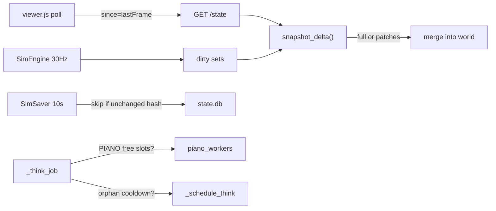
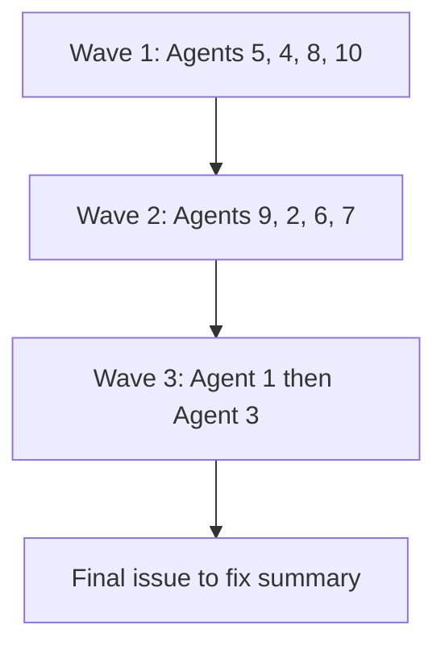

# Plan: Server performance degradation — 10-issue fix

**Status:** Planned (not yet implemented)  
**Date:** 2026-08-01  
**Branch (intended):** `cursor/perf-degradation-fixes-7755`  
**Orchestration:** Grok plans/dispatches/reviews; each issue → one Composer 2.5 implementer. Specs update with code (SDD).

## Locked decisions

- **LLM (issues 6–7):** Safe throttles only — keep PIANO/memory features on; skip work when saturated; pause dispatch on orphan timeouts. No reduction of default module count or memory cadence.
- **`/state` (issues 1 + 3):** Delta polls via `GET /state?since=<frameTick>`; full snapshot on first paint / gap / reset; sprites sent once (create/upgrade), not every poll.

## Background

Long-running sessions feel slower mainly because hot paths scale with world size, not because of classic Python object leaks. Ranking from investigation:

1. `/state` snapshots at 10 Hz under the engine lock (CPU + lock)
2. Autosave full rewrite every 10s (disk + CPU + lock)
3. Structure sprite blobs in persisted state (memory + I/O)
4. `llm.jsonl` full request/response logging (disk)
5. Unbounded live `caravanLog` (memory + I/O, Path1)
6. PIANO fan-out queue pressure (Ollama)
7. Orphaned Ollama timeouts (Ollama queue)
8. `benchmarks.jsonl` burst writes (disk)
9. `/districts.js` poll under lock (CPU + lock)
10. `/council-llm-log` scans all retained sessions (disk, on demand)

## Target architecture

## Dispatch order

Independent issues first; Agents 1 and 3 are coupled (delta protocol, then sprite persistence).

## Orchestration rules

- **Orchestrator:** plan, dispatch, review diffs, run smokes, write the final issue→fix summary. Does not implement multi-file changes.
- **Each issue → one Composer implementer** (`Task` / `subagent_type: implementer`, Composer 2.5).
- **SDD:** each agent updates owning specs in the same change as code.
- **Verify after each issue:** relevant smoke (`scripts/sid_parity_smoke.py` and/or `scripts/path1_smoke.py`); for HTTP/viewer issues, server + browser sanity.
- **Final step:** produce the plain-language summary table (issue → how fixed).

---

## Wave 1 — independent

### Agent 5 — Unbounded `caravanLog`

**Issue:** Live `civilization["caravanLog"]` appends forever; only the snapshot copy is sliced to 20.

**Fix:** After append in `simulation/sim_engine.py` (~6097), trim in place: `c["caravanLog"] = c["caravanLog"][-20:]`. Same cap as snapshot projection (~23449).

**Specs:** `specs/10-path1.md` (caravan log retention).

**Verify:** path1 smoke; confirm trim on append site.

---

### Agent 4 — Fat `llm.jsonl`

**Issue:** Every LLM call logs full `request` + `response` payloads → multi‑MB/hour disk I/O.

**Fix:** Default slim records: keep metadata (`agent_name`, `frame_tick`, `latency_ms`, char counts, `decision`, `error`, `http_status`) and a short response preview; omit full `request`/`response` bodies. Full payloads only when env `SIM_LLM_LOG_FULL=1` (documented in ops). Touch `SessionLogger.log_lm_exchange` and call sites in `run_agent_decision` / `run_piano_module` (`simulation/server.py`).

**Specs:** `specs/12-ops.md` (llm.jsonl schema).

**Verify:** Start server briefly; confirm new lines lack giant `request` objects unless flag set. `/council-llm-log` still works (uses slim decision fields already).

---

### Agent 8 — `benchmarks.jsonl` burst writes

**Issue:** `_sample_benchmarks` (~every 20s) fires many `_log_benchmark` → many sync appends.

**Fix:** Buffer benchmark records in memory (list on `SessionLogger` or engine); flush as a single multi-line write every N seconds or at end of `_sample_benchmarks`. Cap buffer size. Preserve record shape.

**Specs:** `specs/12-ops.md`.

**Verify:** sid_parity smoke; one flush produces multiple JSONL lines.

---

### Agent 10 — `/council-llm-log` full-session scan

**Issue:** Scans every retained session’s `llm.jsonl` on each request.

**Fix:** Prefer live session file first; only scan older sessions if the frame window is not fully covered by the live file. Optional: cache per-file `(min_frame, max_frame)` at open so out-of-range files are skipped. Keep response shape unchanged.

**Specs:** `specs/04-http-api.md`, `specs/12-ops.md`.

**Verify:** Manual or small script against route with in-range / out-of-range frames.

---

## Wave 2

### Agent 9 — `/districts.js` under lock

**Issue:** Every 3s copies all district `tiles`/`terrain` under `engine.lock`.

**Fix:** Under lock, shallow-copy only what is needed into plain dicts/lists; release lock; then `jsonify`. Add a cheap `districtsEpoch` / content revision (bump on district found / tile / terrain / road graph change). Viewer sends `?since=<epoch>`; if unchanged return `{unchanged: true, epoch}` (HTTP 200 with tiny body). Update `pollDistricts` in `simulation/viewer.js` to keep last payload on unchanged.

**Specs:** `specs/04-http-api.md`, `specs/11-viewer.md`.

**Verify:** Found a district / terraform → viewer updates; steady-state polls stay tiny.

---

### Agent 2 — Autosave full rewrite every 10s

**Issue:** Unconditional serialize + DELETE-all + INSERT + WAL checkpoint every 10s.

**Fix:**

1. After `_serialize_state()`, compute a stable content hash (exclude `savedAt`).
2. If hash == last saved hash, skip write (still update an in-memory “last considered” timestamp).
3. Keep graceful-exit flush always writing.
4. Drop redundant double-encode where safe: prefer one `json.dumps` path into DB writers (no `loads` round-trip unless sets need conversion — convert sets explicitly).

Do **not** change `AUTOSAVE_SECONDS=10` in this issue.

**Specs:** `specs/02-engine-core.md` (persistence).

**Verify:** Idle paused world → no `state.db` mtime churn every 10s; one agent action → save occurs.

---

### Agent 6 — PIANO fan-out queue pressure (safe throttle)

**Issue:** Per-decision `_run_piano_modules` submits without a free-slot gate; `ThreadPoolExecutor` queues unboundedly.

**Fix:**

1. Unify inflight accounting for decision-path + always-on PIANO (extend `_piano_refresh_inflight` or sibling set).
2. Before submit loop in `_run_piano_modules`, only submit up to free slots (`PIANO_CONCURRENT_LLM - inflight`); skip rest and fill from module cache / `"none"`.
3. Optionally skip entire fan-out in `_think_job` when piano free slots == 0 (use cache).
4. Count skips via existing `_piano_module_drops` / benchmarks.

No change to module list size or `MEMORY_TICK_FRAMES`.

**Specs:** `specs/03-cognition.md`.

**Verify:** sid_parity smoke; under load, drops increase instead of unbounded queue growth.

---

### Agent 7 — Orphaned Ollama timeouts (safe backpressure)

**Issue:** Client timeout does not cancel Ollama generation; orphans occupy parallel slots; today counted as generic offline.

**Fix:**

1. In `run_agent_decision`, distinguish `requests.exceptions.Timeout` → error `"llm timeout"` (do **not** retry).
2. Engine: on that error, increment `_llm_orphan_timeouts`; if ≥ threshold (e.g. 3), set `llm_cooldown_until` (reuse existing 30s gate in `_schedule_think`).
3. Decay/reset orphan count on successful decision.
4. Optionally count `piano_module_timeout` toward the same orphan pressure (shared Ollama parallel budget).

**Specs:** `specs/03-cognition.md` (retries & degradation).

**Verify:** Forced short timeout in a test harness or documented manual check; cooldown engages; successful call clears pressure.

---

## Wave 3 — coupled

### Agent 1 — Delta `/state` polls (core of issues 1 + 3 poll path)

**Issue:** Full snapshot under lock at 10 Hz; cost grows with village size.

**Fix (concrete protocol):**

| Request | Response |
|---------|----------|
| `GET /state` or `?since=0` | Full snapshot (`full: true` or omit flag; same keys as today) |
| `GET /state?since=<N>` and `N == frameTick` | `{frameTick, unchanged: true}` |
| `GET /state?since=<N>` and contiguous | `{frameTick, baseFrame: N, ...partial fields}` |
| Gap / reset / generation mismatch | Full snapshot + `full: true` + bump `stateGeneration` |

**Partial payload rules:**

- Always include `frameTick` (and `paused` if changed).
- **Agents:** send full agent rows for any agent that moved or changed since `since` (small N); omit unchanged agents.
- **Wildlife / shipments:** same — upsert changed / full list if cheaper at small N.
- **Civilization:** send only dirty subkeys (structures upsert/remove, stockpile, projects, etc.).
- **config:** only on full or when flags change (rare).
- Omitted key means **unchanged** (document clearly); use `null` or tombstones only where “cleared” must be distinct — prefer full resync on generation bump.

**Lock discipline:** copy/dirty under lock; assemble JSON outside lock when possible.

**Viewer:** `pollState` in `simulation/viewer.js` tracks `lastFrameTick` + `stateGeneration`; merges deltas into `world` (replace agent objects by id; deep-merge civ allowlisted keys); on `full`/`unchanged`/error, keep existing reconnect behavior; first successful poll always full.

**Dirty tracking:** maintain sets/flags on mutators (agent move already every tick → agents usually dirty every unpaused poll — still wins by omitting structures/sprites/registries). Mark structure/registry/log dirty only on events.

**Specs:** `specs/04-http-api.md`, `specs/11-viewer.md`, `specs/01-architecture.md` (Contract 2 / data flow).

**Verify:** Browser: agents move smoothly; structure build appears; pause → `unchanged`; kill server / reset → full resync without blank world.

---

### Agent 3 — Structure sprite blobs (persistence + delta)

**Issue:** Large `sprite` grids live in every structure, inflate `/state` and every autosave rewrite.

**Fix:**

1. **HTTP (builds on Agent 1):** structure upserts omit `sprite` unless `spriteChanged` (create, upgrade, custom sprite submit). Viewer keeps a `Map(structureId → sprite)` and merges when present.
2. **Persistence:** add `structure_sprites` table (`structure_id`, `sprite_json`, `updated_frame`). Civ structures in `civ` JSON store without embedded sprite grids. On save, upsert only dirty sprite rows; on restore, merge sprites back onto structures for engine use. Bump `STATE_VERSION` / document migration (restore old DBs: accept embedded sprites once, then split).

**Specs:** `specs/02-engine-core.md` (schema), `specs/05-world.md` (structure projection), `specs/04-http-api.md` (delta sprite rule).

**Verify:** Restore from existing `state.db`; build/upgrade structure → sprite appears in viewer; autosave size / rewrite cost drops when only agents move.

---

## Spec ownership map

| Issues | Specs |
|--------|-------|
| 1, 9 | 04, 11, 01 |
| 2, 3 | 02, 05 |
| 4, 8, 10 | 12, 04 |
| 5 | 10 |
| 6, 7 | 03 |

## Out of scope

- Cutting PIANO module count or slowing memory maintenance (user chose 1B).
- Slowing `STATE_POLL_MS` below 10 Hz (user chose delta instead).
- Cancelling in-flight Ollama generations (not supported by Ollama `stream:false`; we only stop *new* dispatches).
- Changing `AUTOSAVE_SECONDS` interval.

## Final deliverable

After all agents land, orchestrator publishes a **simple summary** (user-facing), one line per issue:

| # | Issue (plain English) | How it was fixed |
|---|----------------------|------------------|
| 1 | … | … |
| … | … | … |
| 10 | … | … |

No jargon dump — each row: what hurt, what changed.

## Implementation checklist

- [ ] Agent 5: trim `caravanLog` on append + specs/10
- [ ] Agent 4: slim `llm.jsonl` by default + specs/12
- [ ] Agent 8: buffer/flush `benchmarks.jsonl` + specs/12
- [ ] Agent 10: narrow `/council-llm-log` session scan + specs/04+12
- [ ] Agent 9: `districts.js` epoch/unchanged + lock hygiene + specs/04+11
- [ ] Agent 2: autosave skip-if-unchanged hash + specs/02
- [ ] Agent 6: PIANO free-slot backpressure + specs/03
- [ ] Agent 7: orphan timeout distinguish + cooldown + specs/03
- [ ] Agent 1: delta `/state?since=` protocol + viewer merge + specs/01+04+11
- [ ] Agent 3: sprite send-once + `structure_sprites` table + specs/02+05
- [ ] Publish plain-language issue→fix summary for all 10
