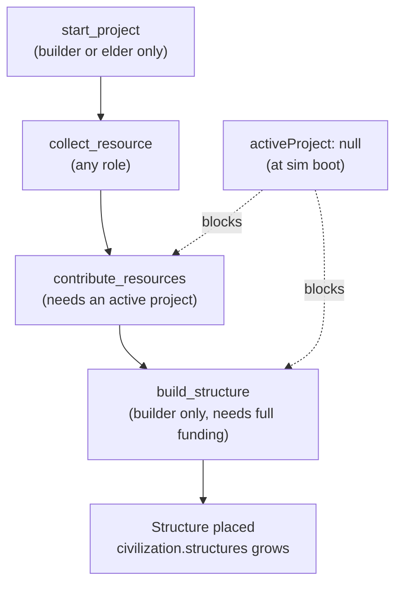

# Simulation Issues — Diagnostic Report

This is a read-only diagnosis of the current state of the simulation. It documents
root causes so that fixes can be prioritized later. It is **not** an implementation
plan and it does not change any code or specs.

Evidence comes from three places: the live logs under `simulation/logs/`, the source
in `simulation/index.html`, `simulation/server.py`, and `simulation/sprites.js`, and
context from prior plans:

- `.cursor/plans/fix_simulation_issues_d52696d6.plan.md` — fixed the LLM `bad_response`
  loop, added cumulative logging, and added a tab-backgrounding warning. These are
  implemented in the code now.
- `.cursor/plans/propose_blueprint_flow_6aa2dfb3.plan.md` — added the blueprint
  proposal pipeline on top of a base build loop that, as shown below, rarely runs.
- `.cursor/plans/implement_simulation_logging_ebbe52d8.plan.md` — added the logging
  that makes this diagnosis possible.

---

## 1. Executive summary

| Symptom | Primary cause |
|---------|---------------|
| No building or civilization progress | `start_project` never fires, so the build pipeline never starts |
| Agents talk about food and wood but never coordinate a build | Only the builder and elder can start projects, and the LLM keeps choosing collect/move/talk instead |
| The GUI looks messy | Overlapping per-agent annotations, no depth sorting, minimal sprites, and a cramped sidebar |

Snapshot from the latest session (`simulation/logs/lm_studio.jsonl`, 36 LLM calls, all
with `error: null`):

| Action chosen by the LLM | Count |
|--------------------------|-------|
| `collect_resource` | 17 |
| `move_to_forest` | 7 |
| `talk_to_nearby` | 5 |
| `move_to_village` | 3 |
| `move_to_market` | 2 |
| `move_to_agent` | 1 |
| `build_structure` | 1 (failed) |
| **`start_project`** | **0** |
| **`contribute_resources`** | **0** |

The activity log tells the same story. Across 35 events there are zero "started",
zero "contributed", and zero "built" entries. The only build-related line is:

> `Zara has no project to build`

Conversations are short resource-trade loops with nothing to contribute to:

> Rex -> Marco: I need some wood for the village fortifications.
> Marco -> Rex: I have plenty of food here. Do you need any?
> Mia -> Marco: I have some food that I can trade. Do you need any?

---

## 2. Why agents are not building or progressing

### The intended build pipeline



The simulation boots with no active project:

```284:294:simulation/index.html
const civilization = {
  level: 1,
  structures: [],
  activeProject: null,
  completedProjects: 0,
  nextStructureId: 1,
  resourceRegistry: { ...BASE_RESOURCES },
  projectRegistry: { ...PROJECT_TEMPLATES },
  pendingBlueprints: [],
  rejectedBlueprintIds: new Set()
};
```

Every later step in the pipeline is gated on `activeProject` being set, so until some
agent calls `start_project`, nothing downstream can happen.

### The three pipeline gates

`start_project` only runs for a builder or elder when there is no active project:

```941:961:simulation/index.html
    case "start_project": {
      if (!civilization.activeProject && (agent.role === "builder" || agent.role === "elder")) {
        const type = pickProjectType(decision.target);
        const tmpl = civilization.projectRegistry[type];
        const contributed = {};
        for (const res of Object.keys(tmpl.needs)) contributed[res] = 0;
        civilization.activeProject = {
          type: type,
          name: tmpl.name,
          needs: { ...tmpl.needs },
          contributed: contributed,
          visualStyle: tmpl.visualStyle || "generic"
        };
        summary = `${agent.name} started ${tmpl.name} project`;
        pushActivity(summary);
        sidebarDirty = true;
      } else {
        summary = `${agent.name} could not start a project`;
      }
      break;
    }
```

`contribute_resources` is a no-op without an active project:

```962:980:simulation/index.html
    case "contribute_resources": {
      const res = pickContributionResource(agent, decision);
      if (res && civilization.activeProject && (agent.resources[res] || 0) > 0) {
        const need = civilization.activeProject.needs[res] || 0;
        const have = civilization.activeProject.contributed[res] || 0;
        if (have < need) {
          agent.resources[res] -= 1;
          civilization.activeProject.contributed[res] = have + 1;
          summary = `${agent.name} contributed ${res} to ${civilization.activeProject.name}`;
          pushActivity(summary);
          sidebarDirty = true;
        } else {
          summary = `${agent.name} project does not need more ${res}`;
        }
      } else {
        summary = `${agent.name} has nothing to contribute`;
      }
      break;
    }
```

`build_structure` fails with "has no project to build" when there is no project:

```981:1006:simulation/index.html
    case "build_structure": {
      if (agent.role === "builder" && civilization.activeProject && isProjectComplete()) {
        const spot = findStructureSpot();
        const structType = civilization.activeProject.type;
        civilization.structures.push({
          id: civilization.nextStructureId++,
          type: structType,
          x: spot.x,
          y: spot.y,
          visualStyle: civilization.activeProject.visualStyle || "generic",
          name: civilization.activeProject.name
        });
        const builtName = civilization.activeProject.name;
        civilization.activeProject = null;
        civilization.completedProjects++;
        checkCivilizationLevel();
        summary = `${agent.name} built ${builtName} at village`;
        pushActivity(summary);
        sidebarDirty = true;
      } else if (civilization.activeProject && !isProjectComplete()) {
        summary = `${agent.name} waiting for more resources`;
      } else {
        summary = `${agent.name} has no project to build`;
      }
      break;
    }
```

The first house is cheap (`{ wood: 3, food: 1 }`), so the blocker is not resource
scarcity — it is that the project is never created in the first place:

```242:247:simulation/index.html
const PROJECT_TEMPLATES = {
  house:     { name: "House",     needs: { wood: 3, food: 1 }, visualStyle: "house" },
  farm_plot: { name: "Farm Plot", needs: { wood: 2, food: 2 }, visualStyle: "farm_plot" },
  workshop:  { name: "Workshop",  needs: { wood: 4, gold: 2 }, visualStyle: "workshop" },
  wall:      { name: "Wall",      needs: { wood: 2, gold: 1 }, visualStyle: "wall" }
};
```

### Root causes, ranked

1. **Nothing enforces `start_project`.** The LLM has to spontaneously choose it, and
   in 36 logged calls it chose it zero times. In the one build-related attempt, the
   builder Zara chose `build_structure` (its reasoning even said it wanted to start a
   project), which failed because no project exists. The pipeline has a hard
   dependency that the model is not reliably satisfying.

2. **Role fallbacks do not rescue valid-but-wrong actions.** The server's
   `role_fallback_action()` only runs on a bad response or on invalid talk. A
   syntactically valid action like `build_structure` with no active project passes
   straight through:

```445:448:simulation/server.py
    if action != "talk_to_nearby":
        if isinstance(decision, dict):
            decision.pop("blueprint", None)
        return decision
```

3. **Server and client elder fallbacks disagree.** The server elder fallback only
   walks to the village; it never starts a project:

```395:397:simulation/server.py
    if role in ("healer", "elder", "blacksmith"):
        if has_project:
            return {"action": "contribute_resources", "target": None, "message": None,
```

   The client builder/elder fallback *would* start a project, but only when a talk
   action is being redirected (see `index.html` around lines 631–664), which rarely
   triggers. So even the existing recovery logic almost never starts a project.

4. **The behavior nudge is weak and unrelated to building.** A nudge is only added
   after two consecutive talks, and it pushes the agent toward collecting or moving,
   not toward starting a project:

```1153:1155:simulation/index.html
  if (agent.consecutiveTalks >= 2) {
    behaviorNudge = "NOTE: You have chatted twice. Prioritize collect_resource, contribute_resources, or move_to_agent.";
  }
```

   There is no nudge that tells the builder or elder to start a project when
   `active_project` is `"none"`.

5. **Talk and movement loops without build authority.** In the logs, the guard (Rex)
   and the trader (Marco) repeatedly discuss wood and food, but neither role can
   start a project. Talking also auto-moves agents toward each other, which produces
   the visible clustering and walking without any build outcome.

6. **A serial LLM queue starves the few agents that matter.** Decisions are processed
   one at a time with a minimum gap:

```771:771:simulation/index.html
const LLM_MIN_GAP_MS = 1500;
```

```1124:1130:simulation/index.html
async function drainThinkQueue() {
  if (llmBusy || thinkQueue.length === 0) return;
  const now = Date.now();
  if (now - lastLlmCallMs < LLM_MIN_GAP_MS) return;
  llmBusy = true;
  const agent = thinkQueue.shift();
  lastLlmCallMs = now;
```

   With 12 agents sharing a one-at-a-time queue and a 1.5s floor, each agent only gets
   a turn every ~18–30 seconds. The builder and elder — the only two agents who can
   start a project — get very few chances to make the right call.

7. **Idle wander makes agents look aimless.** Between LLM turns, an idle agent
   re-targets a random zone roughly once per second, so the world reads as constant
   wandering:

```529:535:simulation/index.html
    agent.idleFrames = (agent.idleFrames || 0) + 1;
    if (agent.idleFrames >= 60) {
      const wanderZone = pickWanderZone(agent);
      setAgentTarget(agent, wanderZone);
      agent.idleFrames = 0;
    }
```

8. **The earlier LLM failure mode is resolved, which isolates this one.** The original
   plan documented a reasoning model returning empty `content`, causing constant
   `rest`. All 36 calls in the latest session have `error: null`, so the LLM is
   connected and responding. That confirms the remaining blocker is decision logic and
   flow, not model connectivity.

---

## 3. Would fewer agents help?

### Current setup

The spec mandates exactly 12 agents, and only two of them can start projects:

- `specs/04-agent-spec.md` lists the 12 agents as fixed ("exactly these — no more, no fewer").
- Only the builder (Zara) and elder (Sage) can call `start_project`.
- The other 10 agents compete for LLM turns doing collect, move, and talk.

### Where fewer agents would genuinely help

| Factor | With 12 agents | With fewer (e.g. 6–8) |
|--------|----------------|------------------------|
| LLM queue throughput | ~18–30s per agent per cycle | ~9–15s per agent |
| Canvas clustering | Several agents spawn close together and overlap | Less overlap, easier to read |
| Talk radius (80px) | Frequent neighbors trigger talk loops | Fewer spurious talks |
| Per-decision context | 12 personalities and inventories in flight | Simpler world state per decision |

### Where fewer agents would not help

- The build blockage is **structural**: no agent ever calls `start_project`. That is
  true regardless of how many agents exist.
- Even a 2-agent world (builder plus farmer) would stall if the builder never picks
  `start_project`.
- Cutting agents conflicts with `specs/04-agent-spec.md`, which fixes the roster.

### Recommendation

Reducing the agent count would improve LLM throughput and visual clarity, but it will
**not** fix civilization progress on its own. The minimum viable fix is to guarantee
that a project gets started when none is active — for example by auto-starting the
first project on boot, redirecting `build_structure` to `start_project` when there is
no active project, or adding a strong builder/elder nudge when `active_project` is
`"none"`.

If you want to experiment with throughput and clarity, a 6-agent subset (builder,
elder, farmer, gatherer, trader, miner) is a reasonable test configuration. Treat it
as an optional development override, not a change to the spec.

---

## 4. Why the GUI looks in poor shape

### Canvas clutter (highest impact)

Each agent draws a tall stack of annotations on top of a 32px sprite — role badge,
speech bubble, name, and resource dots:

```741:758:simulation/index.html
function drawAgent(ctx, agent, frameTick) {
  drawAgentSprite(ctx, agent, frameTick);
  ctx.fillStyle = agent.color;
  ctx.fillRect(agent.x - 10, agent.y - 58, 20, 8);
  ctx.fillStyle = "#fff";
  ctx.font = "bold 7px monospace";
  ctx.textAlign = "center";
  ctx.fillText(agent.role.charAt(0).toUpperCase(), agent.x, agent.y - 52);
  ctx.font = "9px sans-serif";
  ctx.lineWidth = 2;
  ctx.strokeStyle = "rgba(0,0,0,0.7)";
  ctx.strokeText(agent.name, agent.x, agent.y + 30);
  ctx.fillStyle = "#fff";
  ctx.fillText(agent.name, agent.x, agent.y + 30);
  drawResourceDots(ctx, agent, agent.x, agent.y + 36);
  drawSpeechBubble(ctx, agent);
}
```

- The speech bubble sits at `y - 72` and the role badge at `y - 58`, so they share the
  same vertical band and overlap when an agent is talking (`drawSpeechBubble` starts at
  line 719).
- Agents are drawn in array order with no depth sorting, so a later agent always paints
  over an earlier one regardless of who is "in front":

```1313:1318:simulation/index.html
  for (const agent of agents) {
    if (!paused) moveAgent(agent);
  }
  for (const agent of agents) {
    drawAgent(ctx, agent, frameTick);
  }
```

- Agents spawn close together and the talk radius is 80px, so names, badges, and dots
  collide constantly whenever agents gather in the village or market.
- The `isThinking` flag is set and cleared but never rendered, so an agent waiting on a
  slow LLM call looks idle:

```1149:1149:simulation/index.html
  agent.isThinking = true;
```

```1217:1217:simulation/index.html
    agent.isThinking = false;
```

### World map readability

Only the market is labeled, and even that label has poor contrast against the orange
market tiles:

```911:916:simulation/sprites.js
  drawMarketStall(ctx, 568, 368);
  ctx.fillStyle = C.ma;
  ctx.font = "bold 14px monospace";
  ctx.textAlign = "center";
  ctx.fillText("MARKET", 610, 358);
```

Farm, forest, village, beach, and cave have no labels, so a new viewer has to infer
zones from tile color alone. Static houses are drawn at fixed spots that can collide
with player-built structures, which makes duplicates look like rendering glitches:

```906:909:simulation/sprites.js
  drawHouse(ctx, 440, 300);
  drawHouse(ctx, 490, 320);
  drawHouse(ctx, 620, 300);
  drawHouse(ctx, 440, 410);
```

Structures are also drawn before the agent loop, so agents walk over buildings with no
occlusion or shadow, which flattens the scene.

### Sprites and animation

- All 12 agents share one 16×16 silhouette and differ only by palette
  (`makeAgentPalette` at `sprites.js:378`), so they are hard to tell apart on a busy
  canvas — especially when the name labels overlap.
- There are only two animation frames (stand and walk), toggled every 12 ticks:

```847:848:simulation/sprites.js
  const walkFrame = moving && Math.floor(frameTick / 12) % 2 === 1;
  const grid = walkFrame ? data.walk : data.stand;
```

  There are no gather, build, or talk poses, so the world feels static even while
  agents move.
- Head accessories use a fixed horizontal offset and can look detached from the head
  when the sprite is flipped (`ACCESSORIES` lookup at `sprites.js:853`).

### Sidebar and layout

- The page is locked to a fixed 1280px width with no viewport meta tag and no
  high-DPI handling, so it overflows on small windows and looks soft on Retina
  displays (`#wrap` styles near `index.html:13`, canvas element near `index.html:171`).
- The agent list is capped at about 140px for 12 agents, so it scrolls immediately.
- The activity log is only about 70px tall, so only a handful of recent events are
  visible.
- The conversation list is rebuilt with a full `innerHTML` replace on every update,
  which loses scroll position and makes the log jump while you read it.
- The "Resources" stat shows the number of registered resource *types*, not village
  totals, which is misleading.

### Correlation with the running screenshot

The screenshot from the running session matches the code analysis: agents are bunched
in the market and forest with overlapping name labels, resource dots are visible (the
green food markers) but there are no built structures, and single-letter role badges
sit close to the names. The visual noise comes directly from the stacked per-agent
annotations plus the lack of depth sorting and zone labels.

---

## 5. Issue severity matrix

| Priority | Issue | Category | Fix complexity |
|----------|-------|----------|----------------|
| P0 | `start_project` is never called, so nothing is ever built | Progression | Low–medium |
| P0 | `build_structure` with no active project is not redirected to `start_project` | Progression | Low |
| P1 | Serial one-at-a-time LLM queue starves the builder and elder | Performance | Medium |
| P1 | Overlapping agent labels and speech bubbles with no depth sorting | GUI | Medium |
| P2 | `isThinking` is tracked but never shown | GUI | Low |
| P2 | Only the market is labeled; other zones have none | GUI | Low |
| P3 | 12 agents versus a smaller roster (throughput and clarity tradeoff) | Design | Decision needed |
| P3 | Identical sprites with only a two-frame walk animation | GUI | High |

---

## 6. Scope of this document

- This is a diagnosis, not an implementation plan. Fixes belong in separate follow-up
  plans.
- It does not modify any existing plan files.
- It does not change the specs. Where observed behavior conflicts with a spec
  constraint (for example the fixed 12-agent roster), that conflict is noted so it can
  be decided deliberately.
